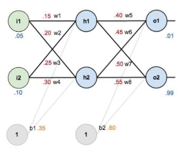

---
layout: default
title: Assignment 1
nav_order: 1
has_children: false
parent: Assignments
permalink: /assignments/Assignment 1/Assignment 1
---

**Artificial Neural Networks**

1st Assignment - Shahid Beheshti University - Master’s Program February 27, 2023

**Due date: March 12**

** You are required to write a detailed report for both Theory and implementation tasks.**

**Exercise 1**

Why is it generally preferable to use a Logistic Regression classifier rather than a classical Perceptron (i.e., a single layer of threshold logic units trained using the Perceptron training algorithm)? How can you tweak a Perceptron to make it equivalent to a Logistic Regression classifier?

**Exercise 2**

Describe the differences between the Cross-Entropy vs Mean Squared Error. Which one do you prefer for the classification problem?

**Exercise 3**

Why do we usually consider cost function as a negative of log-likelihood?

**Exercise 4**

Learning in a Neural network is done by updating the weights. “Backward propagation of errors” known as backpropagation is the common method to do the updating efficiently. Now consider the following neural network with Sigmoid as neurons’ activation function and “Mean Squared Error” as the cost function.

1. Calculate the network error after one step of feed-forward.
1. Calculate one step of backpropagation with a learning rate equal to 0.3.

**W1 = .15 i1->h1       W2 = .20 i1->h2         W3 = .25 i2->h1      W4 = .30 i2->h2**
**W5 = .40 h1->o1       W6 = .45 h1->o2         W7 = .50 h2->o1      W8 = .55 h2->o2**

**Exercise 5**

Implement a simple multi-layer perceptron neural network using PyTorch to solve a classification problem. You have to work with the EMNIST dataset, which consists of 47 classes with 112,000 samples in the training set and 18,000 samples in the test set.

- Report the depth effect of different hidden layers.
- Analyze the dropout technique and report its results.
- Become familiar with batch normalization and report its effects.

