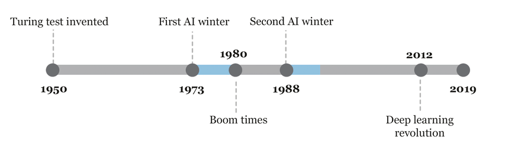
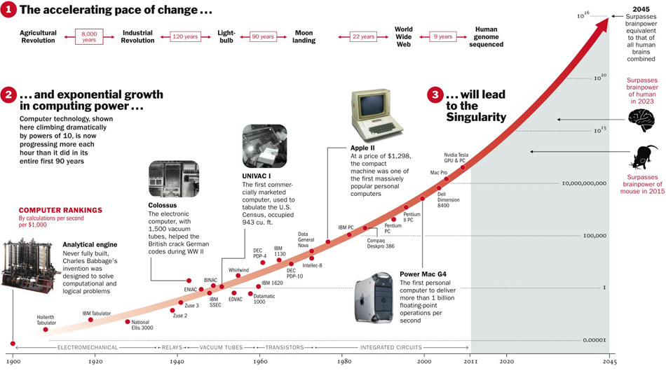
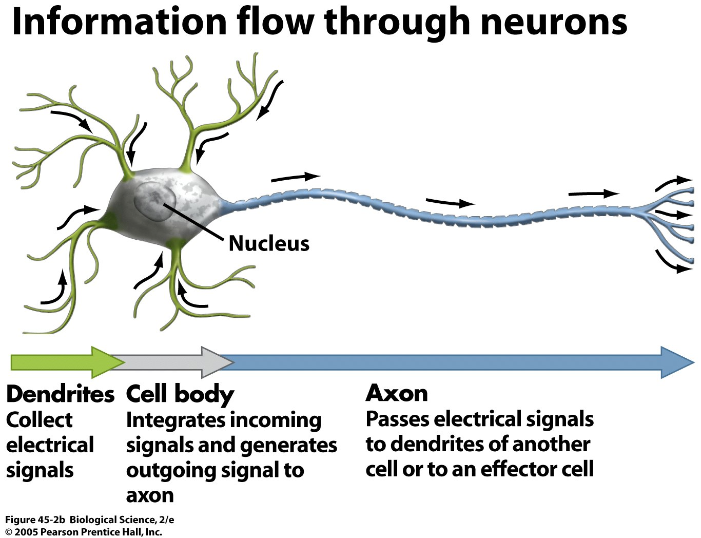
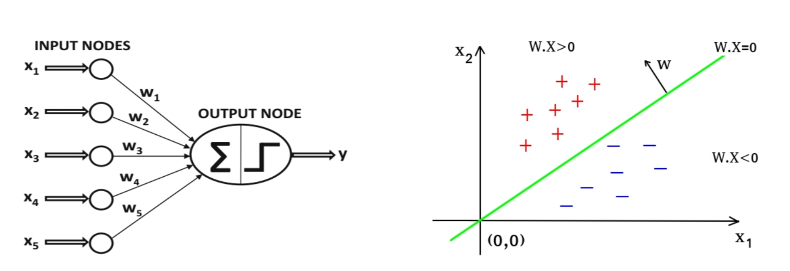

## A Brief History

In 1943, Warren McCulloch and Walter Pitts published a landmark paper entitled "A Logical Calculus of the Ideas Immanent in Nervous Activity". This paper presented a model of the brain as a network of simple processing units, or "neurons", which communicate with each other through binary "on/off" signals. The model was inspired by the structure and function of real neurons in animal brains, and was the first to provide a formal account of how neurons might work together to perform complex computations.

McCulloch and Pitts demonstrated how their model could be used to perform basic logical operations, such as AND, OR, and NOT, and argued that it could be used to simulate any computation that could be performed by a Turing machine. This was a groundbreaking idea, as it suggested that the brain could be thought of as a kind of computer, capable of performing any computation that could be described algorithmically.

The Hebbian learning rule is a neurobiological theory proposed by Canadian psychologist Donald Hebb in 1949. The theory suggests that when a neuron repeatedly and persistently fires in close proximity to another neuron, the connection between these two neurons is strengthened. This process of strengthening the connection between neurons is called synaptic plasticity and is the basis for learning and memory formation in the brain.

The Hebbian learning rule is often summarized as “neurons that fire together, wire together.” It describes how the strength of the connection between two neurons changes as a result of their activation patterns. If neuron A repeatedly fires just before neuron B, the connection between A and B will strengthen, making it more likely that A will activate B in the future.

The Hebbian learning rule is a simple but powerful principle that has been used to explain many aspects of brain function, including how we learn new information, form memories, and adapt to changing environments. It has also been used as a basis for developing artificial neural networks, which are used in machine learning and artificial intelligence to simulate the learning and decision-making processes of the human brain.

The first AI winter is a period between 1974 and 1980 in the history of artificial intelligence (AI) research when the interest and funding in AI research experienced a significant decline. The term "winter" was coined to describe this period of inactivity and pessimism towards AI research. There were multiple reasons behind the first AI winter, including unrealistic expectations about the capabilities of AI, inability to deliver practical applications, and overhyped promises. The lack of significant progress in AI technology and the failure to achieve the goals set by the research community also contributed to the decline of funding and interest in AI research during this period.

The first AI winter saw many AI researchers and experts lose their jobs, and research institutions focused on AI technology were shut down. It took almost a decade for the field to regain momentum and recover from the first AI winter, mainly due to the emergence of new approaches, such as expert systems, and the development of new hardware and software technologies that made it possible to implement AI applications in practical settings. The first AI winter serves as a reminder of the challenges faced by AI research and the importance of realistic expectations and careful planning in the development of AI technology.

The second AI winter refers to the period from the mid-1980s to the late 1990s when there was a significant decrease in interest and funding for artificial intelligence (AI) research and development. The main reason for this decline was the failure of AI systems to deliver on their promised capabilities. In the 1960s and 1970s, AI researchers had high expectations for the field, but by the mid-1980s, progress had stalled, and many AI projects had failed to produce useful results. As a result, funding for AI research decreased significantly, and many researchers left the field.

Another factor contributing to the second AI winter was the emergence of new computing technologies, such as personal computers and the internet, which captured public and investor attention and investment. These technologies promised more immediate and tangible benefits than AI, which was seen as a longer-term and more speculative investment.

The second AI winter lasted until the late 1990s when breakthroughs in machine learning, data mining, and natural language processing reignited interest in the field. The emergence of these new technologies allowed researchers to tackle previously unsolvable problems and opened up new possibilities for AI applications.




There is no guarantee that we will not have another AI winter, but there are several reasons why it is less likely to happen than in the past.

Firstly, there has been a significant increase in computing power and storage capacity, which allows for larger and more complex models to be trained. This has enabled breakthroughs in deep learning, which has become a dominant approach in many AI applications.

Secondly, there has been a massive increase in data availability, thanks to the proliferation of digital devices and the internet. The availability of large and diverse datasets is critical for training and evaluating machine learning models, and this is likely to continue to grow.

Thirdly, there has been a significant increase in investment in AI research and development from both public and private sectors. This investment has resulted in the emergence of many startups and established companies that focus on AI applications, which further accelerates research and development.

Lastly, there is a growing recognition of the potential benefits of AI, not just in commercial applications, but also in healthcare, transportation, energy, and other critical sectors. Governments and policymakers are paying more attention to the ethical, legal, and social implications of AI, which helps to ensure responsible development and deployment of AI.

Of course, there are still challenges and potential risks associated with AI, such as bias, security, and job displacement, but overall, the trend towards increased adoption and investment in AI suggests that another AI winter is less likely to occur.




## Biological Neurons



A biological neuron is a type of cell that is found in the nervous system of animals. It is the basic unit of the nervous system that is responsible for transmitting electrical and chemical signals throughout the body. A typical biological neuron has three main parts: the cell body, the dendrites, and the axon.

The cell body, also known as the soma, is the central part of the neuron that contains the nucleus and other organelles. The dendrites are the short, branched extensions that project from the cell body and receive signals from other neurons or sensory receptors. The axon is a long, slender extension that transmits signals away from the cell body to other neurons or effectors.

At the point where the axon meets the dendrite of another neuron, there is a small gap called the synapse. When an electrical signal reaches the end of an axon, it triggers the release of chemical neurotransmitters into the synapse. These neurotransmitters then bind to receptors on the dendrites of the next neuron, causing a new electrical signal to be generated and transmitted through the network of neurons. This process of electrical and chemical signaling is the basis of communication within the nervous system.

## Artificial Neurons: The Perceptron

A perceptron is a type of artificial neural network that is inspired by the structure and function of biological neurons. It is a single-layer neural network that takes a set of input values, applies weights to them, and produces a single output value.

The perceptron is modeled after the structure of a biological neuron, which consists of a cell body, dendrites, and an axon. In the perceptron, the input values are analogous to the dendrites, the weights to the strength of the synapses between the dendrites and the cell body, and the output value to the axon.

The perceptron works by taking the input values and multiplying them by their corresponding weights. It then sums the weighted inputs and applies an activation function to the result. The output of the activation function is the output of the perceptron.

The activation function is typically a threshold function, which means that the output is 1 if the sum of the weighted inputs is greater than a threshold value, and 0 otherwise. This threshold function is similar to the way in which biological neurons fire or do not fire based on the strength of the signals they receive from their dendrites.

The perceptron was first introduced in 1957 by Frank Rosenblatt as a method for solving binary classification problems. It was a significant development in the field of artificial intelligence, as it demonstrated that machines could learn from data and make decisions based on that learning.

While the perceptron has its limitations and can only solve linearly separable problems, it paved the way for more advanced neural network architectures that can solve more complex problems.



$$ y = step(z) $$

$$ z = w_1x_1 + w_2x_2 + ... + w_nx_n = x^Tw $$

This activation process is performed by applying a step function to the weighted sum of inputs and outputs the results. Usually, *Heaviside step function* and sign function are used as step functions for this model.

$$
    heaviside(z) = \begin{cases} 
                    0 & z < 0 \\
                    1 & z\ge 0 
                    \end{cases}
$$
$$
    sgn(z) = \begin{cases} 
                    -1 & z < 0 \\
                    0 & z = 0 \\
                    1 & z > 0    
              \end{cases}
$$

The training process starts with initializing the weights to small random values. Then, for each training example, the perceptron computes the weighted sum of the input features and applies an activation function. If the result is greater than or equal to a threshold value, the perceptron outputs a 1, indicating that the input belongs to one class; otherwise, it outputs a 0, indicating that the input belongs to the other class.

If the output of the perceptron does not match the true label of the input, the weights are adjusted to correct the error. The adjustment of the weights is based on the perceptron learning rule, which updates the weights according to the difference between the predicted output and the true output, multiplied by the input features. This process continues until the perceptron can correctly classify all of the training data, or until a maximum number of iterations is reached.

The perceptron training process can be visualized as finding a hyperplane in the feature space that separates the two classes of data. As the weights are adjusted during training, the hyperplane is shifted in a way that improves the classification accuracy.


The output of the perceptron in terms of the model parameters and the input data:

$$\hat{y} = \sum_{i=1}^n w_i x_i  + b$$


Use this equation to calculate the loss function. We can use either the Mean Squared Error (MSE) or the Cross Entropy (CE) loss function. For this example, we will use the MSE loss:

$$L = \frac{1}{2N} \sum_{i=1}^N (\hat{y} - y_i)^2$$

Use the chain rule to calculate the derivative of the loss function with respect to the model parameters:

$$
\frac{\partial L}{\partial w_i} = \frac{\partial L}{\partial \hat{y}} \frac{\partial \hat{y}}{\partial w_i} = \frac{1}{N} (\hat{y} - y_i) x_i
$$

Finally, use the derivative to update the model parameters:


$$ w_{i, j}^{t+1} = w_{i,j}^t + \eta(y_j - \hat{y_j})x_i $$


## Implementation with Numpy


```python
import numpy as np

# define the class for the perceptron
class Perceptron(object):
    # initialize and set the learning rate
    def __init__(self, learning_rate=0.01, num_iterations=10):
        self.learning_rate = learning_rate
        self.num_iterations = num_iterations

    # fit the model to the data
    def fit(self, X, y):
        # initialize the weights
        self.weight_ = np.zeros(X.shape[1] + 1)

        # list to store errors
        errors = []

        # iterate over all the epochs
        for i in range(self.num_iterations):
            # get the predictions
            predictions = self.predict(X)

            # calculate the errors
            errors = predictions - y

            # update the weights
            self.weight_[0] -= self.learning_rate * errors.sum()
            self.weight_[1:] -= self.learning_rate * (X.T.dot(errors))

            # store the errors for visualization
            errors.append(np.mean(np.abs(errors)))

        return errors

    # predict new data using the weights
    def predict(self, X):
        # add the bias to the input
        X_biased = np.c_[np.ones(X.shape[0]), X] 

        # calculate the product of weights and inputs
        product = np.dot(X_biased, self.weight_)

        # return the predictions
        return np.where(product >= 0, 1, -1)
```

## Refrences

- Hands on Machine Learning book O'Reilly
- https://cs.stanford.edu/people/eroberts/courses/soco/projects/neural-networks/index.html
