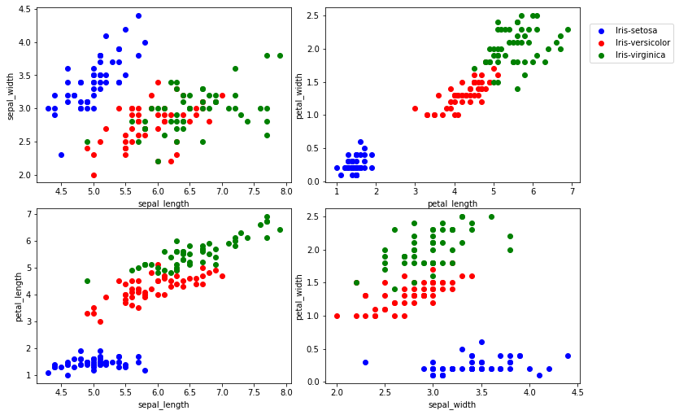

some part of this notebook are copied from Jose Marcial Portilla works.

# Datasets with PyTorch

## Perform standard imports


```python
import torch
import numpy as np
import pandas as pd
import matplotlib.pyplot as plt
%matplotlib inline
```

# Loading data from files
We've seen how to load NumPy arrays into PyTorch, and anyone familiar with <tt>pandas.read_csv()</tt> can use it to prepare data before forming tensors. Here we'll load the <a href='https://en.wikipedia.org/wiki/Iris_flower_data_set'>iris flower dataset</a> saved as a .csv file.


```python
# download csv file from github
!wget https://raw.githubusercontent.com/alisharifi2000/LoopAcademyMedicalImageProcessing/main/pytorch/Data/IRIS.csv
```

    --2023-02-18 08:40:49--  https://raw.githubusercontent.com/alisharifi2000/LoopAcademyMedicalImageProcessing/main/pytorch/Data/IRIS.csv
    Resolving raw.githubusercontent.com (raw.githubusercontent.com)... 185.199.109.133, 185.199.108.133, 185.199.110.133, ...
    Connecting to raw.githubusercontent.com (raw.githubusercontent.com)|185.199.109.133|:443... connected.
    HTTP request sent, awaiting response... 200 OK
    Length: 4617 (4.5K) [text/plain]
    Saving to: ‘IRIS.csv.1’
    
    IRIS.csv.1          100%[===================>]   4.51K  --.-KB/s    in 0s      
    
    2023-02-18 08:40:49 (58.6 MB/s) - ‘IRIS.csv.1’ saved [4617/4617]
    


```python
df = pd.read_csv('/content/IRIS.csv')
df.head()
```


  <div id="df-c4782bb7-f154-486d-a524-bda72f85ec3a">
    <div class="colab-df-container">
      <div>
<style scoped>
    .dataframe tbody tr th:only-of-type {
        vertical-align: middle;
    }

    .dataframe tbody tr th {
        vertical-align: top;
    }

    .dataframe thead th {
        text-align: right;
    }
</style>
<table border="1" class="dataframe">
  <thead>
    <tr style="text-align: right;">
      <th></th>
      <th>sepal_length</th>
      <th>sepal_width</th>
      <th>petal_length</th>
      <th>petal_width</th>
      <th>species</th>
    </tr>
  </thead>
  <tbody>
    <tr>
      <th>0</th>
      <td>5.1</td>
      <td>3.5</td>
      <td>1.4</td>
      <td>0.2</td>
      <td>Iris-setosa</td>
    </tr>
    <tr>
      <th>1</th>
      <td>4.9</td>
      <td>3.0</td>
      <td>1.4</td>
      <td>0.2</td>
      <td>Iris-setosa</td>
    </tr>
    <tr>
      <th>2</th>
      <td>4.7</td>
      <td>3.2</td>
      <td>1.3</td>
      <td>0.2</td>
      <td>Iris-setosa</td>
    </tr>
    <tr>
      <th>3</th>
      <td>4.6</td>
      <td>3.1</td>
      <td>1.5</td>
      <td>0.2</td>
      <td>Iris-setosa</td>
    </tr>
    <tr>
      <th>4</th>
      <td>5.0</td>
      <td>3.6</td>
      <td>1.4</td>
      <td>0.2</td>
      <td>Iris-setosa</td>
    </tr>
  </tbody>
</table>
</div>
      <button class="colab-df-convert" onclick="convertToInteractive('df-c4782bb7-f154-486d-a524-bda72f85ec3a')"
              title="Convert this dataframe to an interactive table."
              style="display:none;">

  <svg xmlns="http://www.w3.org/2000/svg" height="24px"viewBox="0 0 24 24"
       width="24px">
    <path d="M0 0h24v24H0V0z" fill="none"/>
    <path d="M18.56 5.44l.94 2.06.94-2.06 2.06-.94-2.06-.94-.94-2.06-.94 2.06-2.06.94zm-11 1L8.5 8.5l.94-2.06 2.06-.94-2.06-.94L8.5 2.5l-.94 2.06-2.06.94zm10 10l.94 2.06.94-2.06 2.06-.94-2.06-.94-.94-2.06-.94 2.06-2.06.94z"/><path d="M17.41 7.96l-1.37-1.37c-.4-.4-.92-.59-1.43-.59-.52 0-1.04.2-1.43.59L10.3 9.45l-7.72 7.72c-.78.78-.78 2.05 0 2.83L4 21.41c.39.39.9.59 1.41.59.51 0 1.02-.2 1.41-.59l7.78-7.78 2.81-2.81c.8-.78.8-2.07 0-2.86zM5.41 20L4 18.59l7.72-7.72 1.47 1.35L5.41 20z"/>
  </svg>
      </button>

  <style>
    .colab-df-container {
      display:flex;
      flex-wrap:wrap;
      gap: 12px;
    }

    .colab-df-convert {
      background-color: #E8F0FE;
      border: none;
      border-radius: 50%;
      cursor: pointer;
      display: none;
      fill: #1967D2;
      height: 32px;
      padding: 0 0 0 0;
      width: 32px;
    }

    .colab-df-convert:hover {
      background-color: #E2EBFA;
      box-shadow: 0px 1px 2px rgba(60, 64, 67, 0.3), 0px 1px 3px 1px rgba(60, 64, 67, 0.15);
      fill: #174EA6;
    }

    [theme=dark] .colab-df-convert {
      background-color: #3B4455;
      fill: #D2E3FC;
    }

    [theme=dark] .colab-df-convert:hover {
      background-color: #434B5C;
      box-shadow: 0px 1px 3px 1px rgba(0, 0, 0, 0.15);
      filter: drop-shadow(0px 1px 2px rgba(0, 0, 0, 0.3));
      fill: #FFFFFF;
    }
  </style>

      <script>
        const buttonEl =
          document.querySelector('#df-c4782bb7-f154-486d-a524-bda72f85ec3a button.colab-df-convert');
        buttonEl.style.display =
          google.colab.kernel.accessAllowed ? 'block' : 'none';

        async function convertToInteractive(key) {
          const element = document.querySelector('#df-c4782bb7-f154-486d-a524-bda72f85ec3a');
          const dataTable =
            await google.colab.kernel.invokeFunction('convertToInteractive',
                                                     [key], {});
          if (!dataTable) return;

          const docLinkHtml = 'Like what you see? Visit the ' +
            '<a target="_blank" href=https://colab.research.google.com/notebooks/data_table.ipynb>data table notebook</a>'
            + ' to learn more about interactive tables.';
          element.innerHTML = '';
          dataTable['output_type'] = 'display_data';
          await google.colab.output.renderOutput(dataTable, element);
          const docLink = document.createElement('div');
          docLink.innerHTML = docLinkHtml;
          element.appendChild(docLink);
        }
      </script>
    </div>
  </div>


```python
df.shape
```


    (150, 5)


```python
df.species.unique()
```


    array(['Iris-setosa', 'Iris-versicolor', 'Iris-virginica'], dtype=object)


## Plot the data


```python
fig, axes = plt.subplots(nrows=2, ncols=2, figsize=(10,7))
fig.tight_layout()

plots = [(0,1),(2,3),(0,2),(1,3)]
colors = ['b', 'r', 'g']
labels = ['Iris-setosa','Iris-versicolor','Iris-virginica']

for i, ax in enumerate(axes.flat):
    for j, label in enumerate(labels):
        x = df.columns[plots[i][0]]
        y = df.columns[plots[i][1]]
        ax.scatter(df[df['species']== label][x], df[df['species']== label][y],
                   color=colors[j])
        ax.set(xlabel=x, ylabel=y)

fig.legend(labels=labels, loc=3, bbox_to_anchor=(1.0,0.85))
plt.show()
```





The iris dataset consists of 50 samples each from three species of Iris (<em>Iris setosa</em>, <em>Iris virginica</em> and <em>Iris versicolor</em>), for 150 total samples. We have four features (sepal length & width, petal length & width) and three unique labels:
0. <em>Iris setosa</em>
1. <em>Iris virginica</em>
2. <em>Iris versicolor</em>

### The classic method for building train/test split tensors
Before introducing PyTorch's Dataset and DataLoader classes, we'll take a quick look at the alternative.

**hint** we should label encoding or one-hot encoding target. because labels must be numeric and not string!

we can use sklearn package but in this code we use pandas replace method.


```python
repl = {'Iris-setosa':1, 'Iris-versicolor':2 , 'Iris-virginica':3}

df['species'] = df['species'].replace(repl)
df['species'].unique()
```


    array([1, 2, 3])


![image.png](data:image/png;base64,iVBORw0KGgoAAAANSUhEUgAABZAAAACcCAYAAADh046BAAAgAElEQVR4Xu3dCfzc073/8aOoJQmKlkhCagmCNKl9a2kpemt3L7Gky6Wiqij+4aLilou/famltktr67VTFaVFrEWFRqidkASxRiK29s5n3DPOnN/Zvt/5zsx3Zl6/x+M+bmW+yznPc77LvL9nzneef1b+FH8IIIAAAggggAACCCCAAAIIIIAAAggggAACCFgC8xAg0ycQQAABBBBAAAEEEEAAAQQQQAABBBBAAAEEXAIEyPQLBBBAAAEEEEAAAQQQQAABBBBAAAEEEEAAAacAATIdAwEEEEAAAQQQQAABBBBAAAEEEEAAAQQQQIAAmT6AAAIIIIAAAggggAACCCCAAAIIIIAAAgggkC7ACOR0K5ZEAAEEEEAAAQQQQAABBBBAAAEEEEAAAQR6SoAAuaeam8oigAACCCCAAAIIIIAAAggggAACCCCAAALpAgTI6VYsiQACCCCAAAIIIIAAAggggAACCCCAAAII9JQAAXJPNTeVRQABBBBAAAEEEEAAAQQQQAABBBBAAAEE0gUIkNOtWBIBBBBAAAEEEEAAAQQQQAABBBBAAAEEEOgpAQLknmpuKosAAggggAACCCCAAAIIIIAAAggggAACCKQLECCnW7EkAggggAACCCCAAAIIIIAAAggggAACCCDQUwIEyD3V3FQWAQQQQAABBBBAAAEEEEAAAQQQQAABBBBIFyBATrdiSQQQQAABBBBAAAEEEEAAAQQQQAABBBBAoKcECJB7qrmpLAIIIIAAAggggAACCCCAAAIIIIAAAgggkC6QO0D+62vvpO+FJRFAAAEEEEAAAQQQQAABBBBAAAEEEEAAgR4X+MI8Si0w77zqi/N+ofL/v6D6f3E+tcgX51fy72X9I0Aua8tQLgQQQAABBBBAAAEEEEAAAQQQQAABBBDoCYH+81eC5AXmU4suML9aaL55S1VnAuRSNQeFQQABBBBAAAEEEEAAAQQQQAABBBBAAIFeFZCRyYP6L6S+tOD8pSEgQC5NU1AQBBBAAAEEEEAAAQQQQAABBBBAAAEEEEBAqQXn+4IaMmBhNaAyxUW7/wiQ290C7B8BBBBAAAEEEEAAAQQQQAABBBBAAAEEELAE5p1nHrX8Yv3aHiITINM1EUAAAQQQQAABBBBAAAEEEEAAAQQQQACBkgoMHrCQ+srCC7StdATIbaNnxwgggAACCCCAAAIIIIAAAggggAACCCCAQFxgxS/1V4u0aToLAuR4+7AEAggggAACCCCAAAIIIIAAAggggAACCCDQNoEvzKPUyosPUAvNN2/Ly0CA3HJydogAAggggAACCCCAAAIIIIAAAggggAACCGQTmL+SIq+6xCJqPkmTW/hHgNxCbHaFAAIIIIAAAggggAACCCCAAAIIIIAAAgjkFWjHfMgEyHlbi/UQQAABBBBAAAEEEEAAAQQQQAABBBBAAIEWCsjo49WWXETNO0/rRiETILewgdkVAggggAACCCCAAAIIIIAAAggggAACCCDQiMAy/RdUS/dbsJFNZFqXADkTFwsjgAACCCCAAAIIIIAAAggggAACCCCAAALtE1h4/nnVKpUX6rXqjwC5VdLsBwEEEEAAAQQQQAABBBBAAAEEEEAAAQQQKEBgjS8vquSleq34I0BuhTL7QAABBBBAAAEEEEAAAQQQQAABBBBAAAEEChJYbpGF1RILfbGgrYU3Q4DcEmZ2ggACCCCAAAIIIIAAAggggAACCCCAAAIIFCOw+IJfVEMXXbiYjUW2QoDcEmZ2ggACCCCAAAIIIIAAAggggAACCCCAAAIIFCPQf/751LDF+xezMQLkljiyEwQQQAABBBBAAAEEEEAAAQQQQAABBBBAoCUCC8z7BbXakou0ZF+MQG4JMztBAAEEEEAAAQQQQAABBBBAAAEEEEAAAQSKEZD35438ymLFbCyyFQLkljCzEwQQQAABBBBAAAEEEEAAAQTcAofu9e/q2aeerH54xEmnqJHrrgcVAggggAACUYGvL0WAHEViAQQQQAABBBBAAAEEEECgEQEd3K24yqrq8JNOVQMWbc1PQRspM+t2n0BKgHzp2WepG6+4XC22+BJq3HEnqJWGD+8+CGqEAAIIIJBJgAA5ExcLI4AAAggggAACCCCAAALZBG699lp1wakn1VYavdfeascx38+2EZZGoACBWIA8/ZWpar/RO9f2NGKttdUvTj29gD2zCQQQQACBThYgQO7k1qPsCCCAAAIIIIAAAgggUHoBAuTSN1HPFJAAuWeamooigAAChQoQIBfKycYQQAABBBBAAAEEEECgFQL33P5H9eBdd6qhKw3riNG8nTyFxax331P33nG7+svEu9Q2u4zuyHlzu6EORRxXsQBZ9pFlCotOOw6LMGQbCCCAQC8KECD3YqtTZwQQQAABBBBAAAEEOlhAB1xShW1G76rG/OSnHVyb8hc9JXQsey26oQ5FGBfpwHFYRIuwDQQQQKAzBAiQO6OdKCUCCCCAAAIIIIAAAgj8nwDBVWu7QpGhY2tL/vneuqEORdgV6cBxWESLsA0EEECgMwQIkDujnSglAggg0DECl945WU2Y9EKtvFuM/Koas8nqucp/xBV3qxdeeze47mUHbJ1r26yEgClg97WDtl1Hff2rSzUF6a8vvKZOvuEvwW03ctw0pdAt3ihG2cGfmf6WuqRy/pVz5oLzz6e+udqQ3Ofe7Htv/RoEV601LzJ0bG3JCZBt7yLbkuOwXb2Z/SKAAAKtFyBAbr05e0QAAQS6WoAAuaubt2srR4BcrqbtlQBZQt/HX3pDPfXqW9UGOHzH9XM3xLHX3K+mTJ1Zt/4e31xNbTlq+dzbLPOKBFetbZ0iQ8fWlpwAmQC5XT2O/SKAAALdJUCA3F3tSW0QQACBtgsQILe9CShADgEC5BxoTVylFwJk+1z51aUWVceM/kZuVQJk5kDO3XkSViRATkDqkEWKbEse5HRIo1NMBBBAoAABAuQCENkEAggggMDnAkUGyLarK1RiCgt6XxECrQyQXeW199/rU1j0glHRAXIvTGFhBl+x495+sZ4v6Lr12mvVLVdfpaZNnVrd5J4HHqy23GGHus3Pevc9de8dt6u/TLxLzXxtRm1ZWWiZIUPUql8bqbbbbXc1cPCQYLF22niD2udXT7zPuaxrGdn/bTdcpx6aeLd69qkna+uNWGtttc7G3+xT3phN6udmWWLrHHHSKWrkuut5FxNn8fv75Mnqw7kfVJdbbPEl1KojRqhvf2/r4LrmRu+5/Y/qwbvuVE8+/rh65603ax9JOyy3wop9tlVkHWIGrs/NvmPWXZZdcZVV1XIrrujsO5MefEAdc/DPq5uU5Y4//8Lq//b1BVlm+KhRavvdxqgBiy4SLGpKgBxappHjMI8h6yCAAAIIlEOAALkc7UApEEAAga4RIEDumqbsqYoQIJe/ubstZC86QC5/CzZewkaCK1eAfPKRh6v77/xzXcFcwfOE666rhZ6+Wiyw4EJqn3GHqo0229xb0TwB8jNTpqgTDhtXF5baO5Ag+Rennt44sLWFIsLXlPLLbiVE3mfcYd46yHbOPObouvDetbAZtsrnRdQhL6yE3eeccHy079h9TvbnCpBTLFP6IQFy3hZlPQQQQKC3BQiQe7v9qT0CCCBQuAABcuGkbLAFAgTILUBucBcEyA0CdsHqMor19RnTqjWZ8uijtdG4evSlWcURa65VN6rVDpD79R+grjj/vD4qdphnBpASzg0ZOrQ6arTfgAF1ZZANyecnXfzf3pHIWQPkM6+4Sh38wx9UA0g9WvfLAweqF595pm4kr+w7FsDmaX4x0393T5hQC7HX32RTJeUw/zbfZts+9Zb2uuDUk2qLic/Kq6+uhq60knpj+vQ+o4hluwf98tg+RZ3+ytSag3bW29F9Yc7s96vhsh0gN1qHPG6yjoTHpx19VG11s/1mz5qlXnr2WTXz9derpikB8r8feJAav/9+1b5gOsq2nnxsUp9g/YCjjvY+zGg0QG7kOMzryXoIIIAAAu0XIEBufxtQAgQQQKB0Arc++rx65PnX1LQ3Z6l35nxYK9/Si/VTg5YYoNZecaDaeNXBznKnBMiy/d/c9UTd+t8YPkTt/Z2RQYsiprDQdXt+xjtq7sefVPe32MILqBUGfkltsvqy6utfXSpahsmVl149XXn51duz5tb5LDj/fGrg4v3UqMo2vvO1r6oBC33Ru63dTrup9tmaKyytfr712mrWBx+pyydOUY+/WPlS+X/uMi/qFiOXd3rb1jKdh2zjugefVo9VtjHjndm1+q07bBm1/brDgmVqpCOabSPTL8i+zr/9MfXIczOqm5V6fH+T1dVKAxdXUu67npha9Rf7XTYe7u1Psq5s+87JL6vnpr9d5y3bHFbZ3mYjhqplFu8fLf60t95X9z/9qnq0sr3pb82ua/+5H39a+2/Z0EHbrhPsC432I7uwZQlHxeimh59VU998T73w2ru1Ypp9e/1hg5K8y2ak6/b0tLdqx4bumynHrNlmcpzd9tgLffpSaHt2G0c7rLGAa6qelO3F+rFdBleb6bbfaJXBasPK//nOa2Z59HzOYn7lvU/WHbtyHdn8a0Mbfrlf1rlX7eVlVLH87bDHGPWdbbev/uxfRn2+XwnkzFHEEvpK+LfT93/onCpCRoXqYE+25wtB5bOsAbJMyyCh6Oi99lY7jvl+XXPJVAaH77NXXXAogXNsGo0s/c5cNiV0NJd3ufz44HF9plewQ2bXVBjmSHEJiA8/6VTnNA0SND/31FMNBad5fez19tx261rgHgr3xWn2rPf6TOFhjkCWfjBn9pzq9lx9QfYty5/1X8fW9ikh87lXX+d0SmnLlGVkv1mPw6J82Q4CCCCAQOsFCJBbb84eEUAAgdIKyByap930cF1I5yusb47WWIAs+zj+2gfrwjodoMZgGgmQJfA54foH6kIx1/4k+Bi33XrOkCTlxV56mxK6HLrDutXA1PVnBsg6XLVdzPVc3rb1+J03DLafBDfjd96oKSGyaTN8yJLqrVkf1IV0Uhf59yGVBxATJr3Qh8QVdKW2mVj/6wYrBwOpax74u7rlkefr+l2ov/mCt9QyhfqRa79lCJDPu22SunvKZ/PAxv5Cc4+X0UiC0f+57+/B9k/pR+KSsi1Zzn4pXkrg63NvdoCceu6XBz4HbL2W87xmB8gSOIfMU8/7PpOswZW5vATCH8yZo8affqZaafjwYHeX8NIVfJormSGoBHeX/fEO5zazBsiyEdeczHrjEiKP3Wn72hQJvnAxdjynfJ4aKOptmcuHQnVZ/ppLL6mNBrdHEMvnu23+7VodGwnJs9YhxcW1jITCh+29Z/Uj6WsX3PD5A+PUbZoBsl4n1BdkGbs/uEY2y3IpDinLyLayHoep9Wc5BBBAAIHyCRAgl69NKBECCCDQFgEZKXbkFROTA7Y8AbIESwdcdEfdPiRUPHzH9ZPqnDdAlv2Ov+qePoGmb6d28KOXyxIgyzoSSJ32o287A1szQJZgd+5Hn0SD+xPHbFo38tMOkGV/elS1r26Nhja+7Wa1sbdjlytrm8n29vjmas4Q+ZSbHqqNhE7qaJWFfIF2Ef3IVYZ2B8hZwmMpvy9AztpuvmOtSCPXLx5C/SA0ajeLU6cEyK6HeiEf38Mxsw+nnItCx2zKcZo1uDKXl+37wrWUfbuWMcPhi2++1TnyM2uA7ApT7X2fc8Jx6o6bPwsoU5bPW7/UQFG2bwaooZGwZlnMEbt2SJxim1KvLHVI2Z5vGXv08BmXX5V5c3aAHAvh9Q7Mhxm+8DrFIWUZ2WfW4zAzBCsggAACCJRGgAC5NE1BQRBAAIH2Ctghm4SaY7cYWTfSTELC1yvTIsj0FjKSdExlSgL7zzcC2RUsZR0RmzdAtutmTqcg5br3qVf6jJRzhZGy/2srI1ll2oTVl/uyWnrRfrVAN8t2xMwMkLWhhC7fXXN5teN6KysJ9E++8S91obcd2tvWejsSyv9w0zWqZZORt9c+8HStmWQfF+67VeGdzdU2Yjhiua+oQy6tf0mVlO9n312zbkS4HbbZbWaPDpXQ65LKVBjmNAtSKTtkn/jkK+rcCY/W1Vf2/2+VEct6dLhs69wJk+qsXSFiUf3Ihd/OAFn6mt1GO6w3rG4aFllmxruz1UPPTK9OsfKrH3/H2YfKZmTXTR9jeooZafvfVUYmT5k6s1YfGWXrqp+rL9lTzMh54JkZb1edZlZG4YcejjXjJXr2eSVlCot9f31bn6mKdqscu3o6H6n3lZWpdczpjFxGvhHWekobATantZH/zvIAsc+1pjI/741XXF7955Qw2A6QfSFv3pOjGXK6pmGQ7WYNkGMjTmWb5ly7ZQmQzVA7dW5mc5oKe/5eM1xODVJd7ZgaiubtA3o9mUpjv9E71zaT0o72Pu0A+bjzLoiOlpdtyCjkH35vy9rmXP08xSFlGdkJAXKjvYX1EUAAgc4RIEDunLaipAgggEBTBYoKsHwBsiugzjqdQp4A2Q6QJLQ++Qff6mNpj1L0LRdrBDuw9Y3UdgXIMgWFOeWFHVjZIasrQHaNMLYDIjtkjdUp5XO7bcxgyK6r3r9ZftPbFWjaNrpMdt3subTtz32BVewles3uR0UdfyltZS+T57hy7aeMRvZ5Z+wWo5zzbdv9xLWcvUyjo/nLECDb5z0Jho/fY5M+v5pwHZO2kStAth/E2dvxhfUp/ThrcGUuL3PK5hkVKuHcc09NUTNenVZ9mZ+8zG7O+++rqS++WJtiQcpeVIDs247pYwaNZQmQU8NHsx6h9rTDf6nnLnvu1Wfe4Fi/yVOu2DZ9n5v7kmUk+N5177HJc1TbAfLVE+9LLsrPdt25Nje2qw+lOKQsIwXKehwmV4IFEUAAAQRKJ0CAXLomoUAIIIBAewSOveb+ulF4esRn6KVJrpK6AmRZzpz3NjY/sE8gT9Bll8c3zYHs0w46Q/O8ppbRF1ja+5IRnzLy2Pyz6xsLkH3TAcTC0SJ6nF1WM/B1vTCw+sWzMoLY7Bfa2/730CjFUPAvo0vHX3VvXfV84XnMqNn9qJ0BssvJHqWd0kfKaGT2vVBYGZu73e7foelpUqxc/T/LdB6+fWQdgWz3O9d5SO/LDuPthzWpfbiI82zVr4ERyFmCVgmNb7vhOnXXrbfUvbAu1M5FBcgpoWEZA2RzzuLU48FczjWi3ByhrJeVKRq22nGn2ksQY/tKDUVj20n53PWSQ1lP+t4mW/2L84WM5nYbmQYjVs/Y51KOlGXyHIcpdiyDAAIIIFBOAQLkcrYLpUIAAQRaLuD6ebYuhIRJqwxaXK0/bFDdHLyuQtpBjIwsnVGZ9kL/5Q2PZf08AXIjL646d+8tnPMXyyi6+59+VT1amdLi7Vlzg3MX+0KhIkKUWOilzWPhaBGdzW4bM3w362qOyPYFyKlBlJTbFX7qfWcZVR4zakY/Mt2z1LmI9rK3cdB//8k5R7iEriOGfqU61cDGqw4O7rpsRo3My22Ho1keaqS2TxlGIGcJnO1fV8TmePZNn1HEuS9PcJU1cK6eXyovQzvhsHHqnbfe7NOsMrfvkKFD1cL9+6uhK61Um05DFuz1ANmcqiP1eDCX801JIvP7Xn3Jxc72kBG+sZcdpoaiecrsWkdC5Osuu1RNuO66uhHqsqz0ny22316N+clPnbtr5MFArJ6xz6VAKcvkOQ6LsmU7CCCAAAKtFyBAbr05e0QAAQRKK5DygigJhDf/2lDny8qqXyasUaV2ZRuZ87LVAbJrBHKKkVlnAuT6kd15AuTYPK6+QCpLQNfMADllJHu7A2QJ4k+76eHgwxB5+LPaskuqXTZc1fkgqZEAuRlGjQTIsfnGfVPTZDm5Z+mfqdvNEgjLNrOEubFfRMSOIV2HLPsM1TtrIJx1eQn/DhyzWy2s1KNdV1h5ZefUCc2YA7lTRyCbFhIGZ/0bseZawekpZN7nP/3+ZvX4ww/VbVpC2fGnn+mdKzg1FM1a3tjy0pfuveN2dcvVV/UZxS7TqRx7zvl9XrrYSIDMFBaxFuFzBBBAAIE8AgTIedRYBwEEEOhiAQkJ7pz8snrkuRnBWvrm/4yNQJaNhqaRCO203QGy/RPulG5AgEyA3IxwNKXvZV1GXgB322MvqD89/lI0SD50h3Xr5uuWfREgZxMnQP7MK+X4cMlmDYSzLn/NpZeoK84/r7prX8hnlosA+XONVgW1rhG+EvRfcMNNzoOxVeUKnQnkBXuXn3euuv/Oz18u63oxoBkgh+rk2pfZF3mJXrbzMksjgAACCPgFCJDpHQgggAACXgGZ1mLK1Jnq8RdfdwZKriDYNa3CBx99ou6eMrVuP76XooWao4gAOTaa1bf/1HliY6P09PaLGIXXK1NYhOZlDfWJLAFdbPRk7PNGTyPtHoFsl19P0/LUq2/VzY2ul3PNJ1w2o9RjMaXtemUKi9B5OXY8pbZ/Eec+abOsgXDW5c2w8YCjjlYbbbZ5sKsQIH/OY85XvOeBB0fn+005BkPLyFQj4/ffrzZNhK+9yhAg63rIdBwXnHpSrVp20Gu/RM8VBLtMZHT2aUcfVf3IFzynOKQsk+c4bLStWR8BBBBAoH0CBMjts2fPCCCAQEcJ2PNfSuFdP+P2hZr2HKvyc/hfjt44OqeyiZQnQLZfDmjPbZraCK6R1Sf/4Ft9Vk8NrYoIUZoZIMvDgysnTqk+OJCwcJeNhwfnwC1yDmR7mpDQtCd2vzSXtcsk06+42kxG3h76mzvrHpLYDxqK6ke+/la2ANksp4TJJ9/4lz5zJNsjR8tm5Hro45vXPHYesOfTLuIlevY22/ESPfu8HHpYY7evvWw7A2TXCE67TRsJkH1zGvvCwG6fAzkWCpvhaJYXFsaOw9DnZmjtm0PZDEVjdWikLKnr7rnt1rUpUuw+YwfIqeU16/jt722t9hl3WJ/ipITDKcvYAXLKcZhqw3IIIIAAAuUTIEAuX5tQIgQQQKC0AnbYkCVAlhDqyCsmqrkff1KrnwR643feyPmiOhdCngDZFfy4fn4fQ4+NvpP1XUFbJ05h4Zs7NjR6u8gA2fVCR9fISFfwa46Kl8/HnjehrmlPHLNp3UMLWWb8Vff0CUftuhbVjzoxQJYyu9rEDpDLaLTvr2+rezDgm3ondvy7+lLebel92ceMhNIX7rtVrCjBz7POgWw/rJGHRcfvsUmfc7IrjLePpVYHyOYUEykhZSMBcii8s+dKlgbqxgD5Pw/cvzbnsC+g1Z1TTMbutH1tRPDovfZWO475fu6+LSOMVxo+PLi+GSD79pelDrkLW1lRpqnoP2DRPvMa29s0A+Tjzrugro52gByb31m2bY9qPvOKq9TAwUP6VCUlHE5ZRjac9ThsxJV1EUAAAQTaK0CA3F5/9o4AAgiURkDm95W/4YOXUF+pBLtf/+pStbJJMHr74y+qCZNeqCuva7RaaFSsK4TKEsLkCZClwHaIJEHNd9dcXq0/bFAtTJSA6JkZb6sXXntHPVqZB3qH9VauM7DDMdmuDitl3XufekX9z31/rwvIZZlODJB9L0IMvTisyADZ12b/usHKtZc3yv4uu+uJuuA3ZVoFeWhx0DbrVNvdtQ3dwV1heRH9yHfAt3MEsjhc+8Df1bCBi6vVl/uyWnrRfnUhuxy31z/4dJ21L+wsm5HruJVR6vJLhI1XHVxrDglIZ7wzRz307PTqv/1867X7NJXrBZpyfG8xcvnatuRcMKky5Y9M/TP7w4+d29EbdoWycj7ULynU55V7KueWY0Z/I+lakTVAlnP7IZd+Pher7ESOkd2+uVrt/CeG9rnNdd4uKkCW8PHYgw9Uzz71pAqNaLQDNjuAs8GyBsjnnHCcuuPmz+bS9YV3EmyeeczR6s03ZtbCUlm+GwNk00+mRjj10suCAakZLIqJjIbdfey+3nXE8sYrLqsuN3Ld9eqaT6YHkdB68222dQai0hdOPOLwWhv4gtOsdUg66BwL6fLssc++asNvb+ass+njmmrC7N/S/z6c+0G1Hx5yzLHOFwy6vF2jj6W4KeFwyjKyrazHYV5T1kMAAQQQaL8AAXL724ASIIAAAqUQyPoCLN/o4di0Cq5wMmUkcyqSa1uuoCa2PTtAlDDngIvu6BMQx7ZDgJz9JXpimrXNJNB0jSxP3Y6sb46OdwXIqdsy+4RrO3bIF+tD+vO8LxuLbd834jy0nu9FmGU0sqdeiHn4jlnfaHXf9lKmpLB/1eHblt32edpMtu0qk2t6opCR79xfVIBsjiSVcoRG/5ojOCVcW3n11dXQlVZSLz7zTPX/j/nJT2tVyRogyyjSg3/4g7pgWEY6Dx81Ss2eNUs9+dgkNW3qZ3P7y4hX/cI9+e9uDJDFY7/RO9c8JfRcdcQI9eWBA9XD90xUP9r/wD7Bpt2WsrIYLrfiiqrfgAFVx5eefVZNffHFmrPLzpxfWl5ouNwKK1b3+8b06eql556ttYNs3zdtg3yWpw6x84XrcztUNessffPl55+vTV0h67vmbDa3odfXDzRMA9ne3ydPruun8vkZl1/lLXpKOJyyjN5BluMwjyfrIIAAAgiUQ4AAuRztQCkQQACBtgtkCZAlhPjJFl93zl8cC5CrX66vuLsy0vfdujqP3WJU3YhA3yjYGJRvlKwEW6fd9LDzZYCubbqCP9doRntdGZUtI5h1/ToxQG73FBbaVMrxq1v+Gg3tZeTxAVuvpVaqjKB1/cXaTY8iPXfCo7XVfdN1FNGPOjlA1qP3d6yM0Pf9ldHINXrYV/5Q8Csh8hm3POJ8saC9vZQAWayOv/bBaB9vZoAs5U4NkaVO47ZbzzntUDsCZPOFYba/Pc1C1gBZtidTAvzmnF/VhXO+/XT7S/Sk3uaobNvBF5qH1rG3IaH0L391dp9RxqZt6B4gNrVG3jrE7jvsz+0A2be+PPTYZ9yhzhc02gHy8edfqFyBvL3tUICulx0XlXAAACAASURBVE0Jh1OW0dvLchxmtWR5BBBAAIHyCJQ+QJ70+jvqH/8sDxglQQABBLpVQH7K/PhLlZ9ev/Kmeuv9D/oEvDLqbNASA9TaKw4MvkwtJUB2jea1R5AWHSDrdpMw8ZHnX1PT3pxVFyZL/RYfsJAaUqnj+isv4w0jJfD5XWWqiudnvFMLfWTdYcssrrZea8VqqG4GKZ0YIItVO1+iZx5j0ldue+yFaig//a3ZNXPpL8svvZhac/mlatNahI5NabebHn5OPfHyzNo2ZCoDvb4dmofme5b9NNKPyhYgS32k/pNfekM9XXF6e9bcumNDrAcu3k+NqkxrY077EjsXls1IznE3PVwZ7fjme3XnN12/IUssopb78iJqw1UGR+dlF6+Hnpmunp4mU1/MrlHIw4wvDVgwk5X08esqU4SIvflgTZ9XvrXGsn3OR0WOQNaF9/lInVYY+CW1yerL1k3rY7d/UQGyjBI9/ejx1SksRqy1tvrFqacHu5oEbTdeeUXdKEwZsbnLnnvVjYjNEyDLjqU811/227oRx3r0rTndQi8EyNVzXyVUv/MPv6+2j/zpkd97HXSwc3oJ01BGG+v19LpDhg6tjkheY821nEGqXv++P/1JPTTx7rrRyrJvWX/tjb+hNvjWt7z7tztQnjrEznf25zIlx+033VAdYW3WWfrOsssvr9bZ+Jve6S1kW64AWf+73d9lxPGqXxupNtt62+hc0bKNlHA4ZRmzzqnHYVZHlkcAAQQQKI9A6QPkJ2a+pz789B/lEaMkCCCAAAIIIIAAAggggAACCDRJwBcgN2l3bBYBBBBAAIGoQOkD5Kcro0Xe//iTaEVYAAEEEEAAAQQQQAABBBBAAIFOFyBA7vQWpPwIIIBA9wmUPkB+8d056q25H3WfPDVCAAEEEEAAAQQQQAABBBBAwBIgQKZLIIAAAgiUTaD0AfLMyrxwL783p2xulAcBBBBAAAEEEEAAAQQQKKWAzN382quv5i7bCqsMVwMWXST3+p26ogS3ef/6DVgkaQ7ilO0TIKcosQwCCCCAQCsFSh8gf1x5g97f3ni3lSbsCwEEEEAAAQQQKK1A3pfw2RWKvSiwtAAUDAEEogLmSwOjCzsWOOKkU+peQphnG524jvkyxKzll5c3Hn/+hVlXcy5PgFwIIxtBAAEEEChQoPQBstT1yTdnqQ8++bTAarMpBBBAAAEEEECgMwUIkDuz3Sg1Aq0UIEDOp02AnM+NtRBAAAEEul+gIwLkGbPnqmnvz+3+1qCGCCCAAAIIIIBARIAAmS6CAAIIdLcAI5C7u32pHQIIINCJAh0RIFdmsVBPzHxXyXQW/CGAAAIIIIAAAggggAACCCDQrQIEyN3astQLAQQQ6FyBjgiQhfftuR+rF96d3bnSlBwBBBBAAAEEEEAAAQQQQACBiAABMl0EAQQQQKBsAh0TIAvcM2+/r2Z99EnZDCkPAggggAACCCCAAAIIIIAAAggggAACCCDQlQIdFSB/UpnCYsqb7yn5//whgAACCCCAAAIIIIAAAggggAACCCCAAAIINFegowJkoXi/MgL56cpIZP4QQAABBBBAAAEEEEAAAQQQQAABBBBAAAEEmivQcQGycLz5wUfqpffmNFeGrSOAAAIIIIAAAggggAACCCCAAAIIIIAAAj0u0JEBsrSZzIX8/Duz1af/ZDqLHu/DVB8BBBBAAAEEEEAAAQQQQAABBBBAAAEEmiTQsQGyeHz0j3+o59+ereZ88mmTeNgsAggggAACCCCAAAIIIIAAAggggAACCCDQuwIdHSDrZnt77sfq1fc/UB99+o/ebUlqjgACCCCAAAIIIIAAAggggAACCCCAAAIIFCzQFQGyNnl9zofqnUqY/P7HnxTMxOYQQAABBBBAAAEEEEAAAQQQQAABBBBAAIHeE+iqAFk33z8q0yK/91ElSK7Mk/xhZVSyjEz+8NNPlfw7fwgggAACCCCAAAIIIIAAAggggAACCCCAAAJpAl0ZIKdVnaUQQAABBBBAAAEEEEAAAQQQQAABBBBAAAEEyiAwzz8rf2UoCGVAAAEEEEAAAQQQQAABBBBAAAEEEEAAAQQQKJcAAXK52oPSIIAAAggggAACCCCAAAIIIIAAAggggAACpREgQC5NU1AQBBBAAAEEEEAAAQQQQAABBBBAAAEEEECgXAIEyOVqD0qDAAIIIIAAAggggAACCCCAAAIIIIAAAgiURoAAuTRNQUEQQAABBBBAAAEEEEAAAQQQQAABBBBAAIFyCRAgl6s9KA0CCCCAAAIIIIAAAggggAACCCCAAAIIIFAaAQLk0jQFBUEAAQQQQAABBBBAAAEEEEAAAQQQQAABBMolQIBcrvagNAgggAACCCCAAAIIIIAAAggggAACCCCAQGkEcgfIH/9hf/X2MluqWf2HqU8//bQ0FaIgCCCAAAIIIIAAAggggAACCCCAAAIIIIBANwv069dPDRo0qCVVzB0gqwvXrhbww93vaUlB2QkCCCCAAAIIIIAAAggggAACCCCAAAIIIICAUm+88YYaPHhwSygIkFvCzE4QQAABBBBAAAEEEEAAAQQQQAABBBBAAIFiBAiQi3FkKwgggAACCCCAAAIIIIAAAggggAACCCCAQNcJECB3XZNSIQQQQAABBBBAAAEEEEAAAQQQQAABBBBAoBgBAuRiHNkKAggggAACCCCAAAIIIIAAAggggAACCCDQdQIEyF3XpFQIAQQQQAABBBBAAAEEEEAAAQQQQAABBBAoRoAAuRhHtoIAAggggAACCCCAAAIIIIAAAggggAACCHSdAAFy1zUpFUIAAQQQQAABBBBAAAEEEEAAAQQQQAABBIoRIEAuxpGtIIAAAggggAACCCCAAAIIIIAAAggggAACXSdAgNx1TUqFEEAAAQQQQAABBBBAAAEEEEAAAQQQQACBYgQIkItxZCsIIIAAAggggAACCCCAAAIIIIAAAggggEDXCRAgd12TUiEEEEAAAQQQQAABBBBAAAEEEEAAAQQQQKAYAQLkYhzZCgIIIIAAAggggAACCCCAAAIIIIAAAggg0HUCBMhd16RUCAEEEEAAAQQQQAABBBBAAAEEEEAAAQQQKEaAALkYR7aCAAIIIIAAAggggAACCCCAAAIIIIAAAgh0nQABctc1KRVCAAEEEEAAAQQQQAABBBBAAAEEEEAAAQSKESBALsaRrSCAAAIIIIAAAggggAACCCCAAAIIIIAAAl0nQIDcdU1KhRBAAAEEEEAAAQQQQAABBBBAAAEEEEAAgWIECJCLcWQrCCCAAAIIINAjAhtvunm1phP//MceqXF3VfOAnx+iJvzxdnXr729Qyy27bEsr1859t7Si7EzJeWLNUSPVaaeciAYChQvIueSRRycVfh166eWX1Zb/sm2tvE/+7dHq/778yt+pXx57XPV/r7H6aup3V/yWPl54qzZ3g77rj6/Nm1sato4AAp0o0PMBsr4Ynn/ur9RGG24QbEN90tUL6YtnJzZ8Wcv8b6N3V9NnvJbrZsi8sdH10zc9Zapvp/UjXV76u78XnXjyqeqi/75UbbH5ZnxRLNHBJueTv01+oq5EP/rBGHXIQQd6S6nXOfLww9Suu/xbw7XR5yXXflddY5RKufY0XIiSb+Cee+9Te43dtykWzdq2BEMDl16q+gW6DH9SnpkzZ6pQv9Xn8jJeF12G+rzajPK206Kd+3Y56/KErl9Z7pXLcDyUoQw6kCnqWtLKOjV67DXrvBsy6MZzYKzNm/GAQvdb+57FdQ5oVR/X/Snm0YxrRWyfjXze6HEW2rdv267rj6/NG6lbaF3dl5Zccknv9/1Wl8lVXgYKNKsHlHO7B155r/rzU69WC7dk/wXV7QdvU86CFlSqkeN/V9vSIVuOVLutNyx5ywTI//c0NeuX+LJ9eUxu8ZIv2EiAbFatbF/QfOzt6EdZL8qdECDLjdJDDz+i1l5rzWA42KzuL0Gg/mvlDay05QUXXqwefuSv6vDDxkUfghVd/3a7x+qTNUA2v6SEHpjIcldfc13SyB/pG77QWo7/315yYctHQMbcWv25/qLTjNGgzdx2q518+zNHDoX6rRwP8leW0DvmV9T9QGw/vf65Dt7EwXf9ambQ0a3+OiRpxnmt2WaNHnutPu926zkw1M7NCm99x7rr+tGqB0tSV/OXIs0aed3s48refqPHWai8Wbbd6vO7OZDKl7+04yGUy7MZD2la3c/YX5qABMivvTdHXf7jz35h2Ct/EiQTIGds7bwXv3YEfxmr1pGLZ7nghSpIgOzXyRogd0JH0gFubHRps+rSrhHIZuCZ9SFYERbtds9Sh9SypoxA1u0dClzkM1nuxptvqRthIdecc847v/pvOkA+ZNx/qGUGDuzZ0evN/DLYzG1n6X/NXFafB2QEqUzL4DsXhB5mNLN8ebfNF7e8ctnWk36h+47vGtppDx+yCTRn6U65D21GaNLq8263ngNDPVPXuegHFL5j3XX9aHXwqD265Tt4M69xWbbd6vO73p/84tj3S6529S37mMvyIPCNiy9WUw89tG4T/UaOVCtPmNCciwxbLVSAAJkRyMkdigA5maolCxIgN5+ZALn5xq3aAwFyunRqgJyyxdQA2fWFS46/U087sxr06T/5GZ89Etmej04vawY8+ib8xBP+qzZfoQ4P9b4HDRpUm7PQHF1oT6Wjty/LhEZ+6M90OUwL2UaWqW7sdXUZzC/E9tREdsDl+mmr1CFl26G2tkevm/u1wxHfvmT79k80bfciHvyYX7Sk3V1toJ3sn9Pbfq6flJr1Nevq+/lprM1ix5jrlwN6X2bflF8ByHFk19ccUav3ZS7j+kJo/tvUqa9Up1Rx9cdY2eXz0DFh7zv20+wsx0JK2exlTM8zzjq7OuWPaxSyDpntuXzNX9/Itu0wK6urfd7Lcj7RdUvpI6Hzn2zHHt1p1tM3JUWs3+nyxcz0vuXcIH+uvmgfY1l/+eTro6FjT5c/ZJdy3m30/ODq580+B7ajH0s9Q9ch8wG12Sb2MRO6npv3KK62l23Z04BJufT10Bc8NqONdbuHvsP47ntSDcy+ZR/PWY+x0LUgdJyZfVmXwb7vCZ1rQtu2rz++Npdfc8q0fK466/I1cu+i20mMZD+ubfnyALvMrvOxGZ6by/umaYrdl8n2tvned6O/cP3rUktVu5CExkPPPVe9OHYs4XGeG5M2reMLkO9+err62eUT60p1/U+3UkOXHFD7t8seeFqdeOukumXO2HVj9Y1hA2v/9uLMWWq7s/7gHO27668/e5+KHv2s9ykjg3//+EtqyrS31fBlvlQ3OlrWkX/Xf/a0G3a5fdNyMALZ6nD2Bcz1ZSc0p5N5kbT7csrTz9CF39yevVyonHJzbocP5onXdeOs95XnKbV5I3vYEUdV51iUC9n6661bu6m1T/yuuYh9+065WQ1dhH3nmCJHfriCnNT6xEbEFtmPxMK+CJoXS5e16Rf7Eh6qi8vIF1RIf9Ff/Bvpm6HQRm/XvPnR9Zf9T35iivr1BRepDz74QA1dbll1wnHHqhFrrF5dzfWFfqGFFlLf2GhDNf4XR6jFFlu0xmZ/EZQPfF++5bOrLv+NOu2Ms9T9DzxY3YYcR6eceELdNn19OnTOsNex21KHlnffc2+1znKO2eQbG6mDDjygbt/vvPOuOv/Ci9Sf/nynevGll6ublW397Kc/qU2PkdU9pT56GTl3XH/DjbUvLFLOffbeq24uYr1/6Y/yJyN85bwky+42emc19sd7OncZCpBdbe4KLlztbe7MPEZio4N0KOcafaGPY/Pc6rpW6fOHPW+8Ph6lDvbIZvMzcyoD81wU+mmsuZz9M2Xdz7K8MCq0L33M6vOtHYK6QlFZR9cr70987S8uYi9/ek5s+7xt/7xW79e+lkv/Mf+tqJ95m+X1bdP1765+5przT4cEYqCnCfJ9iY+1Wer5wDfqR/+79O3ttt2m7tzgmm/cVU7X/YF5XpHpkHQfSrlGm3WKHRP2vu2+I9vS4YB5n1GUq+1vllcH575rt/nvLmtdN7PcWVz1suZ+fMF1qB+F+kjK+U+2bT4oM4MUV99J7XepZuZyZl/UD4fknC5/+jyb1SjWR33HXqpdI+f01PODvVyzz4Ht6Mex65B8Ln1BXqKn75Nc10TfNcEVqvqCVt9oUFffa9a5Sre5r4yh+548Bvb3p6zv58l7nOl7Q6mvPbAg67nG/q7qOn+5PGPngNh329BxbPfR0MNJsw1c5x9dTvuapQNqM5z2DRhMuS8Tt2nTp0en/yJAznsGL8d6rgBZB8NmGCzL7b/ZiFqArINcM1TW65lTQ+QJkCX0/eFGq9TNT6y34wqUdQD9///wqLr8wWeUWW4p5+vvfdBnbmcCZKP/+YJh+amw+aXZXs4MwkJPG2NfKuxRQObPq8wv13KhNcMZqYJ9MpN/M0NZVyioy2oGIaHlUg9V84vwccccXZv3UwIb2aft4PoC4fqSqutphzSuJ476ZsRsD5eRWaeiAmTfl2Spt/wE3fxLbXNznaL6kfml03SSGxgJKc0XRGYdgRxb3nUBd93kFN03swaZuh/ttMN26uprr69rOzPUCY0Is/tr1gBZgmgJcM2/PC/ey/IwQNpv+5126bNfKYOE53+4+YZacULb1f0qq3vquSa0XTNI1cu5LGVfJ51wnPqX727ZZ7etDpDN0UF2YfTxIaZibs7d7bvJdX2B03Wyr1W6D7tCcN85xx4t7fr5o122LD+R9PWD2BdW+wuQuc/Yz6RDo4585UkJnV0jy+1rgfy3HQD6gn7zy49rZJG5bdcDZvsLmOsLmW3l++LlMtP9zP6SZvcl35f0PP3EF1iYQY75MkzfdcpVH9eoOX3us8/HWe8lYnX1jdjTbazLYVqnuvpGhpr9xz6e7Hsu1z2YHSZoa9e1yz42Ul19I+Rjx7jrOPb1EX2f5HpoZ5dbb8M+3nzfGXy/jNDtmMVM79t1fyyjQW13V5uFrruxPuo79lKvHY2c06Xcefpxs8+Bre7Hqdch8bIH8dgWvmPIdV7xtb3rvJUlrLb7XJ7rnO7TsTDYdd+TxcB1/fQFqs04zszBLinf3VzHW5Z2dC3r63/29dA1YMw2se8b7PZztadr/66H27Ivu2+a3+HM653rHsF17nTt27xnD7X5q0cfrV47+2xGIKd+8SvZcq4A2R4ZbBfZFTDrZfRL+SaN/+yF7HkCZDsklu3EyuTbj+/fCZCNVk296TRvBocMGVz9GXDoraB6F6HgL/bFJzYS2HUydQVyUhb7ZtYXHPhCidixaz/xs0eImA6+LwCum3bflzL7ZO67EQ3ty7wBzfOTI9Mk9aYhb5sX1Y9cwb2vbWOBsL1ebHnf02O7jYvum2Y5Q+GgXs4MR+ULmIwmnvzEE7WR9KHj0rxJCv2kS/YVGoEsn++/377VUbJHHlV5IFMJsiUI/etf7osdis7PzRsl38/JdDvoOssIalnvZwceXA2VzcBVO0rI/sujj6ru8/e33Kou+c1vnU/eU9xTK6bbxwy1H//bZHXRxZeonXbc3jkCWh6OHHXkf6hFF1lUjd59THXUtB2K6/2nllWXI/TTaTPs9p1jQiMWZB969KRuQ70d35d737nRNRJEl8/36xC7r/tG8oqdPUp5zVEjayPffDf0qW0uy2UZ2WSfi2LnPd+2Q+ULBT2yXuza4/ry51sn73XZLL/ry47rHsLuV74g095eLPgywyzXtSB2/fC1ha98rgfK+povI/HsB7suC1c5Q19Os4w8ix0TodGivuCzSFfb2+4Xrr5q30+HjitXUCT7tNslJbh23TumnFt8fcR3P+ers0yPYp8r7f6UGkxlMfOV3/fvsYEIrjZ3tYl5r2Sf+7PYNXJOT2lfe5lmnwN1P2xlP45dh3yfu863vnsKV9/1nXddD01dfaKZ5yqzf7rOyb77Ht1+5r2L3pbv3JYycjfWV2PXgpB1oyF4aNuuB1D28S7/bbd5ykONmInvWm33G7tvhQYDZH04rgPtLPdluu6x/Ebq9+ELL1SnrmAKi5TeUK5lXAGyDoHtKSt0yX2jeuVzcxqK3dYblitAtl9uFwqhdZn06GMdXJvKm510o1pj8BLq1F02rP0zAbIhZAY+KcGQfAmXnzqkzrcWumHzfZb6ZTEUIMfmHMpyQkw5bO2bEbtsZl19T4X1BUNuxrOGJL6gOfalNOuoIZ+FOSLdN++dvjlxjWqJtXlR/SjLF4iYne/m3BVUhcIU38MN2zFmlNJPU8JBV0Dp27aEptdcd31tqglzOdcxGAsUdfl0eCzbM8PfvA86UgLkr6+zgXP0sa6T2a7mqBC5yVxnnbXVhhusV/f2a9MixT2l/cxzhPxvOQ9/a9NN1Abrr1ebWkRvR1vbQXEs5E8ta5EBspQ5y3QOoZtk+0tg6OGWL9TwfalwbSslNEq9zob6QGjEo2sKD/MBb+z8nHVkni6nvn64HianXOfsc5zremQ+2MnSR2xLXz8wv5DZ5/zQNcD+kug7P6csp9dNeShv18sXtPrCEN+ocLsfu65ZIY/YaE1fe8i/pzyo0etrK/vLvcu/EVezvL5AwD5u7PuL2H2LDmpSXV3Lmcd2ypd2s16hh3CynPlQTP7bdQz56mj3p9R+l2qm7yddYZfvmIj9IiJLH5VlXfvJcu1o5Jyeer9gLtfsc2C7+nHoOpQa6KeWXXu6jh3fecI3GjV23c7TxvZ9p+vXD777niwGruNU3xeHvgO66hS7PwqF7a59pZ5rfMew7/ua73yZ+tA5a3u69ud6MGdmBqHv9Ha7+5a1j5ks92W6D8UyGLEgQM7aI8qzvG8OZAlY9Z8dyroCWb2sDnt3XXcl9f+2GlVIgKxHPPsCbdm3Dr19spuuMogAOdTtzHBFL2cHNeYJXpZJ/Tl57GZQpnjw/ZknIPMm2V7e9fKU2MmrnQFy6ARvXxx8N8L2jafeps/SNw9TUQGy3q8On/R/2+1gBm+usvrarah+FBrVZJenyAA5FP7afbHovmnfUMp/h+bl0sFgbO4uMwxObcvUANk1X7nso5kBst137TqZHjLi95j/Or7PS1PM0ctZ3VNvDWT+5fH/eUzdy+VkXQmTj/iPQ2tBsrb2vSjG59kJAXLsp5nml4rQr2xCIZvrGhf6wq/7pu/LSyzEjbV/6MtE6JpofqbPv3bdsoZ/5jZ9X/5iIw59vvaLiPKEqi5L37XO/PfUh3myffshhm80ob1N33kza/gnZfAFFr5/Dz3IjI1sctVZO2e9VtrryX+75g32BcuhBxapx0LseHP1cd8vFeTf9S/zzOtE6H7DPE/4HojZrq57ddsutV6hUXKp952yL9/5zrxni/U78xqVapa1j8d+EeFz8523ffvPYlfEOT21vWW5Zp8D29GPdf3zXofs9wbYx3jooY1vkIdrOilz4EyR14BYv3Xdx/uu96ntp497e9+puYCrzFmPs9QHA+a+7GPTdwy7th06X5q/ogsNbshyrPquqfa/29+NQ4MB7Idbvodd9nnC/FWqroPvvowAOUsrd+6yvgBZamS+kM58GV1KgKxHEeeZwsIegZwaIP/tlTf7zHXsaxlGIAf6rO8ibH4Jerny5u1fHntcUogcC/5co1Ht4vl+0t+pI5BjTwjNp4mpN6N5g+C868VOe76bgSwjgM19FNGP9E1P6k1O1i/FoeVDAXJqaNHqEcixAFmP2DVfcBcb6dsJAbJvbmDfTe+99z1Q90I7c1oLvU5qKBs7rszPJUi+97771R9vv6MWJpujjX0Bsp4SRLYVmkYk1v5FjkBOeemGWXdfWKfPZ+aXQN+5I3S8ukIRvbwvkJcvjb/7n2uqLyu0f4Zulj3PaF9fWfNMPWFfN7Oe53x91L5Wudx913K9Td8XGtc+Yw8j7S84sako9MsmzReBxX4Oal6rU7+M5Wkzn7nvmuD7d1999PLmMe+6N0gNybOcx2RZ3wNx+/ykz6Oh6ZFSHjLGHrhLmVwvuHNtW/dzeUfHXmP3rZtn1Reu+h4q+AZu6PNZUeGE1C90P5F6/ksNnLL0u1SzWN+3Qzxf4JTaV+0+6tt/ql0R5/Ss/bjZ58DU80OR/dhuP/s6FDovm1P5+B5Ku6Z78LW965zpaucs14Cs1zntEftFTGhKL990NOZ9VdbR/EUfZ77vrlnONVnaMXS+lPbU933S3+wXMpvn25CD+UAi9d7DboeUY1y/EyHl4Z++Psv/t3+R4vtOJFOcpjwQZwRy6lFRvuVCAbIurf1yvNB8xDp01i+yKyJAtrfpUtRTWIRGKZvrESBH+mLop4D6AqIvgLGQIRT8pYaXvvmaWh0gm+GYfXK0bxJCU1hoX9dPb1KeJupymF+Q84aLqW2Q5/TlunHKu78i+pG+EMoIt5QvmbJ8USOWtYXv52RmEJFnBLLub7HReq7Q127b1BHI+su8rpPUUV6+qUcQNjKFRdEjkGXE8M677lGtqu+cZU7dcfhh4+peqOgy+v4eu1emrVhfyVzJEuauv/Em1cUkUL/o/HPrVklxTz3G5Biyp8zY6nvbVuc1NueJdk1hIVOOHDn+P6tTdfgepKSG3SkB8rm/vkCdfuavqlXz/brAvPlONXCd+82HVvaLREPTyrjK5Tru9bnL3pY5MkUerMZ+/ZLly6P2yHNO8FnaX0zyjsxzHRPmlwz7y4mvfczt5L0+pPSb0BdevV95OGDWIXUUUOhaYX+hy3utdtUxFnr4Xhrpesmf/BrM7LuuL6K+hx95+rRZH3t91751kOI7vop0jfVt83O9X+k79r2F774l5T5P9mG7FPWwx7Vts06p57/YL0Hs4Dul36WaxR4i2n0/9EuUlPOHvT9f3VPtijynp5Rfn6Niv0Zs5ByYen4osh/HjtXUkMx17TG/89kv3TYfNOoyuM5briCwmecqXZasAausl8Ug72CgWF9NPc58/kcRJQAAC2ZJREFUQanvuHJdP3zHsGvboWuc+Z1e7gFTv1+GLEL7MwczyDXHvCam/MpA9hv7VUjsYbKv7NoixYAAOXY0lPfzlABZSi+Bq56WIvYSPXsksKxrTyGhg2XzhXn2/Mmmmox6/soiC6nLf7y5E1Ovq8sYEydANoTkpPrbSy6sm7tTBwPmCcB1wfN9oTYbIHSR0SfBWOgVGh0j+2rVFBbm035fiKD/PRQgS5m1sf32ebkYuOpjT2YvN3n2yxH0BTLlyV/sJiN2ENmf61Br110+e4Om/LmC/9Q2t7dfRD+Sbfr2L2WV4M98k6+vnXw2sZti7eF6a7zryXOWOZDNUQqhAMs3YsU81lMD5B/tNdY597GEmBJQ2g+bfG72z1dluaIDZNmmaySHuW8JmX/w7z/2zoNsh5K++rhGMKe4px5zrp+T6XXN0c+6v7m2K2103dVX1s77OjT2lUG3R2jfsq7vvGhv11xO38hmOW+5jjX9xd0cVRQaxRG6QbdvwmXZV1+dVh3p7XvwJwGc690AYmaO3EiZKsD2Ct3sS7+WP3PUs+xTRkTK+UzqcuAB+9Xa2v6SnydAFv9TTzuzNm+1vQ1X+6Rcn3wP2sQs5QuJr//GRryZ4bbrxTlmMOgaiW4+RDCvgVIeV6AUazNZLyXwyvIFWNu4wksZMWW/CM11zfX99DnrqPrYMWHvWx+Psbk1U1xTz7PmcrHRdrpv2/eyrnsgvazZn7O4agt7hLSUV48sSxltGxrtn3r+8/VRV7909Tsps33Pm2rmK7/v37MGXrE+6jv2Uu0aOafn6cPNPgfqeyzXnNSu80MR/Th2HQrV2T6mXb8EPOyIo5TUx37pqK+Puc4TvrC4Wecq3TdSw3yzL2UxcA2EEu8zzjq7dr8Tui6a5QzdH4Ue1PgehqRe43zbdp0rQudL8/4hNqgu9dgN7U/fH8g1W/7Ma4Hu864A2DXndsr7B7Lcl2UZEEKAnNobyrecK0CWEcZmUOuaQkKWmTLtbWWO+PUFy3p+Yj0qWRQkEJ75/lyVGiDrgNgOos2y6v3YU2DIvm4/eJs6fAJkqy/a4YEr0PVdBF2j0EI/uXGNenMt77sR10WX7ey04/bVnwy2KkAuagSyroMdKvmCdDsIki8evpO0L6gyjUI/e4uF+aHTmCtc8oVCKW3ejH5kfok2598OXfTtcpghkXnj4LLxhcDmsikXcFk+9hMqGRERaz89f+7d99xbF5TmCZBlWz8/ZFwtRJbpE376k33UJb/5bfVLYdkCZAmITzvjrLrQ2w789DKTHnu8T5BsGtkvD5RAduTXRlQDVPshhLRdinvqLYKU8aKLL1FmG0o9ttt2G+V6gKMDfdm+9A/5QjT+F0dUR07rv2YFyLJ9sTrr7HOqI6T1n328yTG2zfe+WwtAUiz08aCXlfbxjfZ0nYdiAZ153Et55QGT/RN1vW/XA0GfrX0NlHKkTOFhnl99I/lcvvZ52XWOCG3b1RbmtVB/7nshnu53ofcdmMeW65waG9Ud6y++L4rmetrAFVLahqlzX4a+QNvXlbzHhHns6n7uCySlvrav2N7/wIPVlyO7Bg3IOuYcv74HKK7gyNcu9vnG90I8WX/NUaMqAc6j3iaOvWeh0S/0KQ9YdP9y3d/a92/2MrE+4nK17+Hs61jKOSXURwQ75fzn24br3Jra72TfMTNZxvfrMF/YH3sIYHewWB/VZdDrmdeYFDtZL+85PXa+c33e7HNgO/px7DqUOkLevo7Lf+tjyhXkufpe7IGA6wFz7BqQp53N+44sL9DLaiDL2/dg8m+ua0jo4W+e40z2I9Mk+B4oZjnXuK6fZr309SX2a1T5PPb9K0t7xvbn+iWy3r59XLjK5bv/9T18TL0vy3IvT4CcpUeUa1lfgCzhsPlnv0hPPtPTRsSWk8/tl9xJmHzunZOrq+qwOjQCWe/DfLmf/JsdKLvK5BqVTIBcrn5IaRBAAAEEChbQX55co2IL3lXDm8syaqHhnTVhA1nDCbMIWW64m1B0NllCAf1lrdHgvIRVo0gtEOCc0gJkdtF0gTL2Y19QnjLqv+lgJdtByoOskhXZWZzYSOrY6P5OqGMRZcwyfUUR+2Mb7RNIncKifSVszp4JkJvjylYRQAABBEoi0EkBspCV8ctiSlM2Om+vhM9Zpu9IKRPLdLaAfCGVn0+HXsbY2TWk9M0U4JzSTF223SqBMvbjLC9ea5VTWfcjo7ftX8aVtayhcsXmrM46PU4nGqSUuVPv4VPqxjL1AgTIw5K7xBtvvKEGDx6cvHwjC87zz8pfrg1cuHZ1tQ93vyfX6qyEAAIIlF0gNg+vLn8njLyVsobmKrbbIss8sJ0WILvmbit7X0z5WXCoDmUMCkPTmRT5E82yt207y6fn3D7tlBPbWYzM+46dm3lQkpk08wplPKdkrkQTV6CPNhG3wE2XtR/73p0Qm7O2QJqO2VQZHwDkwQu9LyPr/P959t8J6xCid0IrFVdGc2qJJfsv2Geu4OL2VI4tmVNg2HMlx0pIgBwT4vOuEojdZHdaSNdVjdPjlem2vkmA3Hkd2vfSrM6rCSVGAAEEEEAAAQQQSBEIvXQ3ZX2WQQCB3hEgQO6dtqamCCCAAAIIIIAAAggggAACCCCAAAIIIIBAJgEC5ExcLIwAAggggAACCCCAAAIIIIAAAggggAACCPSOAAFy77Q1NUUAAQQQQAABBBBAAAEEEEAAAQQQQAABBDIJECBn4mJhBBBAAAEEEEAAAQQQQAABBBBAAAEEEECgdwQIkHunrakpAggggAACCCCAAAIIIIAAAggggAACCCCQSYAAORMXCyOAAAIIIIAAAggggAACCCCAAAIIIIAAAr0jQIDcO21NTRFAAAEEEEAAAQQQQAABBBBAAAEEEEAAgUwCBMiZuFgYAQQQQAABBBBAAAEEEEAAAQQQQAABBBDoHQEC5N5pa2qKAAIIIIAAAggggAACCCCAAAIIIIAAAghkEiBAzsTFwggggAACCCCAAAIIIIAAAggggAACCCCAQO8IECD3TltTUwQQQAABBBBAAAEEEEAAAQQQQAABBBBAIJMAAXImLhZGAAEEEEAAAQQQQAABBBBAAAEEEEAAAQR6R4AAuXfampoigAACCCCAAAIIIIAAAggggAACCCCAAAKZBDoiQJ5z88/UWwO3UB8utor69NNPM1WQhRFAAAEEEEAAAQQQQAABBBBAAAEEEEAAAQTyCfTr108NGjQo38oZ15rnn5W/jOuwOAIIIIAAAggggAACCCCAAAIIIIAAAggggEAPCBAg90AjU0UEEEAAAQQQQAABBBBAAAEEEEAAAQQQQCCPAAFyHjXWQQABBBBAAAEEEEAAAQQQQAABBBBAAAEEekCAALkHGpkqIoAAAggggAACCCCAAAIIIIAAAggggAACeQQIkPOosQ4CCCCAAAIIIIAAAggggAACCCCAAAIIINADAgTIPdDIVBEBBBBAAAEEEEAAAQQQQAABBBBAAAEEEMgjQICcR411EEAAAQQQQAABBBBAAAEEEEAAAQQQQACBHhAgQO6BRqaKCCCAAAIIIIAAAggggAACCCCAAAIIIIBAHgEC5DxqrIMAAggggAACCCCAAAIIIIAAAggggAACCPSAAAFyDzQyVUQAAQQQQAABBBBAAAEEEEAAAQQQQAABBPIIECDnUWMdBBBAAAEEEEAAAQQQQAABBBBAAAEEEECgBwQIkHugkakiAggggAACCCCAAAIIIIAAAggggAACCCCQR4AAOY8a6yCAAAIIIIAAAggggAACCCCAAAIIIIAAAj0gQIDcA41MFRFAAAEEEEAAAQQQQAABBBBAAAEEEEAAgTwCBMh51FgHAQQQQAABBBBAAAEEEEAAAQQQQAABBBDoAYH/BYCjOAufi0CFAAAAAElFTkSuQmCC)


```python
from sklearn.model_selection import train_test_split

train_X, test_X, train_y, test_y = train_test_split(df.drop('species',axis=1).values,
                                                    df['species'].values, test_size=0.2,
                                                    random_state=33)
```


```python
test_X.shape
```


    (30, 4)


```python
X_train = torch.tensor(train_X)
X_test = torch.tensor(test_X)
y_train = torch.tensor(train_y).reshape(-1, 1)
y_test = torch.tensor(test_y).reshape(-1, 1)
```


```python
print(f'Training size: {len(y_train)}')
labels, counts = y_train.unique(return_counts=True)
print(f'Labels: {labels}\nCounts: {counts}')
```

    Training size: 120
    Labels: tensor([1, 2, 3])
    Counts: tensor([42, 42, 36])


<div class="alert alert-success"><strong>NOTE: </strong>The importance of a balanced training set is discussed in <em>A systematic study of the class imbalance problem in convolutional neural networks</em> by Mateusz Buda, Atsuto Maki, Maciej A. Mazurowski (10/15/17, latest rev 10/13/18) <a href='https://arxiv.org/abs/1710.05381'>https://arxiv.org/abs/1710.05381</a><br>For example, the authors show that oversampling a less common class so that it matches the more common classes is always the preferred choice.</div>


```python
X_train.size()
```


    torch.Size([120, 4])


```python
y_train.size()
```


    torch.Size([120, 1])


## Using PyTorch's Dataset and DataLoader classes
A far better alternative is to leverage PyTorch's <a href='https://pytorch.org/docs/stable/data.html'><strong><tt>Dataset</tt></strong></a> and <a href='https://pytorch.org/docs/stable/data.html#torch.utils.data.DataLoader'><strong><tt>DataLoader</strong></tt></a> classes.

Usually, to set up a Dataset specific to our investigation we would define our own custom class that inherits from <tt>torch.utils.data.Dataset</tt> (we'll do this in the CNN section). For now, we can use the built-in <a href='https://pytorch.org/docs/stable/data.html#torch.utils.data.TensorDataset'><strong><tt>TensorDataset</tt></strong></a> class.


```python
from torch.utils.data import TensorDataset, DataLoader

data = df.drop('species',axis=1).values
labels = df['species'].values

iris = TensorDataset(torch.tensor(data),torch.tensor(labels))
```


```python
len(iris)
```


    150


```python
type(iris)
```


    torch.utils.data.dataset.TensorDataset


```python
for i in iris:
    print(i)
```

    (tensor([5.1000, 3.5000, 1.4000, 0.2000], dtype=torch.float64), tensor(1))
    (tensor([4.9000, 3.0000, 1.4000, 0.2000], dtype=torch.float64), tensor(1))
    (tensor([4.7000, 3.2000, 1.3000, 0.2000], dtype=torch.float64), tensor(1))
    (tensor([4.6000, 3.1000, 1.5000, 0.2000], dtype=torch.float64), tensor(1))
    (tensor([5.0000, 3.6000, 1.4000, 0.2000], dtype=torch.float64), tensor(1))
    (tensor([5.4000, 3.9000, 1.7000, 0.4000], dtype=torch.float64), tensor(1))
    (tensor([4.6000, 3.4000, 1.4000, 0.3000], dtype=torch.float64), tensor(1))
    (tensor([5.0000, 3.4000, 1.5000, 0.2000], dtype=torch.float64), tensor(1))
    (tensor([4.4000, 2.9000, 1.4000, 0.2000], dtype=torch.float64), tensor(1))
    (tensor([4.9000, 3.1000, 1.5000, 0.1000], dtype=torch.float64), tensor(1))
    (tensor([5.4000, 3.7000, 1.5000, 0.2000], dtype=torch.float64), tensor(1))
    (tensor([4.8000, 3.4000, 1.6000, 0.2000], dtype=torch.float64), tensor(1))
    (tensor([4.8000, 3.0000, 1.4000, 0.1000], dtype=torch.float64), tensor(1))
    (tensor([4.3000, 3.0000, 1.1000, 0.1000], dtype=torch.float64), tensor(1))
    (tensor([5.8000, 4.0000, 1.2000, 0.2000], dtype=torch.float64), tensor(1))
    (tensor([5.7000, 4.4000, 1.5000, 0.4000], dtype=torch.float64), tensor(1))
    (tensor([5.4000, 3.9000, 1.3000, 0.4000], dtype=torch.float64), tensor(1))
    (tensor([5.1000, 3.5000, 1.4000, 0.3000], dtype=torch.float64), tensor(1))
    (tensor([5.7000, 3.8000, 1.7000, 0.3000], dtype=torch.float64), tensor(1))
    (tensor([5.1000, 3.8000, 1.5000, 0.3000], dtype=torch.float64), tensor(1))
    (tensor([5.4000, 3.4000, 1.7000, 0.2000], dtype=torch.float64), tensor(1))
    (tensor([5.1000, 3.7000, 1.5000, 0.4000], dtype=torch.float64), tensor(1))
    (tensor([4.6000, 3.6000, 1.0000, 0.2000], dtype=torch.float64), tensor(1))
    (tensor([5.1000, 3.3000, 1.7000, 0.5000], dtype=torch.float64), tensor(1))
    (tensor([4.8000, 3.4000, 1.9000, 0.2000], dtype=torch.float64), tensor(1))
    (tensor([5.0000, 3.0000, 1.6000, 0.2000], dtype=torch.float64), tensor(1))
    (tensor([5.0000, 3.4000, 1.6000, 0.4000], dtype=torch.float64), tensor(1))
    (tensor([5.2000, 3.5000, 1.5000, 0.2000], dtype=torch.float64), tensor(1))
    (tensor([5.2000, 3.4000, 1.4000, 0.2000], dtype=torch.float64), tensor(1))
    (tensor([4.7000, 3.2000, 1.6000, 0.2000], dtype=torch.float64), tensor(1))
    (tensor([4.8000, 3.1000, 1.6000, 0.2000], dtype=torch.float64), tensor(1))
    (tensor([5.4000, 3.4000, 1.5000, 0.4000], dtype=torch.float64), tensor(1))
    (tensor([5.2000, 4.1000, 1.5000, 0.1000], dtype=torch.float64), tensor(1))
    (tensor([5.5000, 4.2000, 1.4000, 0.2000], dtype=torch.float64), tensor(1))
    (tensor([4.9000, 3.1000, 1.5000, 0.1000], dtype=torch.float64), tensor(1))
    (tensor([5.0000, 3.2000, 1.2000, 0.2000], dtype=torch.float64), tensor(1))
    (tensor([5.5000, 3.5000, 1.3000, 0.2000], dtype=torch.float64), tensor(1))
    (tensor([4.9000, 3.1000, 1.5000, 0.1000], dtype=torch.float64), tensor(1))
    (tensor([4.4000, 3.0000, 1.3000, 0.2000], dtype=torch.float64), tensor(1))
    (tensor([5.1000, 3.4000, 1.5000, 0.2000], dtype=torch.float64), tensor(1))
    (tensor([5.0000, 3.5000, 1.3000, 0.3000], dtype=torch.float64), tensor(1))
    (tensor([4.5000, 2.3000, 1.3000, 0.3000], dtype=torch.float64), tensor(1))
    (tensor([4.4000, 3.2000, 1.3000, 0.2000], dtype=torch.float64), tensor(1))
    (tensor([5.0000, 3.5000, 1.6000, 0.6000], dtype=torch.float64), tensor(1))
    (tensor([5.1000, 3.8000, 1.9000, 0.4000], dtype=torch.float64), tensor(1))
    (tensor([4.8000, 3.0000, 1.4000, 0.3000], dtype=torch.float64), tensor(1))
    (tensor([5.1000, 3.8000, 1.6000, 0.2000], dtype=torch.float64), tensor(1))
    (tensor([4.6000, 3.2000, 1.4000, 0.2000], dtype=torch.float64), tensor(1))
    (tensor([5.3000, 3.7000, 1.5000, 0.2000], dtype=torch.float64), tensor(1))
    (tensor([5.0000, 3.3000, 1.4000, 0.2000], dtype=torch.float64), tensor(1))
    (tensor([7.0000, 3.2000, 4.7000, 1.4000], dtype=torch.float64), tensor(2))
    (tensor([6.4000, 3.2000, 4.5000, 1.5000], dtype=torch.float64), tensor(2))
    (tensor([6.9000, 3.1000, 4.9000, 1.5000], dtype=torch.float64), tensor(2))
    (tensor([5.5000, 2.3000, 4.0000, 1.3000], dtype=torch.float64), tensor(2))
    (tensor([6.5000, 2.8000, 4.6000, 1.5000], dtype=torch.float64), tensor(2))
    (tensor([5.7000, 2.8000, 4.5000, 1.3000], dtype=torch.float64), tensor(2))
    (tensor([6.3000, 3.3000, 4.7000, 1.6000], dtype=torch.float64), tensor(2))
    (tensor([4.9000, 2.4000, 3.3000, 1.0000], dtype=torch.float64), tensor(2))
    (tensor([6.6000, 2.9000, 4.6000, 1.3000], dtype=torch.float64), tensor(2))
    (tensor([5.2000, 2.7000, 3.9000, 1.4000], dtype=torch.float64), tensor(2))
    (tensor([5.0000, 2.0000, 3.5000, 1.0000], dtype=torch.float64), tensor(2))
    (tensor([5.9000, 3.0000, 4.2000, 1.5000], dtype=torch.float64), tensor(2))
    (tensor([6.0000, 2.2000, 4.0000, 1.0000], dtype=torch.float64), tensor(2))
    (tensor([6.1000, 2.9000, 4.7000, 1.4000], dtype=torch.float64), tensor(2))
    (tensor([5.6000, 2.9000, 3.6000, 1.3000], dtype=torch.float64), tensor(2))
    (tensor([6.7000, 3.1000, 4.4000, 1.4000], dtype=torch.float64), tensor(2))
    (tensor([5.6000, 3.0000, 4.5000, 1.5000], dtype=torch.float64), tensor(2))
    (tensor([5.8000, 2.7000, 4.1000, 1.0000], dtype=torch.float64), tensor(2))
    (tensor([6.2000, 2.2000, 4.5000, 1.5000], dtype=torch.float64), tensor(2))
    (tensor([5.6000, 2.5000, 3.9000, 1.1000], dtype=torch.float64), tensor(2))
    (tensor([5.9000, 3.2000, 4.8000, 1.8000], dtype=torch.float64), tensor(2))
    (tensor([6.1000, 2.8000, 4.0000, 1.3000], dtype=torch.float64), tensor(2))
    (tensor([6.3000, 2.5000, 4.9000, 1.5000], dtype=torch.float64), tensor(2))
    (tensor([6.1000, 2.8000, 4.7000, 1.2000], dtype=torch.float64), tensor(2))
    (tensor([6.4000, 2.9000, 4.3000, 1.3000], dtype=torch.float64), tensor(2))
    (tensor([6.6000, 3.0000, 4.4000, 1.4000], dtype=torch.float64), tensor(2))
    (tensor([6.8000, 2.8000, 4.8000, 1.4000], dtype=torch.float64), tensor(2))
    (tensor([6.7000, 3.0000, 5.0000, 1.7000], dtype=torch.float64), tensor(2))
    (tensor([6.0000, 2.9000, 4.5000, 1.5000], dtype=torch.float64), tensor(2))
    (tensor([5.7000, 2.6000, 3.5000, 1.0000], dtype=torch.float64), tensor(2))
    (tensor([5.5000, 2.4000, 3.8000, 1.1000], dtype=torch.float64), tensor(2))
    (tensor([5.5000, 2.4000, 3.7000, 1.0000], dtype=torch.float64), tensor(2))
    (tensor([5.8000, 2.7000, 3.9000, 1.2000], dtype=torch.float64), tensor(2))
    (tensor([6.0000, 2.7000, 5.1000, 1.6000], dtype=torch.float64), tensor(2))
    (tensor([5.4000, 3.0000, 4.5000, 1.5000], dtype=torch.float64), tensor(2))
    (tensor([6.0000, 3.4000, 4.5000, 1.6000], dtype=torch.float64), tensor(2))
    (tensor([6.7000, 3.1000, 4.7000, 1.5000], dtype=torch.float64), tensor(2))
    (tensor([6.3000, 2.3000, 4.4000, 1.3000], dtype=torch.float64), tensor(2))
    (tensor([5.6000, 3.0000, 4.1000, 1.3000], dtype=torch.float64), tensor(2))
    (tensor([5.5000, 2.5000, 4.0000, 1.3000], dtype=torch.float64), tensor(2))
    (tensor([5.5000, 2.6000, 4.4000, 1.2000], dtype=torch.float64), tensor(2))
    (tensor([6.1000, 3.0000, 4.6000, 1.4000], dtype=torch.float64), tensor(2))
    (tensor([5.8000, 2.6000, 4.0000, 1.2000], dtype=torch.float64), tensor(2))
    (tensor([5.0000, 2.3000, 3.3000, 1.0000], dtype=torch.float64), tensor(2))
    (tensor([5.6000, 2.7000, 4.2000, 1.3000], dtype=torch.float64), tensor(2))
    (tensor([5.7000, 3.0000, 4.2000, 1.2000], dtype=torch.float64), tensor(2))
    (tensor([5.7000, 2.9000, 4.2000, 1.3000], dtype=torch.float64), tensor(2))
    (tensor([6.2000, 2.9000, 4.3000, 1.3000], dtype=torch.float64), tensor(2))
    (tensor([5.1000, 2.5000, 3.0000, 1.1000], dtype=torch.float64), tensor(2))
    (tensor([5.7000, 2.8000, 4.1000, 1.3000], dtype=torch.float64), tensor(2))
    (tensor([6.3000, 3.3000, 6.0000, 2.5000], dtype=torch.float64), tensor(3))
    (tensor([5.8000, 2.7000, 5.1000, 1.9000], dtype=torch.float64), tensor(3))
    (tensor([7.1000, 3.0000, 5.9000, 2.1000], dtype=torch.float64), tensor(3))
    (tensor([6.3000, 2.9000, 5.6000, 1.8000], dtype=torch.float64), tensor(3))
    (tensor([6.5000, 3.0000, 5.8000, 2.2000], dtype=torch.float64), tensor(3))
    (tensor([7.6000, 3.0000, 6.6000, 2.1000], dtype=torch.float64), tensor(3))
    (tensor([4.9000, 2.5000, 4.5000, 1.7000], dtype=torch.float64), tensor(3))
    (tensor([7.3000, 2.9000, 6.3000, 1.8000], dtype=torch.float64), tensor(3))
    (tensor([6.7000, 2.5000, 5.8000, 1.8000], dtype=torch.float64), tensor(3))
    (tensor([7.2000, 3.6000, 6.1000, 2.5000], dtype=torch.float64), tensor(3))
    (tensor([6.5000, 3.2000, 5.1000, 2.0000], dtype=torch.float64), tensor(3))
    (tensor([6.4000, 2.7000, 5.3000, 1.9000], dtype=torch.float64), tensor(3))
    (tensor([6.8000, 3.0000, 5.5000, 2.1000], dtype=torch.float64), tensor(3))
    (tensor([5.7000, 2.5000, 5.0000, 2.0000], dtype=torch.float64), tensor(3))
    (tensor([5.8000, 2.8000, 5.1000, 2.4000], dtype=torch.float64), tensor(3))
    (tensor([6.4000, 3.2000, 5.3000, 2.3000], dtype=torch.float64), tensor(3))
    (tensor([6.5000, 3.0000, 5.5000, 1.8000], dtype=torch.float64), tensor(3))
    (tensor([7.7000, 3.8000, 6.7000, 2.2000], dtype=torch.float64), tensor(3))
    (tensor([7.7000, 2.6000, 6.9000, 2.3000], dtype=torch.float64), tensor(3))
    (tensor([6.0000, 2.2000, 5.0000, 1.5000], dtype=torch.float64), tensor(3))
    (tensor([6.9000, 3.2000, 5.7000, 2.3000], dtype=torch.float64), tensor(3))
    (tensor([5.6000, 2.8000, 4.9000, 2.0000], dtype=torch.float64), tensor(3))
    (tensor([7.7000, 2.8000, 6.7000, 2.0000], dtype=torch.float64), tensor(3))
    (tensor([6.3000, 2.7000, 4.9000, 1.8000], dtype=torch.float64), tensor(3))
    (tensor([6.7000, 3.3000, 5.7000, 2.1000], dtype=torch.float64), tensor(3))
    (tensor([7.2000, 3.2000, 6.0000, 1.8000], dtype=torch.float64), tensor(3))
    (tensor([6.2000, 2.8000, 4.8000, 1.8000], dtype=torch.float64), tensor(3))
    (tensor([6.1000, 3.0000, 4.9000, 1.8000], dtype=torch.float64), tensor(3))
    (tensor([6.4000, 2.8000, 5.6000, 2.1000], dtype=torch.float64), tensor(3))
    (tensor([7.2000, 3.0000, 5.8000, 1.6000], dtype=torch.float64), tensor(3))
    (tensor([7.4000, 2.8000, 6.1000, 1.9000], dtype=torch.float64), tensor(3))
    (tensor([7.9000, 3.8000, 6.4000, 2.0000], dtype=torch.float64), tensor(3))
    (tensor([6.4000, 2.8000, 5.6000, 2.2000], dtype=torch.float64), tensor(3))
    (tensor([6.3000, 2.8000, 5.1000, 1.5000], dtype=torch.float64), tensor(3))
    (tensor([6.1000, 2.6000, 5.6000, 1.4000], dtype=torch.float64), tensor(3))
    (tensor([7.7000, 3.0000, 6.1000, 2.3000], dtype=torch.float64), tensor(3))
    (tensor([6.3000, 3.4000, 5.6000, 2.4000], dtype=torch.float64), tensor(3))
    (tensor([6.4000, 3.1000, 5.5000, 1.8000], dtype=torch.float64), tensor(3))
    (tensor([6.0000, 3.0000, 4.8000, 1.8000], dtype=torch.float64), tensor(3))
    (tensor([6.9000, 3.1000, 5.4000, 2.1000], dtype=torch.float64), tensor(3))
    (tensor([6.7000, 3.1000, 5.6000, 2.4000], dtype=torch.float64), tensor(3))
    (tensor([6.9000, 3.1000, 5.1000, 2.3000], dtype=torch.float64), tensor(3))
    (tensor([5.8000, 2.7000, 5.1000, 1.9000], dtype=torch.float64), tensor(3))
    (tensor([6.8000, 3.2000, 5.9000, 2.3000], dtype=torch.float64), tensor(3))
    (tensor([6.7000, 3.3000, 5.7000, 2.5000], dtype=torch.float64), tensor(3))
    (tensor([6.7000, 3.0000, 5.2000, 2.3000], dtype=torch.float64), tensor(3))
    (tensor([6.3000, 2.5000, 5.0000, 1.9000], dtype=torch.float64), tensor(3))
    (tensor([6.5000, 3.0000, 5.2000, 2.0000], dtype=torch.float64), tensor(3))
    (tensor([6.2000, 3.4000, 5.4000, 2.3000], dtype=torch.float64), tensor(3))
    (tensor([5.9000, 3.0000, 5.1000, 1.8000], dtype=torch.float64), tensor(3))


Once we have a dataset we can wrap it with a DataLoader. This gives us a powerful sampler that provides single- or multi-process iterators over the dataset.


```python
iris_loader = DataLoader(iris, batch_size=15, shuffle=True)
print(iris_loader)
```

    <torch.utils.data.dataloader.DataLoader object at 0x7fad2ac187f0>


```python
for i_batch, sample_batched in enumerate(iris_loader):
    print(i_batch, sample_batched)
```

    0 [tensor([[5.6000, 2.5000, 3.9000, 1.1000],
            [6.8000, 3.2000, 5.9000, 2.3000],
            [5.1000, 3.5000, 1.4000, 0.2000],
            [7.2000, 3.0000, 5.8000, 1.6000],
            [6.3000, 2.5000, 5.0000, 1.9000],
            [6.0000, 3.0000, 4.8000, 1.8000],
            [6.4000, 2.8000, 5.6000, 2.2000],
            [5.4000, 3.9000, 1.7000, 0.4000],
            [5.5000, 2.3000, 4.0000, 1.3000],
            [6.5000, 2.8000, 4.6000, 1.5000],
            [5.7000, 2.8000, 4.1000, 1.3000],
            [6.1000, 3.0000, 4.9000, 1.8000],
            [5.7000, 2.9000, 4.2000, 1.3000],
            [4.4000, 3.0000, 1.3000, 0.2000],
            [6.3000, 3.4000, 5.6000, 2.4000]], dtype=torch.float64), tensor([2, 3, 1, 3, 3, 3, 3, 1, 2, 2, 2, 3, 2, 1, 3])]
    1 [tensor([[6.1000, 2.9000, 4.7000, 1.4000],
            [6.0000, 2.9000, 4.5000, 1.5000],
            [5.1000, 3.8000, 1.9000, 0.4000],
            [7.0000, 3.2000, 4.7000, 1.4000],
            [5.6000, 2.7000, 4.2000, 1.3000],
            [6.5000, 3.0000, 5.8000, 2.2000],
            [5.6000, 3.0000, 4.5000, 1.5000],
            [5.5000, 2.6000, 4.4000, 1.2000],
            [6.9000, 3.1000, 5.1000, 2.3000],
            [5.5000, 2.4000, 3.8000, 1.1000],
            [5.4000, 3.7000, 1.5000, 0.2000],
            [5.4000, 3.4000, 1.5000, 0.4000],
            [5.3000, 3.7000, 1.5000, 0.2000],
            [7.1000, 3.0000, 5.9000, 2.1000],
            [4.8000, 3.4000, 1.6000, 0.2000]], dtype=torch.float64), tensor([2, 2, 1, 2, 2, 3, 2, 2, 3, 2, 1, 1, 1, 3, 1])]
    2 [tensor([[4.9000, 2.4000, 3.3000, 1.0000],
            [5.0000, 2.3000, 3.3000, 1.0000],
            [5.7000, 4.4000, 1.5000, 0.4000],
            [5.7000, 3.0000, 4.2000, 1.2000],
            [5.0000, 3.5000, 1.6000, 0.6000],
            [6.7000, 3.0000, 5.0000, 1.7000],
            [5.6000, 2.9000, 3.6000, 1.3000],
            [6.8000, 3.0000, 5.5000, 2.1000],
            [4.4000, 2.9000, 1.4000, 0.2000],
            [6.7000, 3.0000, 5.2000, 2.3000],
            [5.8000, 2.7000, 4.1000, 1.0000],
            [5.5000, 2.5000, 4.0000, 1.3000],
            [6.4000, 2.8000, 5.6000, 2.1000],
            [5.0000, 3.0000, 1.6000, 0.2000],
            [6.4000, 3.2000, 4.5000, 1.5000]], dtype=torch.float64), tensor([2, 2, 1, 2, 1, 2, 2, 3, 1, 3, 2, 2, 3, 1, 2])]
    3 [tensor([[4.8000, 3.4000, 1.9000, 0.2000],
            [4.6000, 3.4000, 1.4000, 0.3000],
            [5.4000, 3.4000, 1.7000, 0.2000],
            [7.4000, 2.8000, 6.1000, 1.9000],
            [4.9000, 3.1000, 1.5000, 0.1000],
            [7.7000, 3.0000, 6.1000, 2.3000],
            [6.3000, 3.3000, 6.0000, 2.5000],
            [6.1000, 2.6000, 5.6000, 1.4000],
            [5.0000, 3.4000, 1.6000, 0.4000],
            [6.2000, 3.4000, 5.4000, 2.3000],
            [4.9000, 3.1000, 1.5000, 0.1000],
            [7.7000, 2.6000, 6.9000, 2.3000],
            [4.9000, 3.1000, 1.5000, 0.1000],
            [5.0000, 2.0000, 3.5000, 1.0000],
            [6.4000, 2.9000, 4.3000, 1.3000]], dtype=torch.float64), tensor([1, 1, 1, 3, 1, 3, 3, 3, 1, 3, 1, 3, 1, 2, 2])]
    4 [tensor([[5.1000, 3.8000, 1.6000, 0.2000],
            [6.0000, 2.7000, 5.1000, 1.6000],
            [7.2000, 3.2000, 6.0000, 1.8000],
            [5.1000, 3.8000, 1.5000, 0.3000],
            [6.7000, 3.3000, 5.7000, 2.5000],
            [6.2000, 2.2000, 4.5000, 1.5000],
            [5.8000, 2.7000, 5.1000, 1.9000],
            [5.6000, 2.8000, 4.9000, 2.0000],
            [6.0000, 2.2000, 5.0000, 1.5000],
            [5.1000, 2.5000, 3.0000, 1.1000],
            [4.3000, 3.0000, 1.1000, 0.1000],
            [6.7000, 3.1000, 4.4000, 1.4000],
            [6.5000, 3.2000, 5.1000, 2.0000],
            [5.6000, 3.0000, 4.1000, 1.3000],
            [5.1000, 3.5000, 1.4000, 0.3000]], dtype=torch.float64), tensor([1, 2, 3, 1, 3, 2, 3, 3, 3, 2, 1, 2, 3, 2, 1])]
    5 [tensor([[5.8000, 2.7000, 3.9000, 1.2000],
            [7.9000, 3.8000, 6.4000, 2.0000],
            [6.0000, 2.2000, 4.0000, 1.0000],
            [7.7000, 2.8000, 6.7000, 2.0000],
            [5.9000, 3.0000, 5.1000, 1.8000],
            [5.8000, 2.8000, 5.1000, 2.4000],
            [6.1000, 2.8000, 4.0000, 1.3000],
            [5.5000, 4.2000, 1.4000, 0.2000],
            [6.2000, 2.9000, 4.3000, 1.3000],
            [4.7000, 3.2000, 1.3000, 0.2000],
            [7.3000, 2.9000, 6.3000, 1.8000],
            [6.3000, 2.3000, 4.4000, 1.3000],
            [6.0000, 3.4000, 4.5000, 1.6000],
            [6.9000, 3.1000, 5.4000, 2.1000],
            [5.0000, 3.4000, 1.5000, 0.2000]], dtype=torch.float64), tensor([2, 3, 2, 3, 3, 3, 2, 1, 2, 1, 3, 2, 2, 3, 1])]
    6 [tensor([[4.8000, 3.1000, 1.6000, 0.2000],
            [6.3000, 3.3000, 4.7000, 1.6000],
            [6.3000, 2.8000, 5.1000, 1.5000],
            [4.6000, 3.2000, 1.4000, 0.2000],
            [5.9000, 3.0000, 4.2000, 1.5000],
            [5.0000, 3.3000, 1.4000, 0.2000],
            [5.5000, 3.5000, 1.3000, 0.2000],
            [6.4000, 3.1000, 5.5000, 1.8000],
            [6.4000, 3.2000, 5.3000, 2.3000],
            [5.7000, 2.5000, 5.0000, 2.0000],
            [5.4000, 3.9000, 1.3000, 0.4000],
            [5.2000, 4.1000, 1.5000, 0.1000],
            [6.1000, 3.0000, 4.6000, 1.4000],
            [5.0000, 3.5000, 1.3000, 0.3000],
            [4.8000, 3.0000, 1.4000, 0.1000]], dtype=torch.float64), tensor([1, 2, 3, 1, 2, 1, 1, 3, 3, 3, 1, 1, 2, 1, 1])]
    7 [tensor([[6.1000, 2.8000, 4.7000, 1.2000],
            [6.9000, 3.1000, 4.9000, 1.5000],
            [5.5000, 2.4000, 3.7000, 1.0000],
            [6.2000, 2.8000, 4.8000, 1.8000],
            [4.7000, 3.2000, 1.6000, 0.2000],
            [4.5000, 2.3000, 1.3000, 0.3000],
            [5.0000, 3.2000, 1.2000, 0.2000],
            [5.4000, 3.0000, 4.5000, 1.5000],
            [5.2000, 3.4000, 1.4000, 0.2000],
            [6.7000, 3.3000, 5.7000, 2.1000],
            [5.1000, 3.3000, 1.7000, 0.5000],
            [4.9000, 3.0000, 1.4000, 0.2000],
            [6.5000, 3.0000, 5.5000, 1.8000],
            [6.5000, 3.0000, 5.2000, 2.0000],
            [6.6000, 2.9000, 4.6000, 1.3000]], dtype=torch.float64), tensor([2, 2, 2, 3, 1, 1, 1, 2, 1, 3, 1, 1, 3, 3, 2])]
    8 [tensor([[6.7000, 3.1000, 4.7000, 1.5000],
            [7.6000, 3.0000, 6.6000, 2.1000],
            [7.2000, 3.6000, 6.1000, 2.5000],
            [5.0000, 3.6000, 1.4000, 0.2000],
            [6.7000, 3.1000, 5.6000, 2.4000],
            [5.2000, 2.7000, 3.9000, 1.4000],
            [5.1000, 3.7000, 1.5000, 0.4000],
            [6.7000, 2.5000, 5.8000, 1.8000],
            [5.9000, 3.2000, 4.8000, 1.8000],
            [6.6000, 3.0000, 4.4000, 1.4000],
            [7.7000, 3.8000, 6.7000, 2.2000],
            [4.6000, 3.6000, 1.0000, 0.2000],
            [4.8000, 3.0000, 1.4000, 0.3000],
            [4.4000, 3.2000, 1.3000, 0.2000],
            [6.3000, 2.7000, 4.9000, 1.8000]], dtype=torch.float64), tensor([2, 3, 3, 1, 3, 2, 1, 3, 2, 2, 3, 1, 1, 1, 3])]
    9 [tensor([[5.7000, 3.8000, 1.7000, 0.3000],
            [5.7000, 2.8000, 4.5000, 1.3000],
            [6.9000, 3.2000, 5.7000, 2.3000],
            [5.7000, 2.6000, 3.5000, 1.0000],
            [4.9000, 2.5000, 4.5000, 1.7000],
            [5.8000, 2.6000, 4.0000, 1.2000],
            [6.3000, 2.9000, 5.6000, 1.8000],
            [5.8000, 4.0000, 1.2000, 0.2000],
            [5.1000, 3.4000, 1.5000, 0.2000],
            [5.2000, 3.5000, 1.5000, 0.2000],
            [6.3000, 2.5000, 4.9000, 1.5000],
            [4.6000, 3.1000, 1.5000, 0.2000],
            [6.4000, 2.7000, 5.3000, 1.9000],
            [6.8000, 2.8000, 4.8000, 1.4000],
            [5.8000, 2.7000, 5.1000, 1.9000]], dtype=torch.float64), tensor([1, 2, 3, 2, 3, 2, 3, 1, 1, 1, 2, 1, 3, 2, 3])]


```python
next(iter(iris_loader))
```


    [tensor([[6.7000, 2.5000, 5.8000, 1.8000],
             [6.1000, 2.9000, 4.7000, 1.4000],
             [5.3000, 3.7000, 1.5000, 0.2000],
             [6.8000, 2.8000, 4.8000, 1.4000],
             [6.4000, 3.2000, 5.3000, 2.3000],
             [6.0000, 2.7000, 5.1000, 1.6000],
             [5.2000, 3.4000, 1.4000, 0.2000],
             [5.4000, 3.9000, 1.7000, 0.4000],
             [7.4000, 2.8000, 6.1000, 1.9000],
             [4.8000, 3.0000, 1.4000, 0.3000],
             [5.4000, 3.4000, 1.7000, 0.2000],
             [5.5000, 4.2000, 1.4000, 0.2000],
             [6.9000, 3.1000, 5.4000, 2.1000],
             [5.7000, 2.9000, 4.2000, 1.3000],
             [5.1000, 3.5000, 1.4000, 0.2000]], dtype=torch.float64),
     tensor([3, 2, 1, 2, 3, 2, 1, 1, 3, 1, 1, 1, 3, 2, 1])]


```python
len(list(iris_loader))
```


    10


```python
print(list(iris_loader))
```

    [[tensor([[4.9000, 3.0000, 1.4000, 0.2000],
            [5.7000, 2.8000, 4.5000, 1.3000],
            [4.7000, 3.2000, 1.6000, 0.2000],
            [6.3000, 2.3000, 4.4000, 1.3000],
            [6.4000, 2.8000, 5.6000, 2.2000],
            [6.1000, 2.8000, 4.0000, 1.3000],
            [6.3000, 2.8000, 5.1000, 1.5000],
            [5.8000, 4.0000, 1.2000, 0.2000],
            [5.9000, 3.0000, 4.2000, 1.5000],
            [5.0000, 3.3000, 1.4000, 0.2000],
            [6.5000, 2.8000, 4.6000, 1.5000],
            [5.3000, 3.7000, 1.5000, 0.2000],
            [6.7000, 3.1000, 5.6000, 2.4000],
            [7.2000, 3.6000, 6.1000, 2.5000],
            [5.0000, 2.3000, 3.3000, 1.0000]], dtype=torch.float64), tensor([1, 2, 1, 2, 3, 2, 3, 1, 2, 1, 2, 1, 3, 3, 2])], [tensor([[5.7000, 2.9000, 4.2000, 1.3000],
            [5.5000, 2.4000, 3.8000, 1.1000],
            [6.3000, 3.3000, 6.0000, 2.5000],
            [6.0000, 2.2000, 4.0000, 1.0000],
            [5.8000, 2.8000, 5.1000, 2.4000],
            [6.2000, 3.4000, 5.4000, 2.3000],
            [4.6000, 3.4000, 1.4000, 0.3000],
            [6.8000, 3.2000, 5.9000, 2.3000],
            [5.0000, 3.6000, 1.4000, 0.2000],
            [4.9000, 3.1000, 1.5000, 0.1000],
            [5.6000, 2.9000, 3.6000, 1.3000],
            [6.7000, 3.1000, 4.4000, 1.4000],
            [6.1000, 3.0000, 4.6000, 1.4000],
            [6.3000, 2.9000, 5.6000, 1.8000],
            [7.3000, 2.9000, 6.3000, 1.8000]], dtype=torch.float64), tensor([2, 2, 3, 2, 3, 3, 1, 3, 1, 1, 2, 2, 2, 3, 3])], [tensor([[6.1000, 2.8000, 4.7000, 1.2000],
            [6.7000, 3.1000, 4.7000, 1.5000],
            [4.8000, 3.0000, 1.4000, 0.1000],
            [4.9000, 3.1000, 1.5000, 0.1000],
            [6.3000, 2.5000, 5.0000, 1.9000],
            [5.7000, 4.4000, 1.5000, 0.4000],
            [7.9000, 3.8000, 6.4000, 2.0000],
            [5.2000, 3.5000, 1.5000, 0.2000],
            [6.5000, 3.0000, 5.2000, 2.0000],
            [5.6000, 3.0000, 4.1000, 1.3000],
            [5.1000, 3.4000, 1.5000, 0.2000],
            [5.8000, 2.7000, 4.1000, 1.0000],
            [4.9000, 3.1000, 1.5000, 0.1000],
            [6.0000, 2.2000, 5.0000, 1.5000],
            [6.4000, 3.1000, 5.5000, 1.8000]], dtype=torch.float64), tensor([2, 2, 1, 1, 3, 1, 3, 1, 3, 2, 1, 2, 1, 3, 3])], [tensor([[4.3000, 3.0000, 1.1000, 0.1000],
            [6.3000, 3.4000, 5.6000, 2.4000],
            [7.4000, 2.8000, 6.1000, 1.9000],
            [5.4000, 3.7000, 1.5000, 0.2000],
            [6.4000, 2.7000, 5.3000, 1.9000],
            [5.0000, 3.5000, 1.6000, 0.6000],
            [5.6000, 2.7000, 4.2000, 1.3000],
            [7.1000, 3.0000, 5.9000, 2.1000],
            [4.5000, 2.3000, 1.3000, 0.3000],
            [5.0000, 2.0000, 3.5000, 1.0000],
            [5.6000, 3.0000, 4.5000, 1.5000],
            [4.4000, 2.9000, 1.4000, 0.2000],
            [6.6000, 2.9000, 4.6000, 1.3000],
            [6.4000, 3.2000, 5.3000, 2.3000],
            [5.5000, 4.2000, 1.4000, 0.2000]], dtype=torch.float64), tensor([1, 3, 3, 1, 3, 1, 2, 3, 1, 2, 2, 1, 2, 3, 1])], [tensor([[5.0000, 3.0000, 1.6000, 0.2000],
            [5.4000, 3.9000, 1.7000, 0.4000],
            [4.9000, 2.5000, 4.5000, 1.7000],
            [4.9000, 2.4000, 3.3000, 1.0000],
            [5.1000, 3.5000, 1.4000, 0.2000],
            [5.1000, 3.8000, 1.5000, 0.3000],
            [4.6000, 3.1000, 1.5000, 0.2000],
            [5.4000, 3.4000, 1.5000, 0.4000],
            [5.6000, 2.5000, 3.9000, 1.1000],
            [6.8000, 2.8000, 4.8000, 1.4000],
            [4.4000, 3.0000, 1.3000, 0.2000],
            [6.0000, 3.4000, 4.5000, 1.6000],
            [6.7000, 3.0000, 5.2000, 2.3000],
            [5.8000, 2.7000, 5.1000, 1.9000],
            [6.0000, 2.9000, 4.5000, 1.5000]], dtype=torch.float64), tensor([1, 1, 3, 2, 1, 1, 1, 1, 2, 2, 1, 2, 3, 3, 2])], [tensor([[5.0000, 3.4000, 1.5000, 0.2000],
            [4.7000, 3.2000, 1.3000, 0.2000],
            [6.9000, 3.1000, 5.4000, 2.1000],
            [6.7000, 2.5000, 5.8000, 1.8000],
            [5.7000, 2.8000, 4.1000, 1.3000],
            [4.8000, 3.4000, 1.9000, 0.2000],
            [5.5000, 2.3000, 4.0000, 1.3000],
            [7.7000, 2.6000, 6.9000, 2.3000],
            [6.3000, 3.3000, 4.7000, 1.6000],
            [6.6000, 3.0000, 4.4000, 1.4000],
            [5.7000, 3.8000, 1.7000, 0.3000],
            [5.8000, 2.7000, 3.9000, 1.2000],
            [5.1000, 2.5000, 3.0000, 1.1000],
            [4.4000, 3.2000, 1.3000, 0.2000],
            [5.0000, 3.5000, 1.3000, 0.3000]], dtype=torch.float64), tensor([1, 1, 3, 3, 2, 1, 2, 3, 2, 2, 1, 2, 2, 1, 1])], [tensor([[5.1000, 3.3000, 1.7000, 0.5000],
            [5.1000, 3.5000, 1.4000, 0.3000],
            [6.1000, 3.0000, 4.9000, 1.8000],
            [6.0000, 2.7000, 5.1000, 1.6000],
            [5.5000, 2.4000, 3.7000, 1.0000],
            [6.9000, 3.1000, 5.1000, 2.3000],
            [6.4000, 3.2000, 4.5000, 1.5000],
            [5.8000, 2.7000, 5.1000, 1.9000],
            [6.5000, 3.0000, 5.5000, 1.8000],
            [5.4000, 3.4000, 1.7000, 0.2000],
            [6.5000, 3.2000, 5.1000, 2.0000],
            [6.2000, 2.2000, 4.5000, 1.5000],
            [7.2000, 3.0000, 5.8000, 1.6000],
            [5.2000, 4.1000, 1.5000, 0.1000],
            [6.0000, 3.0000, 4.8000, 1.8000]], dtype=torch.float64), tensor([1, 1, 3, 2, 2, 3, 2, 3, 3, 1, 3, 2, 3, 1, 3])], [tensor([[5.7000, 2.5000, 5.0000, 2.0000],
            [5.1000, 3.7000, 1.5000, 0.4000],
            [5.4000, 3.9000, 1.3000, 0.4000],
            [6.2000, 2.8000, 4.8000, 1.8000],
            [5.7000, 2.6000, 3.5000, 1.0000],
            [7.7000, 2.8000, 6.7000, 2.0000],
            [5.8000, 2.6000, 4.0000, 1.2000],
            [7.2000, 3.2000, 6.0000, 1.8000],
            [4.8000, 3.1000, 1.6000, 0.2000],
            [6.2000, 2.9000, 4.3000, 1.3000],
            [7.7000, 3.0000, 6.1000, 2.3000],
            [5.4000, 3.0000, 4.5000, 1.5000],
            [6.7000, 3.3000, 5.7000, 2.5000],
            [5.1000, 3.8000, 1.9000, 0.4000],
            [6.1000, 2.6000, 5.6000, 1.4000]], dtype=torch.float64), tensor([3, 1, 1, 3, 2, 3, 2, 3, 1, 2, 3, 2, 3, 1, 3])], [tensor([[6.4000, 2.8000, 5.6000, 2.1000],
            [5.5000, 3.5000, 1.3000, 0.2000],
            [4.8000, 3.4000, 1.6000, 0.2000],
            [5.9000, 3.0000, 5.1000, 1.8000],
            [5.1000, 3.8000, 1.6000, 0.2000],
            [6.4000, 2.9000, 4.3000, 1.3000],
            [5.5000, 2.5000, 4.0000, 1.3000],
            [5.2000, 3.4000, 1.4000, 0.2000],
            [6.9000, 3.2000, 5.7000, 2.3000],
            [6.7000, 3.0000, 5.0000, 1.7000],
            [6.3000, 2.7000, 4.9000, 1.8000],
            [6.8000, 3.0000, 5.5000, 2.1000],
            [5.9000, 3.2000, 4.8000, 1.8000],
            [4.6000, 3.2000, 1.4000, 0.2000],
            [5.6000, 2.8000, 4.9000, 2.0000]], dtype=torch.float64), tensor([3, 1, 1, 3, 1, 2, 2, 1, 3, 2, 3, 3, 2, 1, 3])], [tensor([[5.0000, 3.2000, 1.2000, 0.2000],
            [7.6000, 3.0000, 6.6000, 2.1000],
            [6.7000, 3.3000, 5.7000, 2.1000],
            [6.5000, 3.0000, 5.8000, 2.2000],
            [4.8000, 3.0000, 1.4000, 0.3000],
            [6.1000, 2.9000, 4.7000, 1.4000],
            [7.7000, 3.8000, 6.7000, 2.2000],
            [4.6000, 3.6000, 1.0000, 0.2000],
            [5.5000, 2.6000, 4.4000, 1.2000],
            [7.0000, 3.2000, 4.7000, 1.4000],
            [5.0000, 3.4000, 1.6000, 0.4000],
            [5.7000, 3.0000, 4.2000, 1.2000],
            [6.9000, 3.1000, 4.9000, 1.5000],
            [5.2000, 2.7000, 3.9000, 1.4000],
            [6.3000, 2.5000, 4.9000, 1.5000]], dtype=torch.float64), tensor([1, 3, 3, 3, 1, 2, 3, 1, 2, 2, 1, 2, 2, 2, 2])]]


```python
len((list(iris_loader)))
```


    10


```python
print((iris_loader))
```

    <torch.utils.data.dataloader.DataLoader object at 0x7fad2ac187f0>


## A Quick Note on Torchvision
PyTorch offers another powerful dataset tool called <a href='https://pytorch.org/docs/stable/torchvision/index.html'><tt><strong>torchvision</strong></tt></a>, which is useful when working with image data. We'll go into a lot more detail in the Convolutional Neural Network (CNN) section. For now, just know that torchvision offers built-in image datasets like <a href='https://en.wikipedia.org/wiki/MNIST_database'>MNIST</a> and <a href='https://en.wikipedia.org/wiki/CIFAR-10'>CIFAR-10</a>, as well as tools for transforming images into tensors.

# Creating a Custom Dataset for your files

A custom Dataset class must implement three functions: __init__, __len__, and __getitem__.

lets build custom dataset for iris


```python
data_path = '/content/IRIS.csv'
```


```python
from torch.utils.data import Dataset
class CustomImageDataset(Dataset):
    def __init__(self, data_path):
        self.data = pd.read_csv(data_path)

    def __len__(self):
        return len(self.data)

    def __getitem__(self, idx):
        record = self.data.iloc[idx]
        features = list(record.drop(index=['species']).values)
        features =  torch.tensor(features)
        label_name = record['species']
        repl = {'Iris-setosa':1, 'Iris-versicolor':2 , 'Iris-virginica':3}
        label = repl[label_name]
        label = torch.tensor([label])
        return features, label
```


```python
iris = CustomImageDataset(data_path)
```


```python
len(iris)
```


    150


```python
type(iris)
```


    __main__.CustomImageDataset


```python
for i in iris:
    print(i)
```

    (tensor([5.1000, 3.5000, 1.4000, 0.2000], dtype=torch.float64), tensor([1]))
    (tensor([4.9000, 3.0000, 1.4000, 0.2000], dtype=torch.float64), tensor([1]))
    (tensor([4.7000, 3.2000, 1.3000, 0.2000], dtype=torch.float64), tensor([1]))
    (tensor([4.6000, 3.1000, 1.5000, 0.2000], dtype=torch.float64), tensor([1]))
    (tensor([5.0000, 3.6000, 1.4000, 0.2000], dtype=torch.float64), tensor([1]))
    (tensor([5.4000, 3.9000, 1.7000, 0.4000], dtype=torch.float64), tensor([1]))
    (tensor([4.6000, 3.4000, 1.4000, 0.3000], dtype=torch.float64), tensor([1]))
    (tensor([5.0000, 3.4000, 1.5000, 0.2000], dtype=torch.float64), tensor([1]))
    (tensor([4.4000, 2.9000, 1.4000, 0.2000], dtype=torch.float64), tensor([1]))
    (tensor([4.9000, 3.1000, 1.5000, 0.1000], dtype=torch.float64), tensor([1]))
    (tensor([5.4000, 3.7000, 1.5000, 0.2000], dtype=torch.float64), tensor([1]))
    (tensor([4.8000, 3.4000, 1.6000, 0.2000], dtype=torch.float64), tensor([1]))
    (tensor([4.8000, 3.0000, 1.4000, 0.1000], dtype=torch.float64), tensor([1]))
    (tensor([4.3000, 3.0000, 1.1000, 0.1000], dtype=torch.float64), tensor([1]))
    (tensor([5.8000, 4.0000, 1.2000, 0.2000], dtype=torch.float64), tensor([1]))
    (tensor([5.7000, 4.4000, 1.5000, 0.4000], dtype=torch.float64), tensor([1]))
    (tensor([5.4000, 3.9000, 1.3000, 0.4000], dtype=torch.float64), tensor([1]))
    (tensor([5.1000, 3.5000, 1.4000, 0.3000], dtype=torch.float64), tensor([1]))
    (tensor([5.7000, 3.8000, 1.7000, 0.3000], dtype=torch.float64), tensor([1]))
    (tensor([5.1000, 3.8000, 1.5000, 0.3000], dtype=torch.float64), tensor([1]))
    (tensor([5.4000, 3.4000, 1.7000, 0.2000], dtype=torch.float64), tensor([1]))
    (tensor([5.1000, 3.7000, 1.5000, 0.4000], dtype=torch.float64), tensor([1]))
    (tensor([4.6000, 3.6000, 1.0000, 0.2000], dtype=torch.float64), tensor([1]))
    (tensor([5.1000, 3.3000, 1.7000, 0.5000], dtype=torch.float64), tensor([1]))
    (tensor([4.8000, 3.4000, 1.9000, 0.2000], dtype=torch.float64), tensor([1]))
    (tensor([5.0000, 3.0000, 1.6000, 0.2000], dtype=torch.float64), tensor([1]))
    (tensor([5.0000, 3.4000, 1.6000, 0.4000], dtype=torch.float64), tensor([1]))
    (tensor([5.2000, 3.5000, 1.5000, 0.2000], dtype=torch.float64), tensor([1]))
    (tensor([5.2000, 3.4000, 1.4000, 0.2000], dtype=torch.float64), tensor([1]))
    (tensor([4.7000, 3.2000, 1.6000, 0.2000], dtype=torch.float64), tensor([1]))
    (tensor([4.8000, 3.1000, 1.6000, 0.2000], dtype=torch.float64), tensor([1]))
    (tensor([5.4000, 3.4000, 1.5000, 0.4000], dtype=torch.float64), tensor([1]))
    (tensor([5.2000, 4.1000, 1.5000, 0.1000], dtype=torch.float64), tensor([1]))
    (tensor([5.5000, 4.2000, 1.4000, 0.2000], dtype=torch.float64), tensor([1]))
    (tensor([4.9000, 3.1000, 1.5000, 0.1000], dtype=torch.float64), tensor([1]))
    (tensor([5.0000, 3.2000, 1.2000, 0.2000], dtype=torch.float64), tensor([1]))
    (tensor([5.5000, 3.5000, 1.3000, 0.2000], dtype=torch.float64), tensor([1]))
    (tensor([4.9000, 3.1000, 1.5000, 0.1000], dtype=torch.float64), tensor([1]))
    (tensor([4.4000, 3.0000, 1.3000, 0.2000], dtype=torch.float64), tensor([1]))
    (tensor([5.1000, 3.4000, 1.5000, 0.2000], dtype=torch.float64), tensor([1]))
    (tensor([5.0000, 3.5000, 1.3000, 0.3000], dtype=torch.float64), tensor([1]))
    (tensor([4.5000, 2.3000, 1.3000, 0.3000], dtype=torch.float64), tensor([1]))
    (tensor([4.4000, 3.2000, 1.3000, 0.2000], dtype=torch.float64), tensor([1]))
    (tensor([5.0000, 3.5000, 1.6000, 0.6000], dtype=torch.float64), tensor([1]))
    (tensor([5.1000, 3.8000, 1.9000, 0.4000], dtype=torch.float64), tensor([1]))
    (tensor([4.8000, 3.0000, 1.4000, 0.3000], dtype=torch.float64), tensor([1]))
    (tensor([5.1000, 3.8000, 1.6000, 0.2000], dtype=torch.float64), tensor([1]))
    (tensor([4.6000, 3.2000, 1.4000, 0.2000], dtype=torch.float64), tensor([1]))
    (tensor([5.3000, 3.7000, 1.5000, 0.2000], dtype=torch.float64), tensor([1]))
    (tensor([5.0000, 3.3000, 1.4000, 0.2000], dtype=torch.float64), tensor([1]))
    (tensor([7.0000, 3.2000, 4.7000, 1.4000], dtype=torch.float64), tensor([2]))
    (tensor([6.4000, 3.2000, 4.5000, 1.5000], dtype=torch.float64), tensor([2]))
    (tensor([6.9000, 3.1000, 4.9000, 1.5000], dtype=torch.float64), tensor([2]))
    (tensor([5.5000, 2.3000, 4.0000, 1.3000], dtype=torch.float64), tensor([2]))
    (tensor([6.5000, 2.8000, 4.6000, 1.5000], dtype=torch.float64), tensor([2]))
    (tensor([5.7000, 2.8000, 4.5000, 1.3000], dtype=torch.float64), tensor([2]))
    (tensor([6.3000, 3.3000, 4.7000, 1.6000], dtype=torch.float64), tensor([2]))
    (tensor([4.9000, 2.4000, 3.3000, 1.0000], dtype=torch.float64), tensor([2]))
    (tensor([6.6000, 2.9000, 4.6000, 1.3000], dtype=torch.float64), tensor([2]))
    (tensor([5.2000, 2.7000, 3.9000, 1.4000], dtype=torch.float64), tensor([2]))
    (tensor([5.0000, 2.0000, 3.5000, 1.0000], dtype=torch.float64), tensor([2]))
    (tensor([5.9000, 3.0000, 4.2000, 1.5000], dtype=torch.float64), tensor([2]))
    (tensor([6.0000, 2.2000, 4.0000, 1.0000], dtype=torch.float64), tensor([2]))
    (tensor([6.1000, 2.9000, 4.7000, 1.4000], dtype=torch.float64), tensor([2]))
    (tensor([5.6000, 2.9000, 3.6000, 1.3000], dtype=torch.float64), tensor([2]))
    (tensor([6.7000, 3.1000, 4.4000, 1.4000], dtype=torch.float64), tensor([2]))
    (tensor([5.6000, 3.0000, 4.5000, 1.5000], dtype=torch.float64), tensor([2]))
    (tensor([5.8000, 2.7000, 4.1000, 1.0000], dtype=torch.float64), tensor([2]))
    (tensor([6.2000, 2.2000, 4.5000, 1.5000], dtype=torch.float64), tensor([2]))
    (tensor([5.6000, 2.5000, 3.9000, 1.1000], dtype=torch.float64), tensor([2]))
    (tensor([5.9000, 3.2000, 4.8000, 1.8000], dtype=torch.float64), tensor([2]))
    (tensor([6.1000, 2.8000, 4.0000, 1.3000], dtype=torch.float64), tensor([2]))
    (tensor([6.3000, 2.5000, 4.9000, 1.5000], dtype=torch.float64), tensor([2]))
    (tensor([6.1000, 2.8000, 4.7000, 1.2000], dtype=torch.float64), tensor([2]))
    (tensor([6.4000, 2.9000, 4.3000, 1.3000], dtype=torch.float64), tensor([2]))
    (tensor([6.6000, 3.0000, 4.4000, 1.4000], dtype=torch.float64), tensor([2]))
    (tensor([6.8000, 2.8000, 4.8000, 1.4000], dtype=torch.float64), tensor([2]))
    (tensor([6.7000, 3.0000, 5.0000, 1.7000], dtype=torch.float64), tensor([2]))
    (tensor([6.0000, 2.9000, 4.5000, 1.5000], dtype=torch.float64), tensor([2]))
    (tensor([5.7000, 2.6000, 3.5000, 1.0000], dtype=torch.float64), tensor([2]))
    (tensor([5.5000, 2.4000, 3.8000, 1.1000], dtype=torch.float64), tensor([2]))
    (tensor([5.5000, 2.4000, 3.7000, 1.0000], dtype=torch.float64), tensor([2]))
    (tensor([5.8000, 2.7000, 3.9000, 1.2000], dtype=torch.float64), tensor([2]))
    (tensor([6.0000, 2.7000, 5.1000, 1.6000], dtype=torch.float64), tensor([2]))
    (tensor([5.4000, 3.0000, 4.5000, 1.5000], dtype=torch.float64), tensor([2]))
    (tensor([6.0000, 3.4000, 4.5000, 1.6000], dtype=torch.float64), tensor([2]))
    (tensor([6.7000, 3.1000, 4.7000, 1.5000], dtype=torch.float64), tensor([2]))
    (tensor([6.3000, 2.3000, 4.4000, 1.3000], dtype=torch.float64), tensor([2]))
    (tensor([5.6000, 3.0000, 4.1000, 1.3000], dtype=torch.float64), tensor([2]))
    (tensor([5.5000, 2.5000, 4.0000, 1.3000], dtype=torch.float64), tensor([2]))
    (tensor([5.5000, 2.6000, 4.4000, 1.2000], dtype=torch.float64), tensor([2]))
    (tensor([6.1000, 3.0000, 4.6000, 1.4000], dtype=torch.float64), tensor([2]))
    (tensor([5.8000, 2.6000, 4.0000, 1.2000], dtype=torch.float64), tensor([2]))
    (tensor([5.0000, 2.3000, 3.3000, 1.0000], dtype=torch.float64), tensor([2]))
    (tensor([5.6000, 2.7000, 4.2000, 1.3000], dtype=torch.float64), tensor([2]))
    (tensor([5.7000, 3.0000, 4.2000, 1.2000], dtype=torch.float64), tensor([2]))
    (tensor([5.7000, 2.9000, 4.2000, 1.3000], dtype=torch.float64), tensor([2]))
    (tensor([6.2000, 2.9000, 4.3000, 1.3000], dtype=torch.float64), tensor([2]))
    (tensor([5.1000, 2.5000, 3.0000, 1.1000], dtype=torch.float64), tensor([2]))
    (tensor([5.7000, 2.8000, 4.1000, 1.3000], dtype=torch.float64), tensor([2]))
    (tensor([6.3000, 3.3000, 6.0000, 2.5000], dtype=torch.float64), tensor([3]))
    (tensor([5.8000, 2.7000, 5.1000, 1.9000], dtype=torch.float64), tensor([3]))
    (tensor([7.1000, 3.0000, 5.9000, 2.1000], dtype=torch.float64), tensor([3]))
    (tensor([6.3000, 2.9000, 5.6000, 1.8000], dtype=torch.float64), tensor([3]))
    (tensor([6.5000, 3.0000, 5.8000, 2.2000], dtype=torch.float64), tensor([3]))
    (tensor([7.6000, 3.0000, 6.6000, 2.1000], dtype=torch.float64), tensor([3]))
    (tensor([4.9000, 2.5000, 4.5000, 1.7000], dtype=torch.float64), tensor([3]))
    (tensor([7.3000, 2.9000, 6.3000, 1.8000], dtype=torch.float64), tensor([3]))
    (tensor([6.7000, 2.5000, 5.8000, 1.8000], dtype=torch.float64), tensor([3]))
    (tensor([7.2000, 3.6000, 6.1000, 2.5000], dtype=torch.float64), tensor([3]))
    (tensor([6.5000, 3.2000, 5.1000, 2.0000], dtype=torch.float64), tensor([3]))
    (tensor([6.4000, 2.7000, 5.3000, 1.9000], dtype=torch.float64), tensor([3]))
    (tensor([6.8000, 3.0000, 5.5000, 2.1000], dtype=torch.float64), tensor([3]))
    (tensor([5.7000, 2.5000, 5.0000, 2.0000], dtype=torch.float64), tensor([3]))
    (tensor([5.8000, 2.8000, 5.1000, 2.4000], dtype=torch.float64), tensor([3]))
    (tensor([6.4000, 3.2000, 5.3000, 2.3000], dtype=torch.float64), tensor([3]))
    (tensor([6.5000, 3.0000, 5.5000, 1.8000], dtype=torch.float64), tensor([3]))
    (tensor([7.7000, 3.8000, 6.7000, 2.2000], dtype=torch.float64), tensor([3]))
    (tensor([7.7000, 2.6000, 6.9000, 2.3000], dtype=torch.float64), tensor([3]))
    (tensor([6.0000, 2.2000, 5.0000, 1.5000], dtype=torch.float64), tensor([3]))
    (tensor([6.9000, 3.2000, 5.7000, 2.3000], dtype=torch.float64), tensor([3]))
    (tensor([5.6000, 2.8000, 4.9000, 2.0000], dtype=torch.float64), tensor([3]))
    (tensor([7.7000, 2.8000, 6.7000, 2.0000], dtype=torch.float64), tensor([3]))
    (tensor([6.3000, 2.7000, 4.9000, 1.8000], dtype=torch.float64), tensor([3]))
    (tensor([6.7000, 3.3000, 5.7000, 2.1000], dtype=torch.float64), tensor([3]))
    (tensor([7.2000, 3.2000, 6.0000, 1.8000], dtype=torch.float64), tensor([3]))
    (tensor([6.2000, 2.8000, 4.8000, 1.8000], dtype=torch.float64), tensor([3]))
    (tensor([6.1000, 3.0000, 4.9000, 1.8000], dtype=torch.float64), tensor([3]))
    (tensor([6.4000, 2.8000, 5.6000, 2.1000], dtype=torch.float64), tensor([3]))
    (tensor([7.2000, 3.0000, 5.8000, 1.6000], dtype=torch.float64), tensor([3]))
    (tensor([7.4000, 2.8000, 6.1000, 1.9000], dtype=torch.float64), tensor([3]))
    (tensor([7.9000, 3.8000, 6.4000, 2.0000], dtype=torch.float64), tensor([3]))
    (tensor([6.4000, 2.8000, 5.6000, 2.2000], dtype=torch.float64), tensor([3]))
    (tensor([6.3000, 2.8000, 5.1000, 1.5000], dtype=torch.float64), tensor([3]))
    (tensor([6.1000, 2.6000, 5.6000, 1.4000], dtype=torch.float64), tensor([3]))
    (tensor([7.7000, 3.0000, 6.1000, 2.3000], dtype=torch.float64), tensor([3]))
    (tensor([6.3000, 3.4000, 5.6000, 2.4000], dtype=torch.float64), tensor([3]))
    (tensor([6.4000, 3.1000, 5.5000, 1.8000], dtype=torch.float64), tensor([3]))
    (tensor([6.0000, 3.0000, 4.8000, 1.8000], dtype=torch.float64), tensor([3]))
    (tensor([6.9000, 3.1000, 5.4000, 2.1000], dtype=torch.float64), tensor([3]))
    (tensor([6.7000, 3.1000, 5.6000, 2.4000], dtype=torch.float64), tensor([3]))
    (tensor([6.9000, 3.1000, 5.1000, 2.3000], dtype=torch.float64), tensor([3]))
    (tensor([5.8000, 2.7000, 5.1000, 1.9000], dtype=torch.float64), tensor([3]))
    (tensor([6.8000, 3.2000, 5.9000, 2.3000], dtype=torch.float64), tensor([3]))
    (tensor([6.7000, 3.3000, 5.7000, 2.5000], dtype=torch.float64), tensor([3]))
    (tensor([6.7000, 3.0000, 5.2000, 2.3000], dtype=torch.float64), tensor([3]))
    (tensor([6.3000, 2.5000, 5.0000, 1.9000], dtype=torch.float64), tensor([3]))
    (tensor([6.5000, 3.0000, 5.2000, 2.0000], dtype=torch.float64), tensor([3]))
    (tensor([6.2000, 3.4000, 5.4000, 2.3000], dtype=torch.float64), tensor([3]))
    (tensor([5.9000, 3.0000, 5.1000, 1.8000], dtype=torch.float64), tensor([3]))


```python
iris_loader = DataLoader(iris, batch_size=15, shuffle=True)
print(iris_loader)
```


```python
for i_batch, sample_batched in enumerate(iris_loader):
    print(i_batch, sample_batched)
```

    0 [tensor([[7.0000, 3.2000, 4.7000, 1.4000],
            [5.6000, 3.0000, 4.5000, 1.5000],
            [6.8000, 3.0000, 5.5000, 2.1000],
            [6.1000, 2.8000, 4.0000, 1.3000],
            [6.2000, 2.9000, 4.3000, 1.3000],
            [5.8000, 2.6000, 4.0000, 1.2000],
            [4.9000, 3.1000, 1.5000, 0.1000],
            [5.6000, 2.8000, 4.9000, 2.0000],
            [6.6000, 3.0000, 4.4000, 1.4000],
            [7.4000, 2.8000, 6.1000, 1.9000],
            [6.7000, 3.0000, 5.2000, 2.3000],
            [5.0000, 3.5000, 1.6000, 0.6000],
            [5.7000, 2.8000, 4.5000, 1.3000],
            [5.5000, 2.5000, 4.0000, 1.3000],
            [6.3000, 2.5000, 4.9000, 1.5000]], dtype=torch.float64), tensor([2, 2, 3, 2, 2, 2, 1, 3, 2, 3, 3, 1, 2, 2, 2])]
    1 [tensor([[5.7000, 2.9000, 4.2000, 1.3000],
            [6.9000, 3.1000, 5.1000, 2.3000],
            [4.9000, 3.0000, 1.4000, 0.2000],
            [6.3000, 3.3000, 6.0000, 2.5000],
            [6.7000, 2.5000, 5.8000, 1.8000],
            [5.5000, 2.4000, 3.7000, 1.0000],
            [6.3000, 2.7000, 4.9000, 1.8000],
            [6.0000, 2.9000, 4.5000, 1.5000],
            [5.1000, 3.8000, 1.9000, 0.4000],
            [4.8000, 3.0000, 1.4000, 0.1000],
            [6.3000, 2.3000, 4.4000, 1.3000],
            [7.7000, 2.6000, 6.9000, 2.3000],
            [5.5000, 4.2000, 1.4000, 0.2000],
            [5.6000, 2.7000, 4.2000, 1.3000],
            [6.3000, 2.8000, 5.1000, 1.5000]], dtype=torch.float64), tensor([2, 3, 1, 3, 3, 2, 3, 2, 1, 1, 2, 3, 1, 2, 3])]
    2 [tensor([[6.3000, 3.3000, 4.7000, 1.6000],
            [5.6000, 3.0000, 4.1000, 1.3000],
            [5.7000, 4.4000, 1.5000, 0.4000],
            [6.2000, 3.4000, 5.4000, 2.3000],
            [6.8000, 2.8000, 4.8000, 1.4000],
            [5.5000, 2.6000, 4.4000, 1.2000],
            [6.4000, 2.8000, 5.6000, 2.2000],
            [5.1000, 3.3000, 1.7000, 0.5000],
            [5.0000, 3.3000, 1.4000, 0.2000],
            [4.8000, 3.1000, 1.6000, 0.2000],
            [4.6000, 3.6000, 1.0000, 0.2000],
            [6.3000, 2.5000, 5.0000, 1.9000],
            [6.0000, 2.7000, 5.1000, 1.6000],
            [6.7000, 3.1000, 5.6000, 2.4000],
            [6.5000, 2.8000, 4.6000, 1.5000]], dtype=torch.float64), tensor([2, 2, 1, 3, 2, 2, 3, 1, 1, 1, 1, 3, 2, 3, 2])]
    3 [tensor([[4.6000, 3.1000, 1.5000, 0.2000],
            [6.8000, 3.2000, 5.9000, 2.3000],
            [5.9000, 3.0000, 5.1000, 1.8000],
            [6.4000, 3.2000, 4.5000, 1.5000],
            [4.6000, 3.4000, 1.4000, 0.3000],
            [4.9000, 3.1000, 1.5000, 0.1000],
            [4.9000, 2.4000, 3.3000, 1.0000],
            [5.0000, 3.0000, 1.6000, 0.2000],
            [5.4000, 3.7000, 1.5000, 0.2000],
            [7.7000, 3.0000, 6.1000, 2.3000],
            [7.7000, 2.8000, 6.7000, 2.0000],
            [6.9000, 3.1000, 4.9000, 1.5000],
            [5.6000, 2.5000, 3.9000, 1.1000],
            [6.4000, 3.1000, 5.5000, 1.8000],
            [6.0000, 3.0000, 4.8000, 1.8000]], dtype=torch.float64), tensor([1, 3, 3, 2, 1, 1, 2, 1, 1, 3, 3, 2, 2, 3, 3])]
    4 [tensor([[5.9000, 3.0000, 4.2000, 1.5000],
            [4.4000, 3.2000, 1.3000, 0.2000],
            [5.7000, 2.6000, 3.5000, 1.0000],
            [5.1000, 3.8000, 1.6000, 0.2000],
            [6.7000, 3.3000, 5.7000, 2.1000],
            [6.9000, 3.1000, 5.4000, 2.1000],
            [5.5000, 2.4000, 3.8000, 1.1000],
            [7.1000, 3.0000, 5.9000, 2.1000],
            [6.1000, 2.6000, 5.6000, 1.4000],
            [5.1000, 3.5000, 1.4000, 0.3000],
            [5.4000, 3.9000, 1.3000, 0.4000],
            [6.4000, 2.8000, 5.6000, 2.1000],
            [6.1000, 3.0000, 4.9000, 1.8000],
            [5.4000, 3.4000, 1.5000, 0.4000],
            [6.7000, 3.0000, 5.0000, 1.7000]], dtype=torch.float64), tensor([2, 1, 2, 1, 3, 3, 2, 3, 3, 1, 1, 3, 3, 1, 2])]
    5 [tensor([[5.0000, 3.4000, 1.6000, 0.4000],
            [6.0000, 2.2000, 5.0000, 1.5000],
            [7.3000, 2.9000, 6.3000, 1.8000],
            [5.0000, 2.3000, 3.3000, 1.0000],
            [5.7000, 3.8000, 1.7000, 0.3000],
            [7.2000, 3.2000, 6.0000, 1.8000],
            [5.5000, 3.5000, 1.3000, 0.2000],
            [4.8000, 3.4000, 1.9000, 0.2000],
            [5.1000, 3.5000, 1.4000, 0.2000],
            [5.0000, 3.5000, 1.3000, 0.3000],
            [4.4000, 3.0000, 1.3000, 0.2000],
            [5.1000, 3.7000, 1.5000, 0.4000],
            [5.8000, 2.7000, 4.1000, 1.0000],
            [4.5000, 2.3000, 1.3000, 0.3000],
            [5.2000, 3.5000, 1.5000, 0.2000]], dtype=torch.float64), tensor([1, 3, 3, 2, 1, 3, 1, 1, 1, 1, 1, 1, 2, 1, 1])]
    6 [tensor([[4.7000, 3.2000, 1.3000, 0.2000],
            [6.9000, 3.2000, 5.7000, 2.3000],
            [6.7000, 3.3000, 5.7000, 2.5000],
            [5.1000, 3.4000, 1.5000, 0.2000],
            [4.9000, 3.1000, 1.5000, 0.1000],
            [7.2000, 3.6000, 6.1000, 2.5000],
            [5.0000, 3.6000, 1.4000, 0.2000],
            [6.5000, 3.2000, 5.1000, 2.0000],
            [6.5000, 3.0000, 5.8000, 2.2000],
            [4.8000, 3.4000, 1.6000, 0.2000],
            [4.8000, 3.0000, 1.4000, 0.3000],
            [6.4000, 3.2000, 5.3000, 2.3000],
            [4.3000, 3.0000, 1.1000, 0.1000],
            [6.4000, 2.7000, 5.3000, 1.9000],
            [6.5000, 3.0000, 5.5000, 1.8000]], dtype=torch.float64), tensor([1, 3, 3, 1, 1, 3, 1, 3, 3, 1, 1, 3, 1, 3, 3])]
    7 [tensor([[5.2000, 2.7000, 3.9000, 1.4000],
            [5.8000, 2.8000, 5.1000, 2.4000],
            [5.4000, 3.4000, 1.7000, 0.2000],
            [5.0000, 3.2000, 1.2000, 0.2000],
            [5.6000, 2.9000, 3.6000, 1.3000],
            [5.2000, 3.4000, 1.4000, 0.2000],
            [6.7000, 3.1000, 4.4000, 1.4000],
            [5.1000, 2.5000, 3.0000, 1.1000],
            [6.4000, 2.9000, 4.3000, 1.3000],
            [5.8000, 4.0000, 1.2000, 0.2000],
            [5.3000, 3.7000, 1.5000, 0.2000],
            [7.2000, 3.0000, 5.8000, 1.6000],
            [6.0000, 2.2000, 4.0000, 1.0000],
            [4.9000, 2.5000, 4.5000, 1.7000],
            [4.4000, 2.9000, 1.4000, 0.2000]], dtype=torch.float64), tensor([2, 3, 1, 1, 2, 1, 2, 2, 2, 1, 1, 3, 2, 3, 1])]
    8 [tensor([[6.7000, 3.1000, 4.7000, 1.5000],
            [5.4000, 3.0000, 4.5000, 1.5000],
            [5.7000, 2.5000, 5.0000, 2.0000],
            [5.8000, 2.7000, 5.1000, 1.9000],
            [7.7000, 3.8000, 6.7000, 2.2000],
            [5.8000, 2.7000, 5.1000, 1.9000],
            [6.1000, 2.9000, 4.7000, 1.4000],
            [5.8000, 2.7000, 3.9000, 1.2000],
            [6.0000, 3.4000, 4.5000, 1.6000],
            [6.1000, 3.0000, 4.6000, 1.4000],
            [4.7000, 3.2000, 1.6000, 0.2000],
            [6.2000, 2.8000, 4.8000, 1.8000],
            [6.3000, 2.9000, 5.6000, 1.8000],
            [6.6000, 2.9000, 4.6000, 1.3000],
            [6.1000, 2.8000, 4.7000, 1.2000]], dtype=torch.float64), tensor([2, 2, 3, 3, 3, 3, 2, 2, 2, 2, 1, 3, 3, 2, 2])]
    9 [tensor([[5.7000, 3.0000, 4.2000, 1.2000],
            [7.9000, 3.8000, 6.4000, 2.0000],
            [7.6000, 3.0000, 6.6000, 2.1000],
            [6.5000, 3.0000, 5.2000, 2.0000],
            [5.0000, 3.4000, 1.5000, 0.2000],
            [5.4000, 3.9000, 1.7000, 0.4000],
            [6.2000, 2.2000, 4.5000, 1.5000],
            [5.0000, 2.0000, 3.5000, 1.0000],
            [5.7000, 2.8000, 4.1000, 1.3000],
            [5.5000, 2.3000, 4.0000, 1.3000],
            [5.1000, 3.8000, 1.5000, 0.3000],
            [5.2000, 4.1000, 1.5000, 0.1000],
            [6.3000, 3.4000, 5.6000, 2.4000],
            [4.6000, 3.2000, 1.4000, 0.2000],
            [5.9000, 3.2000, 4.8000, 1.8000]], dtype=torch.float64), tensor([2, 3, 3, 3, 1, 1, 2, 2, 2, 2, 1, 1, 3, 1, 2])]


```python

```
