# tensor


```
import torch
```


```
tensor1d = torch.tensor([1, -1, 15, 1000])
print(tensor1d)
```

    tensor([   1,   -1,   15, 1000])
    


```
tensor2d = torch.tensor([[-10, 11, 1.5],
                             [ 5.6, 88, 10.0],
                             [ 2.3, 36, -10.0],
                             [ 2.0, 12, 0.2]])
print(tensor2d)
```

    tensor([[-10.0000,  11.0000,   1.5000],
            [  5.6000,  88.0000,  10.0000],
            [  2.3000,  36.0000, -10.0000],
            [  2.0000,  12.0000,   0.2000]])
    


```
tensor3d = torch.tensor([[[-10, 11, 1.50],
                              [ 5.6, 88, 10.0],
                              [ 2.3, 36, -10.0],
                              [ 2.0, 12, 0.2]],
                             [[-1.0, 11, 1.50],
                              [ 0.6, 88, 1.00],
                              [ 0.3, 3.6, -10.0],
                              [ 2.1, 1.2, 4.20]]])

print(tensor3d)
```

    tensor([[[-10.0000,  11.0000,   1.5000],
             [  5.6000,  88.0000,  10.0000],
             [  2.3000,  36.0000, -10.0000],
             [  2.0000,  12.0000,   0.2000]],
    
            [[ -1.0000,  11.0000,   1.5000],
             [  0.6000,  88.0000,   1.0000],
             [  0.3000,   3.6000, -10.0000],
             [  2.1000,   1.2000,   4.2000]]])
    


```
tensor2d.shape
```


    torch.Size([4, 3])


```
tensor2d.size()
```


    torch.Size([4, 3])


```
tensor1d.dtype
```


    torch.int64


```
tensor3d.dtype
```


    torch.float32


```
zeros1d = torch.zeros(1)
print(zeros1d)
```

    tensor([0.])
    


```
zeros1d = torch.zeros(5)
print(zeros1d)
```

    tensor([0., 0., 0., 0., 0.])
    


```
zeros2d = torch.zeros(2, 3)
print(zeros2d)
```

    tensor([[0., 0., 0.],
            [0., 0., 0.]])
    


```
zeros5d = torch.zeros(2, 3, 8, 6, 5)
print(zeros5d.shape)
```

    torch.Size([2, 3, 8, 6, 5])
    


```
print(zeros5d.numel())
```

    1440
    


```
zeros2d = torch.zeros(2, 2, dtype=torch.float64)
print(zeros2d)
```

    tensor([[0., 0.],
            [0., 0.]], dtype=torch.float64)
    


```
ones1d = torch.ones(4)
print(ones1d)
```

    tensor([1., 1., 1., 1.])
    


```
ones2d = torch.ones(4, 8)
print(ones2d)
```

    tensor([[1., 1., 1., 1., 1., 1., 1., 1.],
            [1., 1., 1., 1., 1., 1., 1., 1.],
            [1., 1., 1., 1., 1., 1., 1., 1.],
            [1., 1., 1., 1., 1., 1., 1., 1.]])
    


```
ones3d = torch.ones(1, 2, 1, dtype=torch.int16)
print(ones3d)
```

    tensor([[[1],
             [1]]], dtype=torch.int16)
    


```
full2d = torch.full((3,4), 5)
print(full2d)
```

    tensor([[5, 5, 5, 5],
            [5, 5, 5, 5],
            [5, 5, 5, 5]])
    


```
eye_tensor = torch.eye(5)
print(eye_tensor)
```

    tensor([[1., 0., 0., 0., 0.],
            [0., 1., 0., 0., 0.],
            [0., 0., 1., 0., 0.],
            [0., 0., 0., 1., 0.],
            [0., 0., 0., 0., 1.]])
    


```
arange_tensor = torch.arange(0, 10, 1)
print(arange_tensor)
```

    tensor([0, 1, 2, 3, 4, 5, 6, 7, 8, 9])
    


```
arange_tensor = torch.arange(1.5, 2.5, 0.1)
print(arange_tensor)
```

    tensor([1.5000, 1.6000, 1.7000, 1.8000, 1.9000, 2.0000, 2.1000, 2.2000, 2.3000,
            2.4000])
    


```
linspace_tensor = torch.linspace(0, 1, 100)
print(linspace_tensor)
```

    tensor([0.0000, 0.0101, 0.0202, 0.0303, 0.0404, 0.0505, 0.0606, 0.0707, 0.0808,
            0.0909, 0.1010, 0.1111, 0.1212, 0.1313, 0.1414, 0.1515, 0.1616, 0.1717,
            0.1818, 0.1919, 0.2020, 0.2121, 0.2222, 0.2323, 0.2424, 0.2525, 0.2626,
            0.2727, 0.2828, 0.2929, 0.3030, 0.3131, 0.3232, 0.3333, 0.3434, 0.3535,
            0.3636, 0.3737, 0.3838, 0.3939, 0.4040, 0.4141, 0.4242, 0.4343, 0.4444,
            0.4545, 0.4646, 0.4747, 0.4848, 0.4949, 0.5051, 0.5152, 0.5253, 0.5354,
            0.5455, 0.5556, 0.5657, 0.5758, 0.5859, 0.5960, 0.6061, 0.6162, 0.6263,
            0.6364, 0.6465, 0.6566, 0.6667, 0.6768, 0.6869, 0.6970, 0.7071, 0.7172,
            0.7273, 0.7374, 0.7475, 0.7576, 0.7677, 0.7778, 0.7879, 0.7980, 0.8081,
            0.8182, 0.8283, 0.8384, 0.8485, 0.8586, 0.8687, 0.8788, 0.8889, 0.8990,
            0.9091, 0.9192, 0.9293, 0.9394, 0.9495, 0.9596, 0.9697, 0.9798, 0.9899,
            1.0000])
    


```
a = torch.rand(2,2)
b = torch.rand(2,2)
print(a)
print(b)
c = a + b
print(c)
```

    tensor([[0.4594, 0.7425],
            [0.1502, 0.2436]])
    tensor([[0.6796, 0.4534],
            [0.4514, 0.6632]])
    tensor([[1.1390, 1.1959],
            [0.6016, 0.9068]])
    


```
a = torch.rand(1, 2, 3)
print(a)
b = 2.5
c = a + b
print(c)
```

    tensor([[[0.6750, 0.2402, 0.8859],
             [0.5521, 0.3160, 0.9857]]])
    tensor([[[3.1750, 2.7402, 3.3859],
             [3.0521, 2.8160, 3.4857]]])
    

out=input+alpha×other


```
alpha = 0.3
c = a + alpha * b
print(c)
```

    tensor([[[1.4250, 0.9902, 1.6359],
             [1.3021, 1.0660, 1.7357]]])
    


```
 d = torch.add(a, b, alpha=alpha)
 print(d)
```

    tensor([[[1.4250, 0.9902, 1.6359],
             [1.3021, 1.0660, 1.7357]]])
    


```
a = torch.randint(10, (4,2))
print(a)
b = torch.randint(10, (2,))
print(b)
c = a * b
print(c)
```

    tensor([[9, 8],
            [9, 6],
            [8, 1],
            [1, 7]])
    tensor([9, 8])
    tensor([[81, 64],
            [81, 48],
            [72,  8],
            [ 9, 56]])
    


```
a = torch.randn(4,2)
b = torch.randn(2,4)
print(a)
print(b)
c = torch.matmul(a, b)
print(c)
```

    tensor([[-0.2558,  1.5415],
            [-1.1941,  0.7168],
            [-1.8735, -0.6500],
            [-2.8587, -1.6622]])
    tensor([[ 0.4040,  0.3098, -0.2444, -0.2476],
            [-0.5253, -0.0618,  0.2590,  0.8926]])
    tensor([[-0.9131, -0.1745,  0.4617,  1.4393],
            [-0.8589, -0.4142,  0.4775,  0.9354],
            [-0.4154, -0.5403,  0.2896, -0.1164],
            [-0.2817, -0.7829,  0.2683, -0.7760]])
    


```
c = a @ b
print(c)
```

    tensor([[-0.9131, -0.1745,  0.4617,  1.4393],
            [-0.8589, -0.4142,  0.4775,  0.9354],
            [-0.4154, -0.5403,  0.2896, -0.1164],
            [-0.2817, -0.7829,  0.2683, -0.7760]])
    


```
a = torch.randn(5)
print(a)
torch.div(a, 0.5)
```

    tensor([ 2.0433, -1.1218, -0.0541,  0.3179,  0.5792])
    


    tensor([ 4.0866, -2.2436, -0.1082,  0.6359,  1.1585])


```
a = torch.randn(4, 4)
print(a)
b = torch.randn(4, 4)
print(b)
c = torch.div(a, b)
print(c)
```

    tensor([[ 0.6657,  0.5462, -0.1865,  0.0868],
            [ 0.8220,  1.1413, -0.1527, -1.1667],
            [-0.6886,  0.3191,  0.7198,  0.7958],
            [-0.3279, -0.1756, -2.1059,  1.9832]])
    tensor([[-1.1737,  1.6681,  0.3638, -0.4306],
            [ 0.3423,  0.1881,  0.0218,  0.4910],
            [-1.8491,  0.5764, -1.3281,  1.4727],
            [-1.7136,  0.1062, -0.4730, -0.6466]])
    tensor([[-0.5672,  0.3275, -0.5127, -0.2015],
            [ 2.4012,  6.0676, -6.9959, -2.3761],
            [ 0.3724,  0.5536, -0.5420,  0.5404],
            [ 0.1913, -1.6533,  4.4519, -3.0671]])
    


```
c = a/b
print(c)
```

    tensor([[-0.5672,  0.3275, -0.5127, -0.2015],
            [ 2.4012,  6.0676, -6.9959, -2.3761],
            [ 0.3724,  0.5536, -0.5420,  0.5404],
            [ 0.1913, -1.6533,  4.4519, -3.0671]])
    


```
#a/b = a @ inv(b)
a = torch.randn(4, 4)
print(a)
b = torch.inverse(a)
print(b)
```

    tensor([[-0.3815,  0.2012,  0.4774,  1.9964],
            [ 0.4370, -0.8975, -0.3551, -2.2378],
            [-1.0331, -0.2406, -0.4446, -0.8757],
            [-0.4407,  0.4014, -0.8402,  0.2170]])
    tensor([[-1.4164e-03,  3.9795e-01, -9.3894e-01,  3.2788e-01],
            [-1.8456e+00, -1.7272e+00,  1.1230e-01, -3.7817e-01],
            [-6.6258e-01, -9.1275e-01,  4.6796e-01, -1.4285e+00],
            [ 8.4510e-01,  4.6842e-01, -3.0267e-01,  4.4238e-01]])
    

# Linear Regression

\begin{equation}
y = a + bx
\end{equation}
$a$ is bias 

$b$ is weights


```
import numpy as np
import torch
```

## make fake data

$ 2 * x + 1 + \mbox{noise} = y$


```
np.random.seed(42)
x = np.random.rand(100, 1) #make random vector with size 100
y = 1 + (2 * x) + .1 * np.random.randn(100, 1) #make y depends on x with noise by equation y = 1 + 2 * x + (noise)
```


```
x.shape
```


    (100, 1)


```
y.shape
```


    (100, 1)


```
# Shuffles the indices
idx = np.arange(100)
np.random.shuffle(idx)
```


```
# Uses first 80 random indices for train
train_idx = idx[:80]
# Uses the remaining indices for validation
val_idx = idx[80:]

# Generates train and validation sets
x_train, y_train = x[train_idx], y[train_idx]
x_val, y_val = x[val_idx], y[val_idx]
```


```
x_train.shape
```


    (80, 1)


```
y_train.shape
```


    (80, 1)


```
import matplotlib.pyplot as plt 

plt.plot(x_train, y_train, 'o')
plt.title('Generated Data (Train)')
plt.grid()
plt.xlabel('x_train')
plt.ylabel('y_train')
```


    Text(0, 0.5, 'y_train')


    
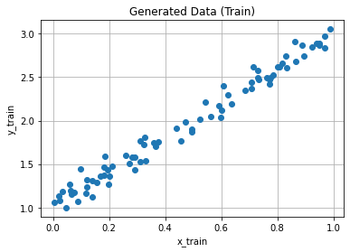
    


## gradient descent

we calculate loss and then by gradient we update our parameters 

we want find $a$ and $b$

### init parameters


```
np.random.seed(42)
a = np.random.randn(1)
b = np.random.randn(1)
print(a, b)

# Computes our model's predicted output
y = a + b * x_train
print(y.shape)
```

    [0.49671415] [-0.1382643]
    (80, 1)
    

### loss function

\begin{equation}
\mbox{MSE} = \frac{1}{N} \sum_{i = 1}^{N} (y_{i} - \hat{y}_{i})^{2}
\end{equation}

\begin{equation}
\mbox{MSE} = \frac{1}{N} \sum_{i = 1}^{N} (y_{i} - (a + b*x_{i}))^{2}
\end{equation}


```
error = (y_train - y)
loss = (error ** 2).mean()
print(loss)
```

    2.7421577700550976
    

### gradient

\begin{equation}
\frac{\partial \mbox{MSE}}{\partial a} = \frac{\partial \mbox{MSE}}{\partial \hat{y}_{i}} * \frac{\partial \hat{y}_{i}}{\partial a}  = \cdots = -2 * \frac{1}{N} \sum_{i = 1}^{N}(y_{i} - \hat{y}_{i})
\end{equation}

\begin{equation}
\frac{\partial \mbox{MSE}}{\partial b} = \frac{\partial \mbox{MSE}}{\partial \hat{y}_{i}} * \frac{\partial \hat{y}_{i}}{\partial b} = \cdots = -2 * \frac{1}{N} \sum_{i = 1}^{N} x_{i} (y_{i} - \hat{y}_{i})
\end{equation}


```
# Computes gradients for both "a" and "b" parameters
a_grad = -2 * error.mean()
b_grad = -2 * (x_train * error).mean()
print('a_grad: ', a_grad)
print('b_grad: ', b_grad)
```

    a_grad:  -3.044811379650508
    b_grad:  -1.8337537171510832
    

### update parameters

\begin{equation}
a = a - \mu \frac{\partial \mbox{MSE}}{\partial a}
\end{equation}
\begin{equation}
b = b - \mu \frac{\partial \mbox{MSE}}{\partial b}
\end{equation}


```
lr = 1e-1
# Updates parameters using gradients and the learning rate
a = a - lr * a_grad
b = b - lr * b_grad
    
print('a: ', a)
print('b: ', b)
```

    a:  [0.80119529]
    b:  [0.04511107]
    

### Do it for 100 epochs


```
# Initializes parameters "a" and "b" randomly
np.random.seed(42)
a = np.random.randn(1)
b = np.random.randn(1)
print('Initial value of a: ', a)
print('Initial value of b: ', b)
# Sets learning rate
lr = 1e-1
# Defines number of epochs
n_epochs = 1000
for epoch in range(n_epochs):
    # Computes our model's predicted output
    yhat = a + b * x_train
    
    # How wrong is our model? That's the error! 
    error = (y_train - yhat)
    # It is a regression, so it computes mean squared error (MSE)
    loss = (error ** 2).mean()
    
    # Computes gradients for both "a" and "b" parameters
    a_grad = -2 * error.mean()
    b_grad = -2 * (x_train * error).mean()
    
    # Updates parameters using gradients and the learning rate
    a = a - lr * a_grad
    b = b - lr * b_grad
    
print('Final value of a: ', a)
print('Final value of b: ', b)
print('Final Error : ',(((a + b * x_train) - y_train)**2).mean())
```

    Initial value of a:  [0.49671415]
    Initial value of b:  [-0.1382643]
    Final value of a:  [1.02354094]
    Final value of b:  [1.96896411]
    Final Error :  0.008044657695505126
    


```
plt.plot(x_val, y_val, 'ro')
plt.title('Validation data and reult of the trained regression model')
plt.grid()
plt.xlabel('x_val')
plt.ylabel('y_val')
# Final regression model
yhat = a + b * x_val
plt.plot(x_val, yhat, 'g')
```


    [<matplotlib.lines.Line2D at 0x7f37708a1040>]


    
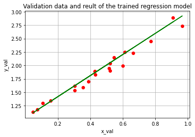
    


### make life easier by pytorch !!!


```
# tensor
tensor = torch.tensor([[[1, 2, 8, 2],
               [3, 0, 9, 9],
               [7, 2, 0, 6]],
              [[0, 9, 8, 2],
               [1, 8, 5, 5], 
               [2, 8, 1, 7]]])

tensor
```


    tensor([[[1, 2, 8, 2],
             [3, 0, 9, 9],
             [7, 2, 0, 6]],
    
            [[0, 9, 8, 2],
             [1, 8, 5, 5],
             [2, 8, 1, 7]]])


```
tensor.shape
```


    torch.Size([2, 3, 4])


```
type(tensor)
```


    torch.Tensor


```
# torch.tensor([[[1, 2, 8, 2],
#                [3, 0, 9, 9],
#                [7, 2, 0, 6]],
#               [[0, 9, 8, 2],
#                [1, 8, 5, 5], 
#                [2, 8, 1, 7]]], device=torch.device('cuda:0'))

# tensor.shape
```


```
torch.cuda.is_available()
```


    True


```
#torch.cuda.get_device_properties('cuda:0')
```


```
#convert numpy array to tensor and 
np_array = np.random.randint(0, 10, (2, 3))
print(np_array)
print(50*'-')
tensor = torch.from_numpy(np_array)
print(tensor)
```

    [[7 4 6]
     [9 2 6]]
    --------------------------------------------------
    tensor([[7, 4, 6],
            [9, 2, 6]])
    


```
#convert tensor  to numpy array 
tensor = torch.from_numpy(np_array)
print(tensor)
print(50*'-')
np_array = tensor.numpy()
print(np_array)
```

    tensor([[7, 4, 6],
            [9, 2, 6]])
    --------------------------------------------------
    [[7 4 6]
     [9 2 6]]
    


```
# TypeError: can't convert CUDA tensor to numpy. Use Tensor.cpu() to copy the tensor to host memory first.
# a = torch.randint(10, (2, 3), device=torch.device('cuda'))
# print(a)
# print(50*'-')
# # Method 1
# b = a.to('cpu').numpy()
# print(b)
# print(50*'-')
# # Method 2
# c = a.cpu().numpy()
# print(c)
```

### use tensor


```
# Converts numpy arrays to tensor
x_train = torch.from_numpy(x_train)
y_train = torch.from_numpy(y_train)
```


```
# Initializes parameters "a" and "b" randomly
torch.manual_seed(42)
a = torch.randn(1)
b = torch.randn(1)
```


```
print('Initial value of a: ', a)
print('Initial value of b: ', b)
```

    Initial value of a:  tensor([0.3367])
    Initial value of b:  tensor([0.1288])
    


```
# Sets learning rate
lr = 1e-1
# Defines number of epochs
n_epochs = 1000
```


```
for epoch in range(n_epochs):
    # Computes our model's predicted output
    yhat = a + b * x_train
    
    # How wrong is our model? That's the error! 
    error = (y_train - yhat)
    # It is a regression, so it computes mean squared error (MSE)
    loss = (error ** 2).mean()
    
    # Computes gradients for both "a" and "b" parameters
    a_grad = -2 * error.mean()
    b_grad = -2 * (x_train * error).mean()
    
    # Updates parameters using gradients and the learning rate
    a = a - lr * a_grad
    b = b - lr * b_grad
    
print('Final value of a: ', a)
print('Final value of b: ', b)
```

    Final value of a:  tensor([1.0235])
    Final value of b:  tensor([1.9690])
    

### pytorch


```
x = torch.randn(1, requires_grad=True)
print('x: ', x)
y = x**2
print('y: ', y)
y.backward()
```

    x:  tensor([0.2345], requires_grad=True)
    y:  tensor([0.0550], grad_fn=<PowBackward0>)
    


```
x.grad
```


    tensor([0.4689])


```
# optimizer
torch.manual_seed(42)
a = torch.randn(1, requires_grad=True)
b = torch.randn(1, requires_grad=True)
optimizer = torch.optim.SGD([a, b], lr=0.01)
print(optimizer)

# update parameters
# optimizer.step()
```

    SGD (
    Parameter Group 0
        dampening: 0
        differentiable: False
        foreach: None
        lr: 0.01
        maximize: False
        momentum: 0
        nesterov: False
        weight_decay: 0
    )
    


```
np.random.seed(42)
x = np.random.rand(100, 1) #make random vector with size 100
y = 1 + 2 * x + .1 * np.random.randn(100, 1) #make y depends on x with noise by equation y = 1 + 2 * x + (noise)
```


```
# Shuffles the indices
idx = np.arange(100)
np.random.shuffle(idx)
```


```
# Uses first 80 random indices for train
train_idx = idx[:80]
# Uses the remaining indices for validation
val_idx = idx[80:]

# Generates train and validation sets
x_train, y_train = x[train_idx], y[train_idx]
x_val, y_val = x[val_idx], y[val_idx]
```


```
# Converts numpy arrays to tensor
x_train = torch.from_numpy(x_train)
y_train = torch.from_numpy(y_train)
```


```
# Initializes parameters "a" and "b" randomly
torch.manual_seed(42)
a = torch.randn(1, requires_grad=True)
b = torch.randn(1, requires_grad=True)
print('Initial value of a: ', a)
print('Initial value of b: ', b)
```

    Initial value of a:  tensor([0.3367], requires_grad=True)
    Initial value of b:  tensor([0.1288], requires_grad=True)
    


```
# Sets learning rate
lr = 1e-1
# Defines optimizer
optimizer = torch.optim.SGD([a, b], lr=lr)
```


```
# Defines number of epochs
n_epochs = 1000
```


```
for epoch in range(n_epochs):
    # Computes our model's predicted output
    yhat = a + b * x_train
    
    # How wrong is our model? That's the error! 
    error = (y_train - yhat)
    # It is a regression, so it computes mean squared error (MSE)
    loss = (error ** 2).mean()
    
    # Computes gradients for both "a" and "b" parameters
    # a_grad = -2 * error.mean()
    # b_grad = -2 * (x_train * error).mean()

    loss.backward()  # simple!

    # Updates parameters using gradients and the learning rate
    # a = a - lr * a_grad
    # b = b - lr * b_grad
    optimizer.step()  # simple!
    
    # Resets gradients!
    optimizer.zero_grad()
    
print('Final value of a: ', a)
print('Final value of b: ', b)
```

    Final value of a:  tensor([1.0235], requires_grad=True)
    Final value of b:  tensor([1.9690], requires_grad=True)
    


```
# Resets gradients!
x = torch.tensor(1., requires_grad=True)
```


```
# First try
y = x**3
y.backward()
print('Gradient: ', x.grad)
```

    Gradient:  tensor(3.)
    


```
# Second try
y = x**3
y.backward()
print('Gradient: ', x.grad)
```

    Gradient:  tensor(6.)
    

### pytorch loss function


```
loss = torch.nn.MSELoss()
input = torch.randn(3, 5, requires_grad=True)
target = torch.randn(3, 5)
output = loss(input, target)
print(output)
```

    tensor(0.9842, grad_fn=<MseLossBackward0>)
    


```
np.random.seed(42)
x = np.random.rand(100, 1) #make random vector with size 100
y = 1 + 2 * x + .1 * np.random.randn(100, 1) #make y depends on x with noise by equation y = 1 + 2 * x + (noise)
```


```
# Shuffles the indices
idx = np.arange(100)
np.random.shuffle(idx)
```


```
# Uses first 80 random indices for train
train_idx = idx[:80]
# Uses the remaining indices for validation
val_idx = idx[80:]

# Generates train and validation sets
x_train, y_train = x[train_idx], y[train_idx]
x_val, y_val = x[val_idx], y[val_idx]
```


```
# Converts numpy arrays to tensor
x_train = torch.from_numpy(x_train)
y_train = torch.from_numpy(y_train)
```


```
# Initializes parameters "a" and "b" randomly
torch.manual_seed(42)
a = torch.randn(1, requires_grad=True)
b = torch.randn(1, requires_grad=True)
print('Initial value of a: ', a)
print('Initial value of b: ', b)
```

    Initial value of a:  tensor([0.3367], requires_grad=True)
    Initial value of b:  tensor([0.1288], requires_grad=True)
    


```
# Sets learning rate
lr = 1e-1
# Defines optimizer
optimizer = torch.optim.SGD([a, b], lr=lr)
# Defines MSE loss
loss_fn = torch.nn.MSELoss()
# Defines number of epochs
n_epochs = 1000
```


```
for epoch in range(n_epochs):
    # Computes our model's predicted output
    yhat = a + b * x_train
    
    # How wrong is our model? That's the error! 
    # error = (y_train - yhat)
    # It is a regression, so it computes mean squared error (MSE)
    # loss = (error ** 2).mean()
    loss = loss_fn(yhat, y_train)
    # Computes gradients for both "a" and "b" parameters
    # a_grad = -2 * error.mean()
    # b_grad = -2 * (x_train * error).mean()
    loss.backward()  # simple!
    # Updates parameters using gradients and the learning rate
    # a = a - lr * a_grad
    # b = b - lr * b_grad
    optimizer.step()  # simple!
    # Resets gradients!
    optimizer.zero_grad()

yhat = a + b * x_train
final_error =  loss_fn(yhat, y_train)

print('Final value of a: ', a)
print('Final value of b: ', b)
print('Final loss : ',final_error)
```

    Final value of a:  tensor([1.0235], requires_grad=True)
    Final value of b:  tensor([1.9690], requires_grad=True)
    Final loss :  tensor(0.0080, dtype=torch.float64, grad_fn=<MseLossBackward0>)
    

### pytorch FC 


```
class NeuralNetwork(torch.nn.Module):
    def __init__(self, n_input, n_unit1, n_output):
        super().__init__()
        # Inputs to 1st hidden layer linear transformation 
        self.hidden = torch.nn.Linear(n_input, n_unit1)
        self.sigmoid = torch.nn.Sigmoid()
        # Output layer 
        self.output = torch.nn.Linear(n_unit1, n_output)
        self.softmax = torch.nn.Softmax(dim=1)
        
    def forward(self, x):
        x = self.hidden(x) 
        x = self.sigmoid(x)
        x = self.output(x)
        x = self.softmax(x)
        return x
```


```
nn_model = NeuralNetwork(10, 30, 2)
print(nn_model)
```

    NeuralNetwork(
      (hidden): Linear(in_features=10, out_features=30, bias=True)
      (sigmoid): Sigmoid()
      (output): Linear(in_features=30, out_features=2, bias=True)
      (softmax): Softmax(dim=1)
    )
    


```
model = torch.nn.Sequential(
    torch.nn.Linear(10, 30),
    torch.nn.Sigmoid(),
    torch.nn.Linear(30, 2),
    torch.nn.Softmax()
)
print(model)
```

    Sequential(
      (0): Linear(in_features=10, out_features=30, bias=True)
      (1): Sigmoid()
      (2): Linear(in_features=30, out_features=2, bias=True)
      (3): Softmax(dim=None)
    )
    


```
class LinRegModel(torch.nn.Module):
    def __init__(self):
        super().__init__()
        # Inputs to 1st hidden layer linear transformation 
        self.neuron = torch.nn.Linear(1, 1)
        
    def forward(self, x):
        x = x.float()
        y = self.neuron(x)
        return y.float()
```


```
lreg_model = LinRegModel()
print(lreg_model)
```

    LinRegModel(
      (neuron): Linear(in_features=1, out_features=1, bias=True)
    )
    


```
np.random.seed(42)
x = np.random.rand(100, 1) #make random vector with size 100
y = 1 + 2 * x + .1 * np.random.randn(100, 1) #make y depends on x with noise by equation y = 1 + 2 * x + (noise)
```


```
# Shuffles the indices
idx = np.arange(100)
np.random.shuffle(idx)
```


```
# Uses first 80 random indices for train
train_idx = idx[:80]
# Uses the remaining indices for validation
val_idx = idx[80:]

# Generates train and validation sets
x_train, y_train = x[train_idx], y[train_idx]
x_val, y_val = x[val_idx], y[val_idx]
```


```
# Converts numpy arrays to tensor
x_train = torch.from_numpy(x_train)
x_train = x_train.float()
y_train = torch.from_numpy(y_train)
y_train = y_train.float()
```


```
# Sets learning rate
lr = 1e-1
```


```
# training step
lreg_model.train()
# Defines optimizer
optimizer = torch.optim.SGD(lreg_model.parameters(), lr=lr)
# Defines MSE loss
loss_fn = torch.nn.MSELoss()
# Defines number of epochs
n_epochs = 1000
```


```
# evaluate model
# model.eval()

# with torch.no_grad():
#     ...
#     out_data = model(data)
#     ...
```


```
for epoch in range(n_epochs):
    # Computes our model's predicted output
    # yhat = a + b * x_train
    yhat = lreg_model(x_train)
    
    # How wrong is our model? That's the error! 
    # error = (y_train - yhat)
    # It is a regression, so it computes mean squared error (MSE)
    # loss = (error ** 2).mean()
    loss = loss_fn(yhat, y_train)
    # Computes gradients for both "a" and "b" parameters
    # a_grad = -2 * error.mean()
    # b_grad = -2 * (x_train * error).mean()
    loss.backward()  # simple!
    # Updates parameters using gradients and the learning rate
    # a = a - lr * a_grad
    # b = b - lr * b_grad
    optimizer.step()  # simple!
    # Resets gradients!
    optimizer.zero_grad()
    
# print('Final value of a: ', a)
# print('Final value of b: ', a)
print(lreg_model.state_dict())
```

    OrderedDict([('neuron.weight', tensor([[1.9690]])), ('neuron.bias', tensor([1.0235]))])
    

# Classification

## pre-process data


```
# lets work with MNIST dataset!
```


```
from sklearn.datasets import load_digits
digits = load_digits()
```


```
digits.keys()
```


    dict_keys(['data', 'target', 'frame', 'feature_names', 'target_names', 'images', 'DESCR'])


```
digits['data'].shape
```


    (1797, 64)


```
digits['data'][0]
```


    array([ 0.,  0.,  5., 13.,  9.,  1.,  0.,  0.,  0.,  0., 13., 15., 10.,
           15.,  5.,  0.,  0.,  3., 15.,  2.,  0., 11.,  8.,  0.,  0.,  4.,
           12.,  0.,  0.,  8.,  8.,  0.,  0.,  5.,  8.,  0.,  0.,  9.,  8.,
            0.,  0.,  4., 11.,  0.,  1., 12.,  7.,  0.,  0.,  2., 14.,  5.,
           10., 12.,  0.,  0.,  0.,  0.,  6., 13., 10.,  0.,  0.,  0.])


```
digits['target']
```


    array([0, 1, 2, ..., 8, 9, 8])


```
digits.images.shape
```


    (1797, 8, 8)


```
import matplotlib.pyplot as plt
plt.figure(figsize=(10,4))
plt.title(f'label: {digits.target[0]}')
plt.imshow(digits.images[0], cmap='gray')
```


    <matplotlib.image.AxesImage at 0x7f6e7d3207f0>


    
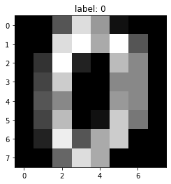
    


```
# build csv file of meta data
import pandas as pd
file_names = [f'/content/images/{i}.jpg' for i in range(100)]
df = pd.DataFrame({'file_name':file_names , 'target':digits.target[:100]})
df.head()
```


  <div id="df-07282521-b203-493c-9d1a-5ead2f129c84">
    <div class="colab-df-container">
      <div>
<style scoped>
    .dataframe tbody tr th:only-of-type {
        vertical-align: middle;
    }

    .dataframe tbody tr th {
        vertical-align: top;
    }

    .dataframe thead th {
        text-align: right;
    }
</style>
<table border="1" class="dataframe">
  <thead>
    <tr style="text-align: right;">
      <th></th>
      <th>file_name</th>
      <th>target</th>
    </tr>
  </thead>
  <tbody>
    <tr>
      <th>0</th>
      <td>/content/images/0.jpg</td>
      <td>0</td>
    </tr>
    <tr>
      <th>1</th>
      <td>/content/images/1.jpg</td>
      <td>1</td>
    </tr>
    <tr>
      <th>2</th>
      <td>/content/images/2.jpg</td>
      <td>2</td>
    </tr>
    <tr>
      <th>3</th>
      <td>/content/images/3.jpg</td>
      <td>3</td>
    </tr>
    <tr>
      <th>4</th>
      <td>/content/images/4.jpg</td>
      <td>4</td>
    </tr>
  </tbody>
</table>
</div>
      <button class="colab-df-convert" onclick="convertToInteractive('df-07282521-b203-493c-9d1a-5ead2f129c84')"
              title="Convert this dataframe to an interactive table."
              style="display:none;">

  <svg xmlns="http://www.w3.org/2000/svg" height="24px"viewBox="0 0 24 24"
       width="24px">
    <path d="M0 0h24v24H0V0z" fill="none"/>
    <path d="M18.56 5.44l.94 2.06.94-2.06 2.06-.94-2.06-.94-.94-2.06-.94 2.06-2.06.94zm-11 1L8.5 8.5l.94-2.06 2.06-.94-2.06-.94L8.5 2.5l-.94 2.06-2.06.94zm10 10l.94 2.06.94-2.06 2.06-.94-2.06-.94-.94-2.06-.94 2.06-2.06.94z"/><path d="M17.41 7.96l-1.37-1.37c-.4-.4-.92-.59-1.43-.59-.52 0-1.04.2-1.43.59L10.3 9.45l-7.72 7.72c-.78.78-.78 2.05 0 2.83L4 21.41c.39.39.9.59 1.41.59.51 0 1.02-.2 1.41-.59l7.78-7.78 2.81-2.81c.8-.78.8-2.07 0-2.86zM5.41 20L4 18.59l7.72-7.72 1.47 1.35L5.41 20z"/>
  </svg>
      </button>

  <style>
    .colab-df-container {
      display:flex;
      flex-wrap:wrap;
      gap: 12px;
    }

    .colab-df-convert {
      background-color: #E8F0FE;
      border: none;
      border-radius: 50%;
      cursor: pointer;
      display: none;
      fill: #1967D2;
      height: 32px;
      padding: 0 0 0 0;
      width: 32px;
    }

    .colab-df-convert:hover {
      background-color: #E2EBFA;
      box-shadow: 0px 1px 2px rgba(60, 64, 67, 0.3), 0px 1px 3px 1px rgba(60, 64, 67, 0.15);
      fill: #174EA6;
    }

    [theme=dark] .colab-df-convert {
      background-color: #3B4455;
      fill: #D2E3FC;
    }

    [theme=dark] .colab-df-convert:hover {
      background-color: #434B5C;
      box-shadow: 0px 1px 3px 1px rgba(0, 0, 0, 0.15);
      filter: drop-shadow(0px 1px 2px rgba(0, 0, 0, 0.3));
      fill: #FFFFFF;
    }
  </style>

      <script>
        const buttonEl =
          document.querySelector('#df-07282521-b203-493c-9d1a-5ead2f129c84 button.colab-df-convert');
        buttonEl.style.display =
          google.colab.kernel.accessAllowed ? 'block' : 'none';

        async function convertToInteractive(key) {
          const element = document.querySelector('#df-07282521-b203-493c-9d1a-5ead2f129c84');
          const dataTable =
            await google.colab.kernel.invokeFunction('convertToInteractive',
                                                     [key], {});
          if (!dataTable) return;

          const docLinkHtml = 'Like what you see? Visit the ' +
            '<a target="_blank" href=https://colab.research.google.com/notebooks/data_table.ipynb>data table notebook</a>'
            + ' to learn more about interactive tables.';
          element.innerHTML = '';
          dataTable['output_type'] = 'display_data';
          await google.colab.output.renderOutput(dataTable, element);
          const docLink = document.createElement('div');
          docLink.innerHTML = docLinkHtml;
          element.appendChild(docLink);
        }
      </script>
    </div>
  </div>


```
df['mode'] = 'train'
test_size = int(len(df) * 0.2)
ix = df.sample(test_size).index
df.loc[ix, 'mode'] = 'test'
df.sample(5)
```


  <div id="df-1b99148c-d9f1-45a5-a0d5-bdd0bba07419">
    <div class="colab-df-container">
      <div>
<style scoped>
    .dataframe tbody tr th:only-of-type {
        vertical-align: middle;
    }

    .dataframe tbody tr th {
        vertical-align: top;
    }

    .dataframe thead th {
        text-align: right;
    }
</style>
<table border="1" class="dataframe">
  <thead>
    <tr style="text-align: right;">
      <th></th>
      <th>file_name</th>
      <th>target</th>
      <th>mode</th>
    </tr>
  </thead>
  <tbody>
    <tr>
      <th>92</th>
      <td>/content/images/92.jpg</td>
      <td>9</td>
      <td>train</td>
    </tr>
    <tr>
      <th>83</th>
      <td>/content/images/83.jpg</td>
      <td>3</td>
      <td>train</td>
    </tr>
    <tr>
      <th>5</th>
      <td>/content/images/5.jpg</td>
      <td>5</td>
      <td>train</td>
    </tr>
    <tr>
      <th>93</th>
      <td>/content/images/93.jpg</td>
      <td>1</td>
      <td>train</td>
    </tr>
    <tr>
      <th>16</th>
      <td>/content/images/16.jpg</td>
      <td>6</td>
      <td>train</td>
    </tr>
  </tbody>
</table>
</div>
      <button class="colab-df-convert" onclick="convertToInteractive('df-1b99148c-d9f1-45a5-a0d5-bdd0bba07419')"
              title="Convert this dataframe to an interactive table."
              style="display:none;">

  <svg xmlns="http://www.w3.org/2000/svg" height="24px"viewBox="0 0 24 24"
       width="24px">
    <path d="M0 0h24v24H0V0z" fill="none"/>
    <path d="M18.56 5.44l.94 2.06.94-2.06 2.06-.94-2.06-.94-.94-2.06-.94 2.06-2.06.94zm-11 1L8.5 8.5l.94-2.06 2.06-.94-2.06-.94L8.5 2.5l-.94 2.06-2.06.94zm10 10l.94 2.06.94-2.06 2.06-.94-2.06-.94-.94-2.06-.94 2.06-2.06.94z"/><path d="M17.41 7.96l-1.37-1.37c-.4-.4-.92-.59-1.43-.59-.52 0-1.04.2-1.43.59L10.3 9.45l-7.72 7.72c-.78.78-.78 2.05 0 2.83L4 21.41c.39.39.9.59 1.41.59.51 0 1.02-.2 1.41-.59l7.78-7.78 2.81-2.81c.8-.78.8-2.07 0-2.86zM5.41 20L4 18.59l7.72-7.72 1.47 1.35L5.41 20z"/>
  </svg>
      </button>

  <style>
    .colab-df-container {
      display:flex;
      flex-wrap:wrap;
      gap: 12px;
    }

    .colab-df-convert {
      background-color: #E8F0FE;
      border: none;
      border-radius: 50%;
      cursor: pointer;
      display: none;
      fill: #1967D2;
      height: 32px;
      padding: 0 0 0 0;
      width: 32px;
    }

    .colab-df-convert:hover {
      background-color: #E2EBFA;
      box-shadow: 0px 1px 2px rgba(60, 64, 67, 0.3), 0px 1px 3px 1px rgba(60, 64, 67, 0.15);
      fill: #174EA6;
    }

    [theme=dark] .colab-df-convert {
      background-color: #3B4455;
      fill: #D2E3FC;
    }

    [theme=dark] .colab-df-convert:hover {
      background-color: #434B5C;
      box-shadow: 0px 1px 3px 1px rgba(0, 0, 0, 0.15);
      filter: drop-shadow(0px 1px 2px rgba(0, 0, 0, 0.3));
      fill: #FFFFFF;
    }
  </style>

      <script>
        const buttonEl =
          document.querySelector('#df-1b99148c-d9f1-45a5-a0d5-bdd0bba07419 button.colab-df-convert');
        buttonEl.style.display =
          google.colab.kernel.accessAllowed ? 'block' : 'none';

        async function convertToInteractive(key) {
          const element = document.querySelector('#df-1b99148c-d9f1-45a5-a0d5-bdd0bba07419');
          const dataTable =
            await google.colab.kernel.invokeFunction('convertToInteractive',
                                                     [key], {});
          if (!dataTable) return;

          const docLinkHtml = 'Like what you see? Visit the ' +
            '<a target="_blank" href=https://colab.research.google.com/notebooks/data_table.ipynb>data table notebook</a>'
            + ' to learn more about interactive tables.';
          element.innerHTML = '';
          dataTable['output_type'] = 'display_data';
          await google.colab.output.renderOutput(dataTable, element);
          const docLink = document.createElement('div');
          docLink.innerHTML = docLinkHtml;
          element.appendChild(docLink);
        }
      </script>
    </div>
  </div>


```
df['mode'].value_counts()
```


    train    80
    test     20
    Name: mode, dtype: int64


```
df.to_csv('data.csv', index=False)
```


```
# save mnist images as files!

# build folder
! mkdir 'images'
```


```
import imageio

for i, image in enumerate(digits.images[:100]):
    file_name = f'/content/images/{i}.jpg'
    imageio.imwrite(file_name, image)
```

    WARNING:imageio:Lossy conversion from float64 to uint8. Range [0.0, 15.0]. Convert image to uint8 prior to saving to suppress this warning.
    WARNING:imageio:Lossy conversion from float64 to uint8. Range [0.0, 16.0]. Convert image to uint8 prior to saving to suppress this warning.
    WARNING:imageio:Lossy conversion from float64 to uint8. Range [0.0, 16.0]. Convert image to uint8 prior to saving to suppress this warning.
    WARNING:imageio:Lossy conversion from float64 to uint8. Range [0.0, 15.0]. Convert image to uint8 prior to saving to suppress this warning.
    WARNING:imageio:Lossy conversion from float64 to uint8. Range [0.0, 16.0]. Convert image to uint8 prior to saving to suppress this warning.
    WARNING:imageio:Lossy conversion from float64 to uint8. Range [0.0, 16.0]. Convert image to uint8 prior to saving to suppress this warning.
    WARNING:imageio:Lossy conversion from float64 to uint8. Range [0.0, 16.0]. Convert image to uint8 prior to saving to suppress this warning.
    WARNING:imageio:Lossy conversion from float64 to uint8. Range [0.0, 16.0]. Convert image to uint8 prior to saving to suppress this warning.
    WARNING:imageio:Lossy conversion from float64 to uint8. Range [0.0, 16.0]. Convert image to uint8 prior to saving to suppress this warning.
    WARNING:imageio:Lossy conversion from float64 to uint8. Range [0.0, 16.0]. Convert image to uint8 prior to saving to suppress this warning.
    WARNING:imageio:Lossy conversion from float64 to uint8. Range [0.0, 16.0]. Convert image to uint8 prior to saving to suppress this warning.
    WARNING:imageio:Lossy conversion from float64 to uint8. Range [0.0, 16.0]. Convert image to uint8 prior to saving to suppress this warning.
    WARNING:imageio:Lossy conversion from float64 to uint8. Range [0.0, 16.0]. Convert image to uint8 prior to saving to suppress this warning.
    WARNING:imageio:Lossy conversion from float64 to uint8. Range [0.0, 16.0]. Convert image to uint8 prior to saving to suppress this warning.
    WARNING:imageio:Lossy conversion from float64 to uint8. Range [0.0, 16.0]. Convert image to uint8 prior to saving to suppress this warning.
    WARNING:imageio:Lossy conversion from float64 to uint8. Range [0.0, 16.0]. Convert image to uint8 prior to saving to suppress this warning.
    WARNING:imageio:Lossy conversion from float64 to uint8. Range [0.0, 16.0]. Convert image to uint8 prior to saving to suppress this warning.
    WARNING:imageio:Lossy conversion from float64 to uint8. Range [0.0, 16.0]. Convert image to uint8 prior to saving to suppress this warning.
    WARNING:imageio:Lossy conversion from float64 to uint8. Range [0.0, 16.0]. Convert image to uint8 prior to saving to suppress this warning.
    WARNING:imageio:Lossy conversion from float64 to uint8. Range [0.0, 16.0]. Convert image to uint8 prior to saving to suppress this warning.
    WARNING:imageio:Lossy conversion from float64 to uint8. Range [0.0, 16.0]. Convert image to uint8 prior to saving to suppress this warning.
    WARNING:imageio:Lossy conversion from float64 to uint8. Range [0.0, 16.0]. Convert image to uint8 prior to saving to suppress this warning.
    WARNING:imageio:Lossy conversion from float64 to uint8. Range [0.0, 16.0]. Convert image to uint8 prior to saving to suppress this warning.
    WARNING:imageio:Lossy conversion from float64 to uint8. Range [0.0, 15.0]. Convert image to uint8 prior to saving to suppress this warning.
    WARNING:imageio:Lossy conversion from float64 to uint8. Range [0.0, 16.0]. Convert image to uint8 prior to saving to suppress this warning.
    WARNING:imageio:Lossy conversion from float64 to uint8. Range [0.0, 16.0]. Convert image to uint8 prior to saving to suppress this warning.
    WARNING:imageio:Lossy conversion from float64 to uint8. Range [0.0, 16.0]. Convert image to uint8 prior to saving to suppress this warning.
    WARNING:imageio:Lossy conversion from float64 to uint8. Range [0.0, 16.0]. Convert image to uint8 prior to saving to suppress this warning.
    WARNING:imageio:Lossy conversion from float64 to uint8. Range [0.0, 16.0]. Convert image to uint8 prior to saving to suppress this warning.
    WARNING:imageio:Lossy conversion from float64 to uint8. Range [0.0, 16.0]. Convert image to uint8 prior to saving to suppress this warning.
    WARNING:imageio:Lossy conversion from float64 to uint8. Range [0.0, 16.0]. Convert image to uint8 prior to saving to suppress this warning.
    WARNING:imageio:Lossy conversion from float64 to uint8. Range [0.0, 16.0]. Convert image to uint8 prior to saving to suppress this warning.
    WARNING:imageio:Lossy conversion from float64 to uint8. Range [0.0, 16.0]. Convert image to uint8 prior to saving to suppress this warning.
    WARNING:imageio:Lossy conversion from float64 to uint8. Range [0.0, 16.0]. Convert image to uint8 prior to saving to suppress this warning.
    WARNING:imageio:Lossy conversion from float64 to uint8. Range [0.0, 16.0]. Convert image to uint8 prior to saving to suppress this warning.
    WARNING:imageio:Lossy conversion from float64 to uint8. Range [0.0, 16.0]. Convert image to uint8 prior to saving to suppress this warning.
    WARNING:imageio:Lossy conversion from float64 to uint8. Range [0.0, 16.0]. Convert image to uint8 prior to saving to suppress this warning.
    WARNING:imageio:Lossy conversion from float64 to uint8. Range [0.0, 16.0]. Convert image to uint8 prior to saving to suppress this warning.
    WARNING:imageio:Lossy conversion from float64 to uint8. Range [0.0, 16.0]. Convert image to uint8 prior to saving to suppress this warning.
    WARNING:imageio:Lossy conversion from float64 to uint8. Range [0.0, 16.0]. Convert image to uint8 prior to saving to suppress this warning.
    WARNING:imageio:Lossy conversion from float64 to uint8. Range [0.0, 16.0]. Convert image to uint8 prior to saving to suppress this warning.
    WARNING:imageio:Lossy conversion from float64 to uint8. Range [0.0, 16.0]. Convert image to uint8 prior to saving to suppress this warning.
    WARNING:imageio:Lossy conversion from float64 to uint8. Range [0.0, 16.0]. Convert image to uint8 prior to saving to suppress this warning.
    WARNING:imageio:Lossy conversion from float64 to uint8. Range [0.0, 16.0]. Convert image to uint8 prior to saving to suppress this warning.
    WARNING:imageio:Lossy conversion from float64 to uint8. Range [0.0, 16.0]. Convert image to uint8 prior to saving to suppress this warning.
    WARNING:imageio:Lossy conversion from float64 to uint8. Range [0.0, 16.0]. Convert image to uint8 prior to saving to suppress this warning.
    WARNING:imageio:Lossy conversion from float64 to uint8. Range [0.0, 16.0]. Convert image to uint8 prior to saving to suppress this warning.
    WARNING:imageio:Lossy conversion from float64 to uint8. Range [0.0, 16.0]. Convert image to uint8 prior to saving to suppress this warning.
    WARNING:imageio:Lossy conversion from float64 to uint8. Range [0.0, 16.0]. Convert image to uint8 prior to saving to suppress this warning.
    WARNING:imageio:Lossy conversion from float64 to uint8. Range [0.0, 16.0]. Convert image to uint8 prior to saving to suppress this warning.
    WARNING:imageio:Lossy conversion from float64 to uint8. Range [0.0, 16.0]. Convert image to uint8 prior to saving to suppress this warning.
    WARNING:imageio:Lossy conversion from float64 to uint8. Range [0.0, 16.0]. Convert image to uint8 prior to saving to suppress this warning.
    WARNING:imageio:Lossy conversion from float64 to uint8. Range [0.0, 16.0]. Convert image to uint8 prior to saving to suppress this warning.
    WARNING:imageio:Lossy conversion from float64 to uint8. Range [0.0, 16.0]. Convert image to uint8 prior to saving to suppress this warning.
    WARNING:imageio:Lossy conversion from float64 to uint8. Range [0.0, 16.0]. Convert image to uint8 prior to saving to suppress this warning.
    WARNING:imageio:Lossy conversion from float64 to uint8. Range [0.0, 16.0]. Convert image to uint8 prior to saving to suppress this warning.
    WARNING:imageio:Lossy conversion from float64 to uint8. Range [0.0, 16.0]. Convert image to uint8 prior to saving to suppress this warning.
    WARNING:imageio:Lossy conversion from float64 to uint8. Range [0.0, 16.0]. Convert image to uint8 prior to saving to suppress this warning.
    WARNING:imageio:Lossy conversion from float64 to uint8. Range [0.0, 16.0]. Convert image to uint8 prior to saving to suppress this warning.
    WARNING:imageio:Lossy conversion from float64 to uint8. Range [0.0, 16.0]. Convert image to uint8 prior to saving to suppress this warning.
    WARNING:imageio:Lossy conversion from float64 to uint8. Range [0.0, 16.0]. Convert image to uint8 prior to saving to suppress this warning.
    WARNING:imageio:Lossy conversion from float64 to uint8. Range [0.0, 16.0]. Convert image to uint8 prior to saving to suppress this warning.
    WARNING:imageio:Lossy conversion from float64 to uint8. Range [0.0, 16.0]. Convert image to uint8 prior to saving to suppress this warning.
    WARNING:imageio:Lossy conversion from float64 to uint8. Range [0.0, 16.0]. Convert image to uint8 prior to saving to suppress this warning.
    WARNING:imageio:Lossy conversion from float64 to uint8. Range [0.0, 16.0]. Convert image to uint8 prior to saving to suppress this warning.
    WARNING:imageio:Lossy conversion from float64 to uint8. Range [0.0, 16.0]. Convert image to uint8 prior to saving to suppress this warning.
    WARNING:imageio:Lossy conversion from float64 to uint8. Range [0.0, 16.0]. Convert image to uint8 prior to saving to suppress this warning.
    WARNING:imageio:Lossy conversion from float64 to uint8. Range [0.0, 16.0]. Convert image to uint8 prior to saving to suppress this warning.
    WARNING:imageio:Lossy conversion from float64 to uint8. Range [0.0, 16.0]. Convert image to uint8 prior to saving to suppress this warning.
    WARNING:imageio:Lossy conversion from float64 to uint8. Range [0.0, 16.0]. Convert image to uint8 prior to saving to suppress this warning.
    WARNING:imageio:Lossy conversion from float64 to uint8. Range [0.0, 16.0]. Convert image to uint8 prior to saving to suppress this warning.
    WARNING:imageio:Lossy conversion from float64 to uint8. Range [0.0, 16.0]. Convert image to uint8 prior to saving to suppress this warning.
    WARNING:imageio:Lossy conversion from float64 to uint8. Range [0.0, 16.0]. Convert image to uint8 prior to saving to suppress this warning.
    WARNING:imageio:Lossy conversion from float64 to uint8. Range [0.0, 16.0]. Convert image to uint8 prior to saving to suppress this warning.
    WARNING:imageio:Lossy conversion from float64 to uint8. Range [0.0, 16.0]. Convert image to uint8 prior to saving to suppress this warning.
    WARNING:imageio:Lossy conversion from float64 to uint8. Range [0.0, 16.0]. Convert image to uint8 prior to saving to suppress this warning.
    WARNING:imageio:Lossy conversion from float64 to uint8. Range [0.0, 16.0]. Convert image to uint8 prior to saving to suppress this warning.
    WARNING:imageio:Lossy conversion from float64 to uint8. Range [0.0, 16.0]. Convert image to uint8 prior to saving to suppress this warning.
    WARNING:imageio:Lossy conversion from float64 to uint8. Range [0.0, 16.0]. Convert image to uint8 prior to saving to suppress this warning.
    WARNING:imageio:Lossy conversion from float64 to uint8. Range [0.0, 16.0]. Convert image to uint8 prior to saving to suppress this warning.
    WARNING:imageio:Lossy conversion from float64 to uint8. Range [0.0, 16.0]. Convert image to uint8 prior to saving to suppress this warning.
    WARNING:imageio:Lossy conversion from float64 to uint8. Range [0.0, 16.0]. Convert image to uint8 prior to saving to suppress this warning.
    WARNING:imageio:Lossy conversion from float64 to uint8. Range [0.0, 16.0]. Convert image to uint8 prior to saving to suppress this warning.
    WARNING:imageio:Lossy conversion from float64 to uint8. Range [0.0, 16.0]. Convert image to uint8 prior to saving to suppress this warning.
    WARNING:imageio:Lossy conversion from float64 to uint8. Range [0.0, 16.0]. Convert image to uint8 prior to saving to suppress this warning.
    WARNING:imageio:Lossy conversion from float64 to uint8. Range [0.0, 16.0]. Convert image to uint8 prior to saving to suppress this warning.
    WARNING:imageio:Lossy conversion from float64 to uint8. Range [0.0, 16.0]. Convert image to uint8 prior to saving to suppress this warning.
    WARNING:imageio:Lossy conversion from float64 to uint8. Range [0.0, 16.0]. Convert image to uint8 prior to saving to suppress this warning.
    WARNING:imageio:Lossy conversion from float64 to uint8. Range [0.0, 16.0]. Convert image to uint8 prior to saving to suppress this warning.
    WARNING:imageio:Lossy conversion from float64 to uint8. Range [0.0, 16.0]. Convert image to uint8 prior to saving to suppress this warning.
    WARNING:imageio:Lossy conversion from float64 to uint8. Range [0.0, 16.0]. Convert image to uint8 prior to saving to suppress this warning.
    WARNING:imageio:Lossy conversion from float64 to uint8. Range [0.0, 16.0]. Convert image to uint8 prior to saving to suppress this warning.
    WARNING:imageio:Lossy conversion from float64 to uint8. Range [0.0, 16.0]. Convert image to uint8 prior to saving to suppress this warning.
    WARNING:imageio:Lossy conversion from float64 to uint8. Range [0.0, 16.0]. Convert image to uint8 prior to saving to suppress this warning.
    WARNING:imageio:Lossy conversion from float64 to uint8. Range [0.0, 16.0]. Convert image to uint8 prior to saving to suppress this warning.
    WARNING:imageio:Lossy conversion from float64 to uint8. Range [0.0, 16.0]. Convert image to uint8 prior to saving to suppress this warning.
    WARNING:imageio:Lossy conversion from float64 to uint8. Range [0.0, 16.0]. Convert image to uint8 prior to saving to suppress this warning.
    WARNING:imageio:Lossy conversion from float64 to uint8. Range [0.0, 16.0]. Convert image to uint8 prior to saving to suppress this warning.
    WARNING:imageio:Lossy conversion from float64 to uint8. Range [0.0, 16.0]. Convert image to uint8 prior to saving to suppress this warning.
    WARNING:imageio:Lossy conversion from float64 to uint8. Range [0.0, 16.0]. Convert image to uint8 prior to saving to suppress this warning.
    


```
# build dataset
from torch.utils.data import Dataset
class CustomImageDataset(Dataset):
    def __init__(self, data_path, mode):
        self.data = pd.read_csv(data_path)
        self.mode = mode
        # filter train/test data
        self.data = self.data[self.data['mode'] == self.mode]
        self.data.reset_index(drop=True, inplace=True)

    def __len__(self):
        return len(self.data)

    def __getitem__(self, idx):
        record = self.data.iloc[idx]
        image_path = record['file_name']
        label = record['target']

        if self.mode == 'train':
            label_one_hot = [0.0]*10
            label_one_hot[label] = 1
        else:
            label_one_hot = label

        # read image file
        # we can use different package like opencv,imageio,PIL,matplotlib,...
        image_array = plt.imread(image_path)
        image_array = image_array.reshape(64)

        label_one_hot = torch.tensor(label_one_hot)
        image_array = torch.tensor(image_array)
        return image_array, label_one_hot
```


```
data_path = '/content/data.csv'
train_dataset = CustomImageDataset(data_path=data_path, mode='train')
test_dataset = CustomImageDataset(data_path=data_path, mode='test')
```


```
next(iter(train_dataset))
```


    (tensor([  0,   2,  88, 217, 158,  21,   0,   0,  16,   0, 228, 236, 166, 253,
              95,   0,   0,  41, 255,  44,  11, 182, 132,   3,  11,  80, 220,   0,
               2, 143, 133,   5,   6,  71, 122,   0,   5, 155, 140,   0,   0,  76,
             194,   0,  26, 207, 105,  15,   0,  18, 255,  83, 146, 211,   4,   0,
               4,   3,  87, 228, 182,   0,   9,   2], dtype=torch.uint8),
     tensor([1., 0., 0., 0., 0., 0., 0., 0., 0., 0.]))


```
next(iter(test_dataset))
```


    (tensor([  0,   7, 145, 223, 128,  13,   0,   2,   0,   0, 204, 215, 228, 199,
               5,   0,   3,   5, 128, 164,   0, 231,  59,  10,   0,   0,  74, 241,
             186, 238,  38,   0,   7,   0,  69, 255, 255,  13,  15,  14,   1,  53,
             238, 126, 159, 207,  21,   3,   0,  19, 248,  29,  43, 255, 133,   0,
               0,   3, 169, 249, 245, 163,  26,   1], dtype=torch.uint8),
     tensor(8))


```
from torch.utils.data import DataLoader
train_dataloader = DataLoader(train_dataset, batch_size=5, shuffle=True)
test_dataloader = DataLoader(test_dataset, batch_size=20, shuffle=True)
```


```
# build network !
import torch.nn as nn
class NeuralNetwork(torch.nn.Module):
    def __init__(self):
        super().__init__()
        self.hidden = torch.nn.Linear(64, 32)
        self.sigmoid = torch.nn.Sigmoid()
        self.hidden1 = torch.nn.Linear(32, 16)
        # Output layer 
        self.output = torch.nn.Linear(16, 10)
        
    def forward(self, x):
        x = x.to(torch.float32)
        x = self.hidden(x) 
        x = self.sigmoid(x)
        x = self.hidden1(x)
        x = self.output(x)
        return x
```


```
net = NeuralNetwork()
net
```


    NeuralNetwork(
      (hidden): Linear(in_features=64, out_features=32, bias=True)
      (sigmoid): Sigmoid()
      (hidden1): Linear(in_features=32, out_features=16, bias=True)
      (output): Linear(in_features=16, out_features=10, bias=True)
    )


```
import torch.optim as optim

criterion = nn.CrossEntropyLoss()
optimizer = optim.SGD(net.parameters(), lr=0.001, momentum=0.9)
```


```
device = torch.device('cuda:0' if torch.cuda.is_available() else 'cpu')

# Assuming that we are on a CUDA machine, this should print a CUDA device:

print(device)
```

    cuda:0
    


```
# if we can gpu, let use it!
net.to(device)
```


    NeuralNetwork(
      (hidden): Linear(in_features=64, out_features=32, bias=True)
      (sigmoid): Sigmoid()
      (hidden1): Linear(in_features=32, out_features=16, bias=True)
      (output): Linear(in_features=16, out_features=10, bias=True)
    )


```
no_epochs = 10
for epoch in range(no_epochs):
    for i, data in enumerate(train_dataloader, 0):
        # get the inputs; data is a list of [inputs, labels]
        inputs, labels = data
        inputs = inputs.to(device)
        labels = labels.to(device)
        # zero the parameter gradients
        optimizer.zero_grad()

        # forward + backward + optimize
        outputs = net(inputs)
        loss = criterion(outputs, labels)
        loss.backward()
        optimizer.step()

        print(f'epoch:{epoch + 1}, batch: {i+1},  loss: {loss.item()}')
```

    epoch:1, batch: 1,  loss: 2.1908631324768066
    epoch:1, batch: 2,  loss: 2.224562168121338
    epoch:1, batch: 3,  loss: 2.406986951828003
    epoch:1, batch: 4,  loss: 2.4482572078704834
    epoch:1, batch: 5,  loss: 2.319631338119507
    epoch:1, batch: 6,  loss: 2.207183599472046
    epoch:1, batch: 7,  loss: 2.2555484771728516
    epoch:1, batch: 8,  loss: 2.279235601425171
    epoch:1, batch: 9,  loss: 2.2593040466308594
    epoch:1, batch: 10,  loss: 2.286088705062866
    epoch:1, batch: 11,  loss: 2.545666456222534
    epoch:1, batch: 12,  loss: 2.4073219299316406
    epoch:1, batch: 13,  loss: 2.331043004989624
    epoch:1, batch: 14,  loss: 2.3777008056640625
    epoch:1, batch: 15,  loss: 2.261925458908081
    epoch:1, batch: 16,  loss: 2.1023812294006348
    epoch:2, batch: 1,  loss: 2.1612069606781006
    epoch:2, batch: 2,  loss: 2.2677056789398193
    epoch:2, batch: 3,  loss: 2.446007490158081
    epoch:2, batch: 4,  loss: 2.2930259704589844
    epoch:2, batch: 5,  loss: 2.2307610511779785
    epoch:2, batch: 6,  loss: 2.1262547969818115
    epoch:2, batch: 7,  loss: 2.174713373184204
    epoch:2, batch: 8,  loss: 2.4077744483947754
    epoch:2, batch: 9,  loss: 2.1118643283843994
    epoch:2, batch: 10,  loss: 2.1846072673797607
    epoch:2, batch: 11,  loss: 2.208353042602539
    epoch:2, batch: 12,  loss: 2.111048936843872
    epoch:2, batch: 13,  loss: 2.3346307277679443
    epoch:2, batch: 14,  loss: 2.375053644180298
    epoch:2, batch: 15,  loss: 2.3144726753234863
    epoch:2, batch: 16,  loss: 2.29840350151062
    epoch:3, batch: 1,  loss: 2.3953609466552734
    epoch:3, batch: 2,  loss: 2.074617624282837
    epoch:3, batch: 3,  loss: 2.0533435344696045
    epoch:3, batch: 4,  loss: 2.272300958633423
    epoch:3, batch: 5,  loss: 2.291416883468628
    epoch:3, batch: 6,  loss: 2.365598678588867
    epoch:3, batch: 7,  loss: 2.2665815353393555
    epoch:3, batch: 8,  loss: 2.2684059143066406
    epoch:3, batch: 9,  loss: 2.0873420238494873
    epoch:3, batch: 10,  loss: 2.2886240482330322
    epoch:3, batch: 11,  loss: 2.3690507411956787
    epoch:3, batch: 12,  loss: 2.2202694416046143
    epoch:3, batch: 13,  loss: 2.313382863998413
    epoch:3, batch: 14,  loss: 2.104445457458496
    epoch:3, batch: 15,  loss: 2.260211706161499
    epoch:3, batch: 16,  loss: 2.050424575805664
    epoch:4, batch: 1,  loss: 2.464210271835327
    epoch:4, batch: 2,  loss: 2.3058598041534424
    epoch:4, batch: 3,  loss: 2.3367178440093994
    epoch:4, batch: 4,  loss: 2.1102194786071777
    epoch:4, batch: 5,  loss: 2.1745903491973877
    epoch:4, batch: 6,  loss: 2.1484971046447754
    epoch:4, batch: 7,  loss: 2.1926991939544678
    epoch:4, batch: 8,  loss: 2.150862216949463
    epoch:4, batch: 9,  loss: 1.9954556226730347
    epoch:4, batch: 10,  loss: 2.0690479278564453
    epoch:4, batch: 11,  loss: 2.132089853286743
    epoch:4, batch: 12,  loss: 2.0676677227020264
    epoch:4, batch: 13,  loss: 2.3002305030822754
    epoch:4, batch: 14,  loss: 2.38397479057312
    epoch:4, batch: 15,  loss: 2.123269557952881
    epoch:4, batch: 16,  loss: 2.004640579223633
    epoch:5, batch: 1,  loss: 2.1065430641174316
    epoch:5, batch: 2,  loss: 2.1438424587249756
    epoch:5, batch: 3,  loss: 2.191101312637329
    epoch:5, batch: 4,  loss: 2.313643217086792
    epoch:5, batch: 5,  loss: 2.162065267562866
    epoch:5, batch: 6,  loss: 2.1472058296203613
    epoch:5, batch: 7,  loss: 2.22294020652771
    epoch:5, batch: 8,  loss: 2.1290218830108643
    epoch:5, batch: 9,  loss: 2.1258203983306885
    epoch:5, batch: 10,  loss: 2.240772008895874
    epoch:5, batch: 11,  loss: 2.1791350841522217
    epoch:5, batch: 12,  loss: 2.0856432914733887
    epoch:5, batch: 13,  loss: 2.0481395721435547
    epoch:5, batch: 14,  loss: 1.9638092517852783
    epoch:5, batch: 15,  loss: 2.2188031673431396
    epoch:5, batch: 16,  loss: 2.0778210163116455
    epoch:6, batch: 1,  loss: 2.144806146621704
    epoch:6, batch: 2,  loss: 1.9162601232528687
    epoch:6, batch: 3,  loss: 2.0913197994232178
    epoch:6, batch: 4,  loss: 2.2266457080841064
    epoch:6, batch: 5,  loss: 1.9286491870880127
    epoch:6, batch: 6,  loss: 2.006355047225952
    epoch:6, batch: 7,  loss: 2.143359899520874
    epoch:6, batch: 8,  loss: 2.02276873588562
    epoch:6, batch: 9,  loss: 2.2432315349578857
    epoch:6, batch: 10,  loss: 2.1693453788757324
    epoch:6, batch: 11,  loss: 2.2603983879089355
    epoch:6, batch: 12,  loss: 2.103860855102539
    epoch:6, batch: 13,  loss: 2.0979373455047607
    epoch:6, batch: 14,  loss: 2.1934289932250977
    epoch:6, batch: 15,  loss: 2.1618306636810303
    epoch:6, batch: 16,  loss: 2.1570911407470703
    epoch:7, batch: 1,  loss: 1.9818881750106812
    epoch:7, batch: 2,  loss: 2.334798574447632
    epoch:7, batch: 3,  loss: 2.0481016635894775
    epoch:7, batch: 4,  loss: 2.0699918270111084
    epoch:7, batch: 5,  loss: 2.1774942874908447
    epoch:7, batch: 6,  loss: 2.181626558303833
    epoch:7, batch: 7,  loss: 2.166632652282715
    epoch:7, batch: 8,  loss: 1.9819879531860352
    epoch:7, batch: 9,  loss: 1.9898792505264282
    epoch:7, batch: 10,  loss: 2.0292041301727295
    epoch:7, batch: 11,  loss: 2.022294282913208
    epoch:7, batch: 12,  loss: 2.221928358078003
    epoch:7, batch: 13,  loss: 1.9757635593414307
    epoch:7, batch: 14,  loss: 2.09120774269104
    epoch:7, batch: 15,  loss: 2.0597217082977295
    epoch:7, batch: 16,  loss: 2.1298887729644775
    epoch:8, batch: 1,  loss: 2.0941884517669678
    epoch:8, batch: 2,  loss: 2.136359214782715
    epoch:8, batch: 3,  loss: 1.9520286321640015
    epoch:8, batch: 4,  loss: 2.267650604248047
    epoch:8, batch: 5,  loss: 2.1401755809783936
    epoch:8, batch: 6,  loss: 1.916703462600708
    epoch:8, batch: 7,  loss: 2.0482423305511475
    epoch:8, batch: 8,  loss: 1.917816162109375
    epoch:8, batch: 9,  loss: 2.0706393718719482
    epoch:8, batch: 10,  loss: 2.071678638458252
    epoch:8, batch: 11,  loss: 2.1015563011169434
    epoch:8, batch: 12,  loss: 1.9428249597549438
    epoch:8, batch: 13,  loss: 2.277313709259033
    epoch:8, batch: 14,  loss: 1.9660637378692627
    epoch:8, batch: 15,  loss: 2.267744541168213
    epoch:8, batch: 16,  loss: 2.0209202766418457
    epoch:9, batch: 1,  loss: 1.977026343345642
    epoch:9, batch: 2,  loss: 1.980362892150879
    epoch:9, batch: 3,  loss: 2.0005500316619873
    epoch:9, batch: 4,  loss: 2.1845550537109375
    epoch:9, batch: 5,  loss: 1.9319108724594116
    epoch:9, batch: 6,  loss: 2.2868587970733643
    epoch:9, batch: 7,  loss: 2.0340218544006348
    epoch:9, batch: 8,  loss: 2.094358444213867
    epoch:9, batch: 9,  loss: 2.0003163814544678
    epoch:9, batch: 10,  loss: 2.023909330368042
    epoch:9, batch: 11,  loss: 2.0238759517669678
    epoch:9, batch: 12,  loss: 2.014430284500122
    epoch:9, batch: 13,  loss: 2.0417122840881348
    epoch:9, batch: 14,  loss: 2.031055450439453
    epoch:9, batch: 15,  loss: 1.9574825763702393
    epoch:9, batch: 16,  loss: 2.12681245803833
    epoch:10, batch: 1,  loss: 2.175635576248169
    epoch:10, batch: 2,  loss: 2.1380021572113037
    epoch:10, batch: 3,  loss: 1.9599369764328003
    epoch:10, batch: 4,  loss: 1.9095171689987183
    epoch:10, batch: 5,  loss: 2.0523219108581543
    epoch:10, batch: 6,  loss: 1.9941107034683228
    epoch:10, batch: 7,  loss: 1.8930692672729492
    epoch:10, batch: 8,  loss: 1.8279964923858643
    epoch:10, batch: 9,  loss: 1.901199221611023
    epoch:10, batch: 10,  loss: 2.0580239295959473
    epoch:10, batch: 11,  loss: 2.076740026473999
    epoch:10, batch: 12,  loss: 2.0451810359954834
    epoch:10, batch: 13,  loss: 1.9357643127441406
    epoch:10, batch: 14,  loss: 1.924949049949646
    epoch:10, batch: 15,  loss: 2.1606929302215576
    epoch:10, batch: 16,  loss: 2.0498740673065186
    


```
# lets visualize network graph
!brew install graphviz
!pip install torchviz
```

    /bin/bash: brew: command not found
    Looking in indexes: https://pypi.org/simple, https://us-python.pkg.dev/colab-wheels/public/simple/
    Collecting torchviz
      Downloading torchviz-0.0.2.tar.gz (4.9 kB)
      Preparing metadata (setup.py) ... [?25l[?25hdone
    Requirement already satisfied: torch in /usr/local/lib/python3.8/dist-packages (from torchviz) (1.13.1+cu116)
    Requirement already satisfied: graphviz in /usr/local/lib/python3.8/dist-packages (from torchviz) (0.10.1)
    Requirement already satisfied: typing-extensions in /usr/local/lib/python3.8/dist-packages (from torch->torchviz) (4.5.0)
    Building wheels for collected packages: torchviz
      Building wheel for torchviz (setup.py) ... [?25l[?25hdone
      Created wheel for torchviz: filename=torchviz-0.0.2-py3-none-any.whl size=4151 sha256=030220c2b38c9333a7a7d7090dea5d04906438c9890c83b4647d7e3b3b323480
      Stored in directory: /root/.cache/pip/wheels/05/7d/1b/8306781244e42ede119edbb053bdcda1c1f424ca226165a417
    Successfully built torchviz
    Installing collected packages: torchviz
    Successfully installed torchviz-0.0.2
    


```
from torchviz import make_dot
image = next(iter(train_dataset))[0]
image = image.to(device)
output = net(image)
make_dot(output, params=dict(net.named_parameters()))
```


    
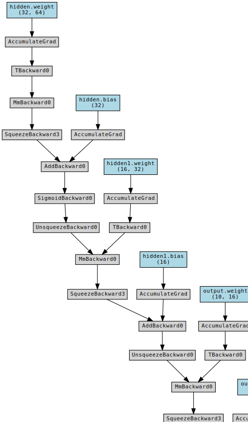
    


```
correct = 0
total = 0
# since we're not training, we don't need to calculate the gradients for our outputs
with torch.no_grad():
    for data in test_dataloader:
        inputs, labels = data
        inputs = inputs.to(device)
        labels = labels.to(device)
        # calculate outputs by running images through the network
        outputs = net(inputs)
        # the class with the highest energy is what we choose as prediction
        _, predicted = torch.max(outputs.data, 1)
        total += labels.size(0)
        correct += (predicted == labels).sum().item()

print(f'Accuracy of the network on the 20 test images: {100 * correct // total} %')
```

    Accuracy of the network on the 20 test images: 70 %
    


```
test_dataloader1 = DataLoader(test_dataset, batch_size=1, shuffle=True)
```


```
with torch.no_grad():
    for data in test_dataloader1:
        inputs, labels = data
        image = inputs.numpy().reshape(8,8)
        inputs = inputs.to(device)
        outputs = net(inputs)
        _, predicted = torch.max(outputs.data, 1)

        plt.figure(figsize=(4,4))
        plt.title(f'true label :{labels}, predict label {predicted}')
        plt.imshow(image, cmap='gray')
```


    
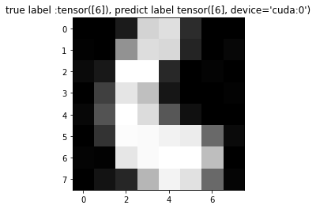
    


    
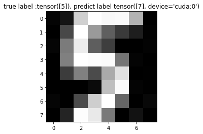
    


    
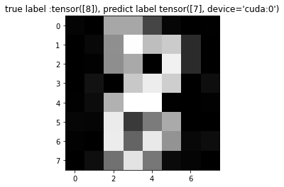
    


    
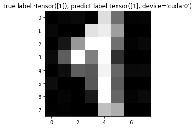
    


    
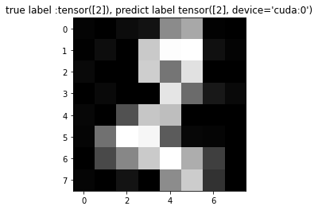
    


    
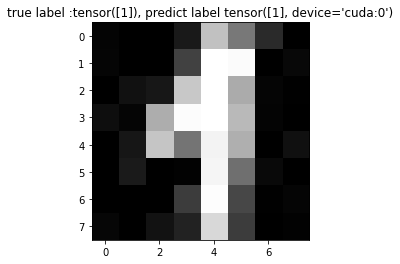
    


    
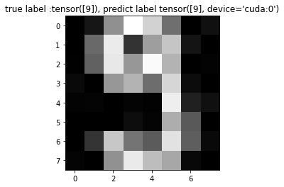
    


    
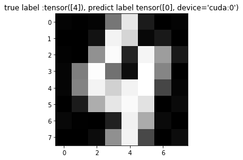
    


    
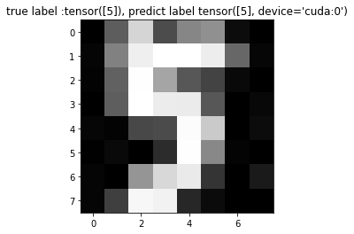
    


    
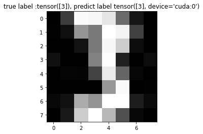
    


    
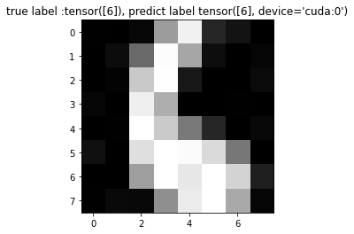
    


    
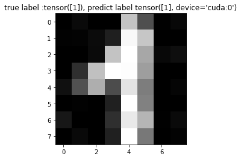
    


    
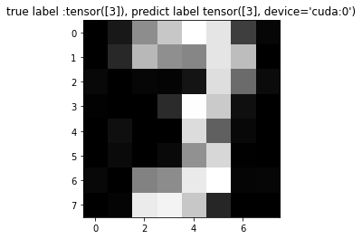
    


    
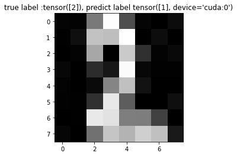
    


    
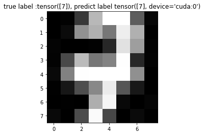
    


    
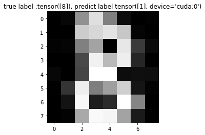
    


    
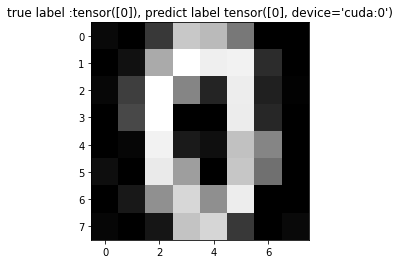
    


    
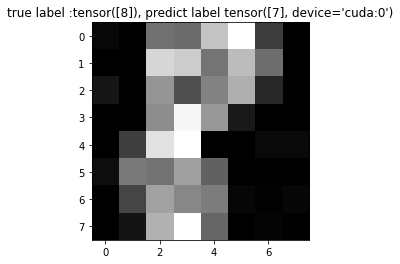
    


    
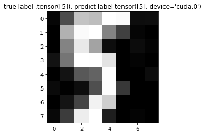
    


    
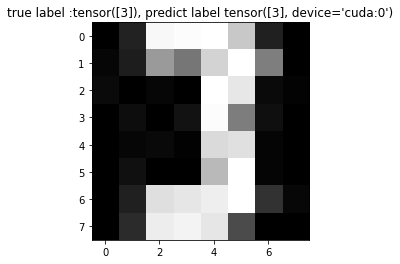
    


```

```
